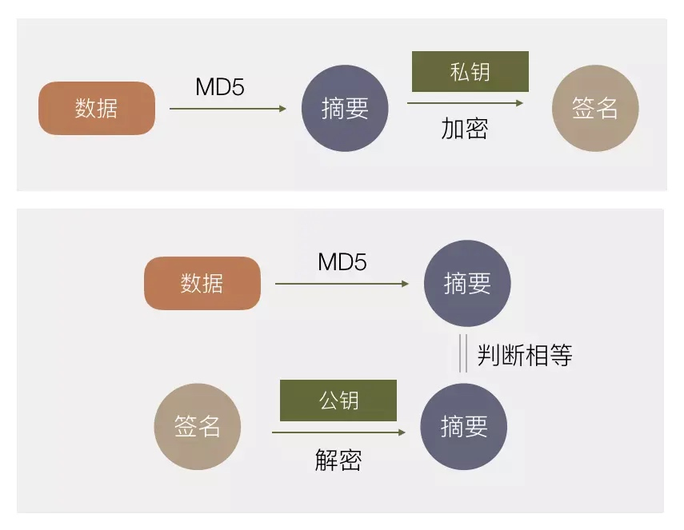
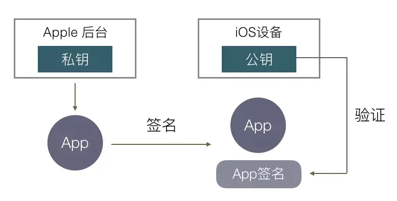
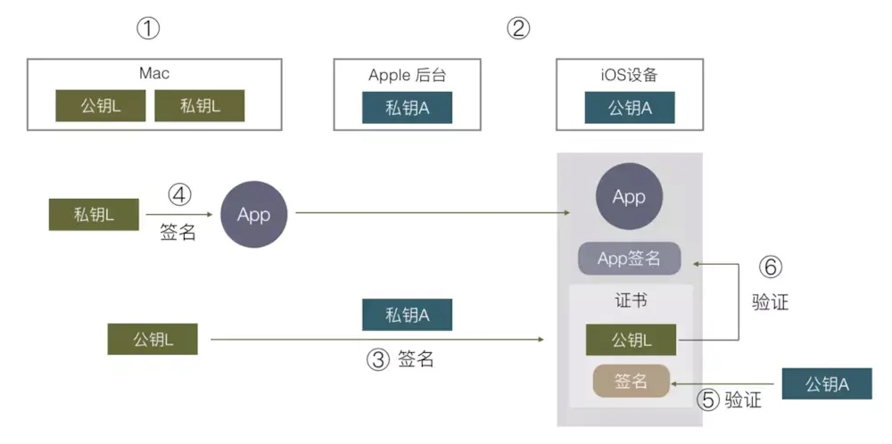
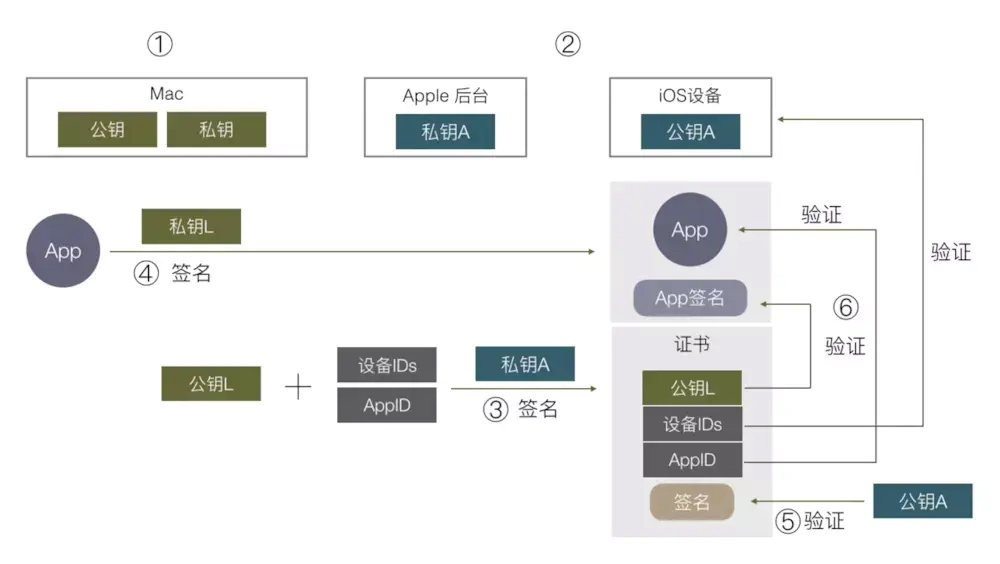

# RSA
RSA是由罗纳德·李维斯特（Ron Rivest）、阿迪·萨莫尔（Adi Shamir）和伦纳德·阿德曼（Leonard Adleman）
非对称加密算法

#iosApp签名机制
[学习来源](http://blog.cnbang.net/tech/3386/)
[重签名](https://www.jianshu.com/p/ecba455911db)
##签名与验证签名


##AppleStore签名机制和验证机制

Apple也有一对秘钥, 私钥在Apple后台, 私钥A(A:Apple), 公钥在ios设备, 公钥A
从AppStore下载的App带有Apple对App的签名(MD5+私钥A), 下载到iOS设备上后, 把自己算出的MD5, 用公钥A把签名解码后得出的MD5, 两个MD5对比是否相同, 相同则可以正常使用.

思考:为什么我们上传App Store要用苹果的发布证书呢, 那是什么机制?
猜想:
上传App Store相当于App Store服务器来检测我们App是否有效, 首先要有证书, 本机Mac要有证书的私钥L, 私钥L来签名App, 服务器拿到Profile文件, 用公钥A来验证Profile的有效性(是否经苹果授权, 是否被串改), 最后发现profile有效, App也是有效的, 则上传成功.

##证书
因为苹果服务器是受信任的, 所以由他签名的东西也是受苹果信任的, 就是受信任的. 证书就是这么回事, 证书由苹果生成, 并由苹果签名, 到了ios里, 该证书就是受信任的. 由这个证书解码的签名也是受信任的. 

##跟苹果请求证书
CSR文件, 包含了mac的公钥, 跟苹果(CA)请求证书

>苹果是iOS应用程序的唯一有效CA

##Apple开发者签名和验证机制

开发者做的事情:
* 开发者有一对秘钥, 公钥L, 私钥L, (L:Local)都在mac里
* 开发者找苹果申请一个开发者证书, 苹果拿到公钥L, 并用私钥A签名, 生成证书
* mac打包好的App, 用私钥L签名, 然后和开发者证书一起发给手机

手机验证:
* iOS拿到App\App签名\证书
* 先校验证书的公钥L: 用公钥A把证书里的签名解码(对公钥L的签名), 得到MD5(公钥L), 与证书中的公钥L做MD5对比是否一致, 一致则说明证书没问题
* 拿到公钥L之后, 解码App签名, 得到MD5, 跟自己算出的MD5对比, 如果一致, 则可以启动App了

以上是"苹果控制开发人员安装app"的机制
加上deviceId和AppId的限制后, 就变成限制开发人员滥装app的了


Provisioning Profile文件
* 在苹果后台申请的AppId和DeviceId和App的权限,加上证书, 组成的数据用私钥A签名, 把数据和签名组成Provisioning Profile文件
* 编译好App后, Provision Profile文件会打进App里, 变成:embedded.mobileprovision文件, 一起安装到手机上
* iOS会去校验embedded.mobileprovision签名是否正确, 里面的证书是否正确(确保里面的数据都是通过苹果授权)

##embedded.mobileprovision (Provision Profile)
两个文件的内容是一样的, 内容(关键)
1. 创建日期和国旗日期
2. entitlement(权利)
    1. 推送的环境(development | production)
    2. teamId
    3. 各种app的capability
3. 证书信息(Certificates)
    1. 选择证书的信息, 过期时间
4. Provisioned Devices(各个手机的UUID)

##ios重签名
* 除了App Store下载的app, 其他包里都会有embedded.mobileprovision文件(包括开发者包, 企业包, 重签名包)
* 防重签名
    * 判断MainBundle里是否有embedded.mobileprovision这个文件, 无则没事
    * 有则继续判断TeamId, 判断是否是自己的TeamID, 是则没事, 否则就是重签名包

    ```objective-c
    // 不能单纯的判断是否存在embedded.mobileprovision，因为开发环境+Testflight是存在当前文件的。
+ (BOOL)checkResign 
{
    NSString *mobileProvisionPath = [[[NSBundle mainBundle] bundlePath] stringByAppendingPathComponent:@"embedded.mobileprovision"];
    FILE *fp=fopen([mobileProvisionPath UTF8String],"r");
    char ch;
    if(fp==NULL) {
        // 1. embedded.mobileprovision文件不存在（App Store环境）
        // 2. 打开embedded.mobileprovision失败
        return NO;
    }
    NSMutableString *str = [NSMutableString string];
    while((ch=fgetc(fp))!=EOF) {
        [str appendFormat:@"%c",ch];
    }
    fclose(fp);
    
    NSString *teamIdentifier = nil;
    NSRange teamIdentifierRange = [str rangeOfString:@"<key>com.apple.developer.team-identifier</key>"];
    if (teamIdentifierRange.location != NSNotFound)
    {
        NSInteger location = teamIdentifierRange.location + teamIdentifier.length;
        NSInteger length = [str length] - location;
        if (length > 0 && location >= 0)
        {
            NSString *newStr = [str substringWithRange:NSMakeRange(location, length)];
            NSArray *val = [newStr componentsSeparatedByString:@"</string>"];
            NSString *v = [val firstObject];
            NSRange startRange = [v rangeOfString:@"<string>"];
            
            NSInteger newLocation = startRange.location + startRange.length;
            NSInteger newLength = [v length] - newLocation;
            if (newLength > 0 && location >= 0)
            {
                teamIdentifier = [v substringWithRange:NSMakeRange(newLocation, newLength)];
            }
        }
    }
    // developer ->  Account -> Membership -> Team ID
    return ![teamIdentifier isEqualToString:@"Team ID"];
}
    ```
    
用 ios-app-signer可以重签名
uncover重签名过程
1. [uncOver官网](https://unc0ver.dev/)
2. 下载release包
3. 上苹果开发者网配证书(AD证书, 新建appID(capability要对的上), provisionProfile)
4. 证书选择自己本地有私钥的证书
5. 在ios-app-signer里选择下载的ipa包, profile选择自己下载的profile, 
6. 点ok就行了.