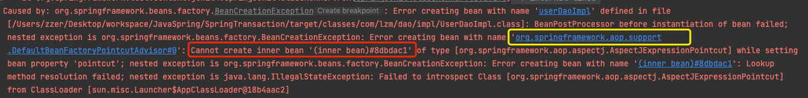

#Cannot resolve org.mybatis:mybatis:pom:3.4.5 failed to transfer from
1. 保证坐标没问题
###解决办法
1. 发现没装Maven， 就重新下载最新Maven
2. 重新配置localRepository
3. 重新打开idea，下载完即可


# 问题

###解决
原因是在spring容器中无法生成内部bean对象，去搜一下`org.springframework.aop`就知道要导入以下坐标
```xml
<dependency>
            <groupId>org.aspectj</groupId>
            <artifactId>aspectjweaver</artifactId>
            <version>1.9.6</version>
</dependency>
```