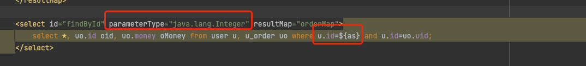
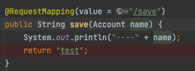
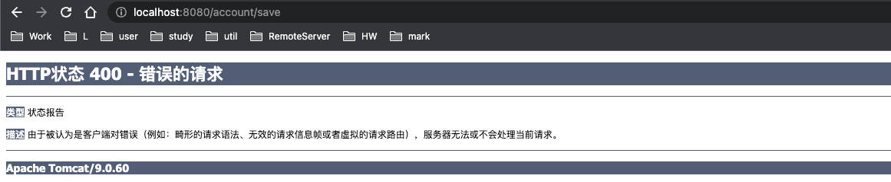
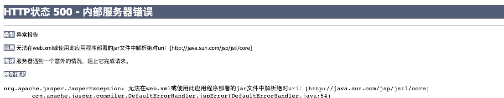
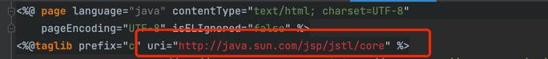

#Cannot resolve org.mybatis:mybatis:pom:3.4.5 failed to transfer from
1. 保证坐标没问题
###解决办法
1. 发现没装Maven， 就重新下载最新Maven
2. 重新配置localRepository
3. 重新打开idea，下载完即可


# 问题

###解决
原因是在spring容器中无法生成内部bean对象，去搜一下`org.springframework.aop`就知道要导入以下坐标
```xml
<dependency>
            <groupId>org.aspectj</groupId>
            <artifactId>aspectjweaver</artifactId>
            <version>1.9.6</version>
</dependency>
```


#问题
```
org.apache.ibatis.exceptions.PersistenceException: 
### Error querying database.  Cause: org.apache.ibatis.reflection.ReflectionException: There is no getter for property named 'as' in 'class java.lang.Integer'
### Cause: org.apache.ibatis.reflection.ReflectionException: There is no getter for property named 'as' in 'class java.lang.Integer'
```
问题出现在这里

表示类Ingeter里没有as这个属性的getter方法
但我们实际并不是要获取integer的as属性，而是把int当做变量使用

##解决：把${as} 改为 #{as}

# SpringMVC，POJO对象作为入参的controller方法
问题：


当我不知道为什么老出现上述问题的时候，在想到底怎样才会让webmvc框架帮我把入参封装到Account对象里，

答案：
不需要任何配置，只需要请求的字段与POJO类的字段一致就行。
那为什么会出现上述报错呢：是因为请求数据字段类型与POJO类字段类型不匹配，String->int, 或者请求字段为空


# SpringMVC: controller返回ResponseBody的时候中文出现乱码
解决： 在RequestMapping里使用produces
```java
@RequestMapping(value = "/save", produces = "text/json;charset=utf-8")
    @ResponseBody
    public String save(Account name) {
        System.out.println("----" + name);
        return "保存成功";
    }
```

# 无法在web.xml或使用此应用程序部署的jar文件中解析绝对uri：[http://java.sun.com/jsp/jstl/core]


出现上述问题，就是没导包
```aidl
<dependency>
      <groupId>jstl</groupId>
      <artifactId>jstl</artifactId>
      <version>1.2</version>
    </dependency>
```

# Invalid bound statement (not found): com.lzm.mapper.AccountMapper.findAll
表示mapper.xml没对mapper接口代理对象关联
即：spring容器已经有mapper接口的代理对象了，也注入成功了。但接口没有实现，即没有跟mapper.xml关联起来
出现在mybatisConfig.xml没有读取mapper.xml， 或者mapper.xml的namespace或者方法id没有和接口对上


