# TomcatServlet


# 注解
```
@Scope("prototype|singleton")
@Component("beanId")
@Repository("beanId") //Dao层
@Service("beanId") //Service层
@Controller("beanId") //web层
@Autowired //自动注入，根据成员类型(如果容器里只有一个这种类的bean, 也不用@Qulifier也行)
@Qualifier(name="beanId") //指定beanId注入（需要跟Autowired一起用）
@Resources(name="beanId") //指定beanId注入（可单独使用，但需要导库：javax.annotation-api）
@POSTConstruction //在函数上用，指定初始化后执行的方法
@PreDestroy //指定bean的销毁方法

@Configuration //指定配置类
@ComponentScan("package") //指定扫描的包
@PropertySource("classpath:fileName") //指定加载的property, 替代:`    <context:property-placeholder location="classpath:jdbc.properties"/>
`
@Bean("beanId") //用于函数，返回的对象，存储到容器当中, 作为容器中的bean
@Value("@{propertyKey}") //用于注入
@Import({DataSourceConfiguration.class, Other.class}) //用于加载其他配置类
```
@value 可以直接注入基本数据类型, 也可以引用el表达式, 使用property文件数据(前提, 容器导入了property文件)
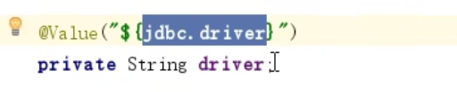

#使用指定配置类, 来代替context.xml
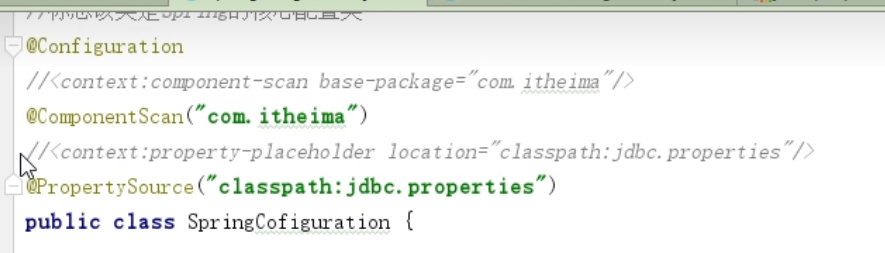
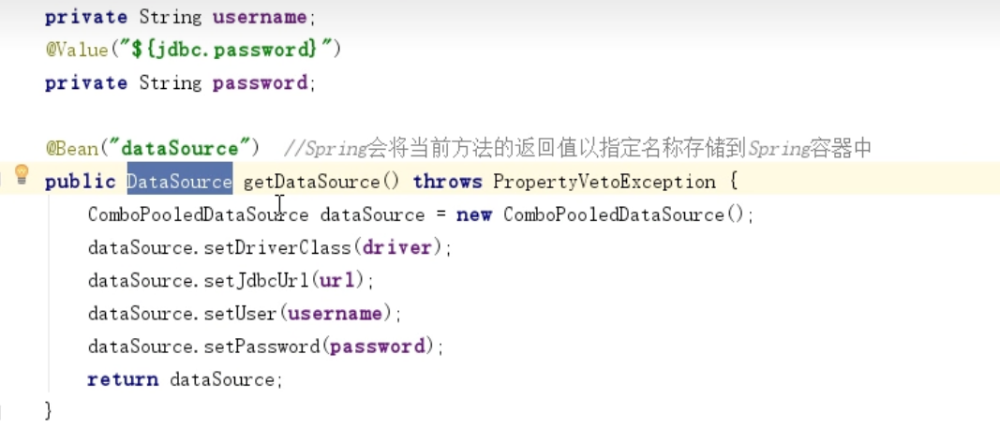
##在核心配置类里, 加载其他配置类
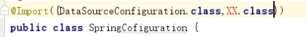

#配置context.xml扫描包
`<context:component-scan base-package="com.lzx"/>`
在context命名空间下, 所以需要引用context命名空间

# Spring框架
## spring-context
spring的主框架，主要是实现spring容器，配置`applicationContext.xml`

* ClassPathXMLApplicationContext
* SystemFileApplicationContext 
* AnnotationApplicationContext
##spring-web
是spring对web的封装
ContextLoaderListener，是spring对web的服务启动的监听器。只要做好web.xml相关配置，在web服务启动的时候，就会创建好spring容器
配置：指定applicationContext.xml
```xml
<context-param>
    <param-name>contextConfigLocation</param-name>
    <param-value>classpath:applicationContext.xml</param-value>
  </context-param>
```

## spring-webmvc

DispatcherServlet: 前端控制器
主要用于转发请求到指定的Servlet。需要给他配置spring容器，来让他知道他转发到哪个容器的哪个方法。

### DispatcherServlet 工作原理
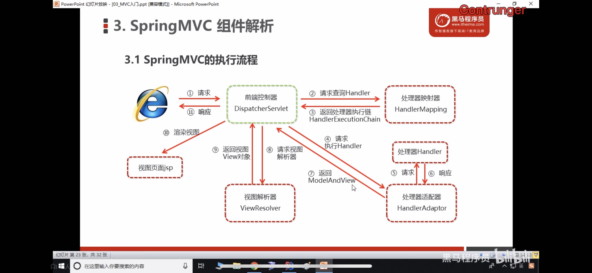
1. 浏览器发送请求给Tomcat服务器，Tomcat引擎把请求封装，转发给DispatcherServlet处理
2. DispatcherServlet收到请求后，转发给`HandlerMapping`
3. HandlerMapping收到请求，生成HandlerExecutionChain（执行链），返回给DispatcherServlet
4. DispatcherServlet把HandlerExecutionChain转发给HandlerAdapter
5. HandlerAdapter负责根据HandlerExecutionChain来执行，使用处理器Handler来执行。
6. 处理器Handler处理，结果返回给HandlerAdapter，这里就是我们编写的@Controller逻辑
7. 根据Handler处理的结果，生成ModelAndView，返回给DispatcherServlet
8. DispatcherServlet转发ModelAndView给ViewResolver（视图解析器）
9. ViewResolver处理，返回View对象给DispatcherServlet
10. DispatcherServlet拿到view对象，进行渲染视图，得到jsp
11. 然后返回给浏览器

@Controller: 在指定的类，表明这里是web的控制器，在spring-context库里


@RequestMapping("/path"): 用来匹配请求路径。在函数上注解。在spring-web库里

# ModelAndView使用
在通过`modelAndView.addObject("key","value")`给request域设置入参的时候，
如果在jsp使用`el表达式`没效果的话，在%>前面加`isELIgnored="false"`

@RequestMapping("/path"): 
1. 用来匹配请求路径。在函数上注解。在spring-web库里
2. 也可以用在类上，表示路径前缀。（"/user/quick")
3. 入参
    1. value： 字符串，缺省值，表示路径
    2. params： 数组，要求入参一定要有指定入参
    3. method：枚举（RequestMethod.GET), 指定请求方法
    4. @RequestMapping(value="/path", method=ReqeustMethod.POST, params={"username", "age!20"}h
    5. 表示路径/path, 一定要用POST请求，入参一定要有username，age，age不能是20

```java
@RequestMapping("/user")
class controller {

@RequestMapping("/quick")
public void func1() {
    return "success.jsp" //如果前面不加/，则表示jsp在/user路径下
    return "/success.jsp" //前面加/, 则表示在类加载路径下的jsp
}

}

```

### ViewResolver 源码
在spring-mvc的源码库里。寻找DispatcherServlet.properties文件，里面有告知你哪个类是ViewResolver。
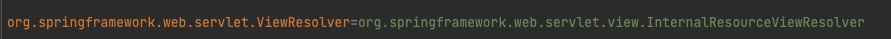
找到父类
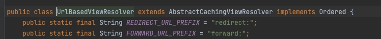
默认的是foward前缀，可以换成redirect前缀
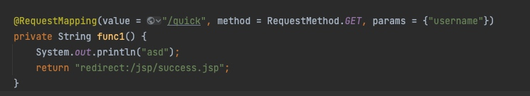

还有这个set方法
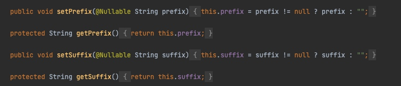
用来表示前缀和后缀
我们可以用spring注入的方式，给这个类成员变量进行赋值

这样，你方法返回值就可以省略前缀和后缀了。

## RequestMapping使用
获取HttpServletRequest和HttpServletResponse都可以通过设置形参方式获取
```
@RequestMapping("/asd")
private void func(HttpServletRequest request, HttpServletResponse response)
```
request可以设置Request域的参数：`request.setAttribute(key, value)`
response可以设置回写数据:
`response.getWriter().print("jsonString")`

## @ResponseBody
用在方法上，表示return的字符串是用于数据回写

### 对象转json字符串
导包
```
 <dependency>
      <groupId>com.fasterxml.jackson.core</groupId>
      <artifactId>jackson-core</artifactId>
      <version>2.9.0</version>
    </dependency>
    <dependency>
      <groupId>com.fasterxml.jackson.core</groupId>
      <artifactId>jackson-databind</artifactId>
      <version>2.9.0</version>
    </dependency>
    <dependency>
      <groupId>com.fasterxml.jackson.core</groupId>
      <artifactId>jackson-annotations</artifactId>
      <version>2.9.0</version>
    </dependency>
```
目标类不需要实现什么特殊接口
直接如下使用
```java
@RequestMapping("/quick5")
    @ResponseBody
    private String func5() throws JsonProcessingException {
        User user = new User();
        user.setUsername("lisi");
        user.setAge(123);
        ObjectMapper objectMapper = new ObjectMapper();
        String json = objectMapper.writeValueAsString(user);
        return json;
    }
```

### 通过SpringMVC 框架，集成Jackson
通过注入，配置HandlerAdapter
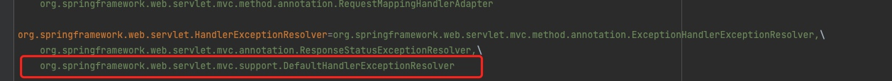
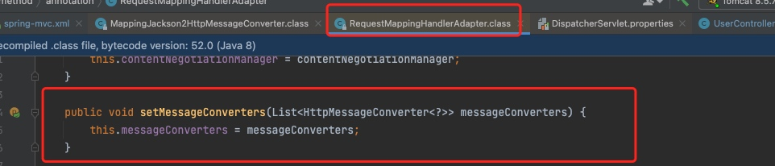

```xml
<bean id="handlerAdapter" class="org.springframework.web.servlet.mvc.method.annotation.RequestMappingHandlerAdapter">
        <property name="messageConverters">
            <list>
                <bean class="org.springframework.http.converter.json.MappingJackson2HttpMessageConverter"/>
            </list>
        </property>
    </bean>
```

PS： org.springframework.http.converter.json.MappingJackson2HttpMessageConverter
这个类依赖jackson框架
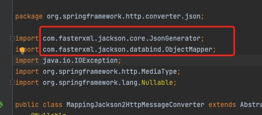

### \<mvc:annotation-driven/>
使用这个标签，springMVC就会自动加载RequestMappingHandlerMapping，RequestMappingHandlerAdapter。并且会自动集成Jackson框架到HandlerAdapter上。

PS：所以上面对HandlerAdapter配置的xml代码可以不用写

## Get请求获取入参
在RequestMapping方法里，直接声明同名的形参，即可获得相应的入参
http://localhost:8080/quick?username=asd
```java
@RequestMapping("/quick")
private void func1(String username){
 
}
```
### 入参对象
或者直接传入一个对象，对象成员变量与入参同名
```java
private void func(User user){
}
```
### 入参数组
需要请求地址http://localhost/quick?asd=123&asd=321&asd=231
```java
private void func(String[] asd){
}
```

### 入参集合(List\<T>)
集合只能封装到对象里，作为成员变量。
```java
class VO {
    private List<User> userList
}

@RequestMapping("")
private void func(VO vo) {
}
```
还只能用POST，不能用GET=。=
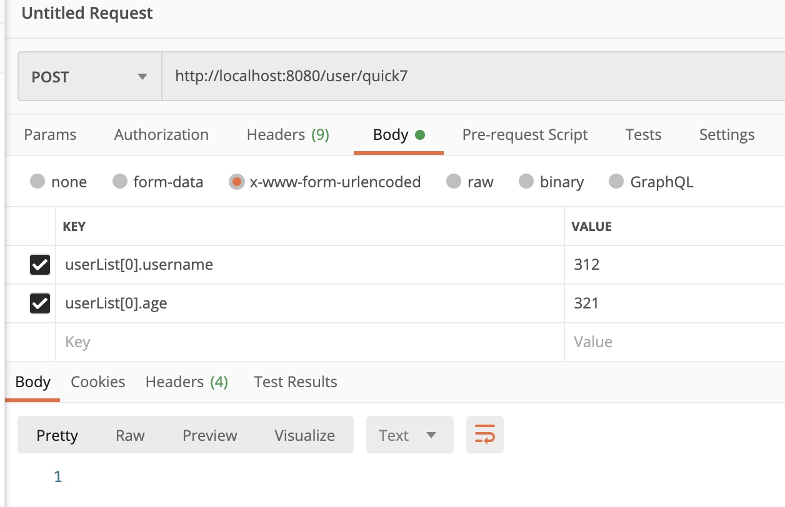

### RequestBody (表示获取请求体数据)
在获取集合类型入参时，如果不想作为成员变量封装在对象里，则需要引用注解`@RequestBody`
```java
private void func(@RequestBody List<User> userList){ 
}
```
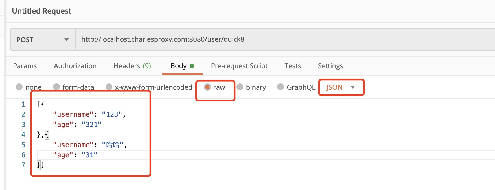
入参名不重要，主要是要数组

### 中文编码
> 教程里是用web的表单提交数据到Tomcat，如果出现中文，则Tomcat会拿到的是乱码，如果是使用postman去提交，则Tomcat可以正常拿到中文
> 因此需要配置web的编码方式。去web.xml配置

```xml
  <filter>
    <filter-name>CharacterEncodingFilter</filter-name>
    <filter-class>org.springframework.web.filter.CharacterEncodingFilter</filter-class>
    <init-param>
      <param-name>encoding</param-name>
      <param-value>UTF-8</param-value>
    </init-param>
  </filter>
  <filter-mapping>
    <filter-name>CharacterEncodingFilter</filter-name>
    <url-pattern>/*</url-pattern>
  </filter-mapping>
```

### @RequestParam

使用在方法形参，缺省为value，表示把web入参映射到这个方法形参，required（缺省为TRUE）表示是否强制，defaultValue，web端没传时的默认值

http://localhost:8080/quick?name=asd    
```java
private void func(@RequestParam(value="name",required = false, defaultValue="haha") String username) {
    print(username)
}
```


#Restful风格
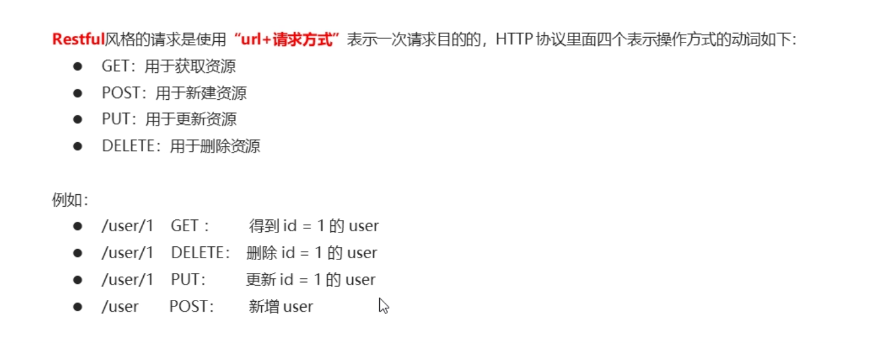

### Resultful请求方式，获取入参
### @PathVariable
http://localhost:8080/quick/123
```java
@RequestMapping("/quick/{username}")
private void func(@PathVariable("username") String name) {
}
```

# SpringMVC 请求参数类型转换
### Converter类型转换器
场景: web端传了一个2022-2-2的字符串, SpringMVC需要识别并得到正确的Date对象. 需要自己实现转换器
http://localhost/path?date=2022-02-02
```java
private void func(Date date) {
    print(date);//会报错, 因为Spring转不过来
}
```
(通过SpringMVC框架提供的接口(org.springframework.core.convert.converter.Converter)实现)

声明一个类,实现上述接口
```java
public class DateConverter implements Converter<String, Date> //表示拿到String,返回Date{
    @Override
    public Date convert(String s) {
        return null;
    }
}
```
建好类了之后, 去SpringMVC的配置xml去配置.
```xml
 <mvc:annotation-driven conversion-service="dateConvert"/>

    <bean id="dateConvert" class="org.springframework.context.support.ConversionServiceFactoryBean">
        <property name="converters">
            <list>
                <bean class="cn.zzstc.converter.DateConverter"></bean>
            </list>
        </property>
    </bean>
```

### 获取请求头信息,获取Cookie
```java
@RequestMapping("/quick12")
    @ResponseBody
    private void func12(@RequestHeader(value = "User-Agent") String userAgent, @CookieValue("JSESSIONID") String cookie) {
        System.out.println(userAgent);
        System.out.println(cookie);
    }
    
//    Mozilla/5.0 (Linux; Android 6.0; Nexus 5 Build/MRA58N) AppleWebKit/537.36 (KHTML, like Gecko) Chrome/98.0.4758.109 Mobile Safari/537.36
//12B6E5220B8799D92EEF904A04611EC1
```
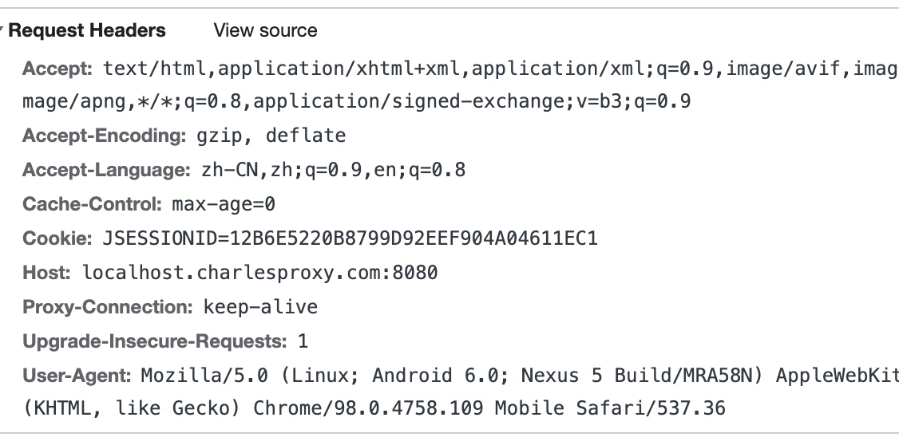
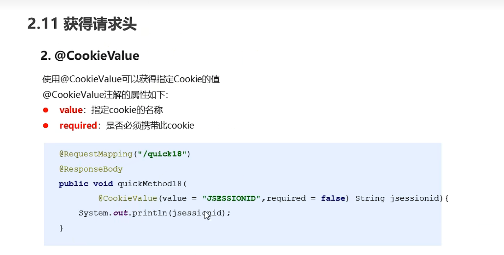

# 文件上传
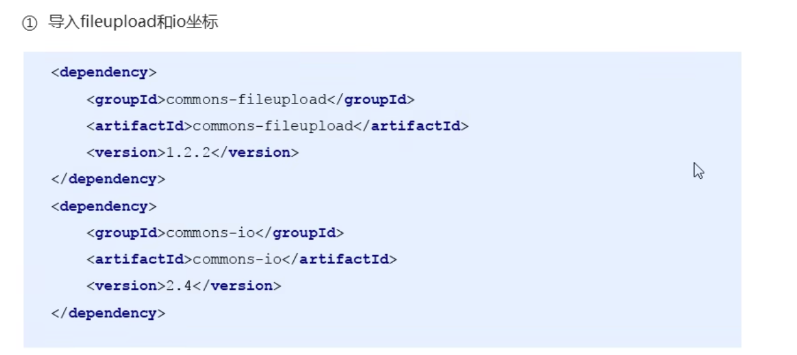
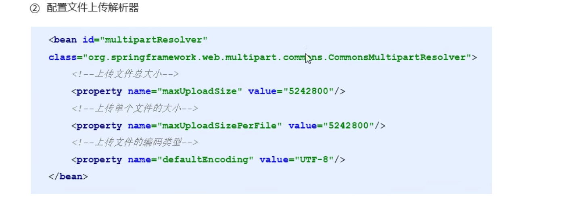
## web端,制作文件上传
```xml
<form action="${pageContext.request.contextPath}/user/quick13" enctype="multipart/form-data" method="post">
        用户名<input type="text" name="username" ><br/>
        文件名<input type="file" name="file"><br/>
        <input type="submit" name="提交">
    </form>
```

```java
@ReqeustMapping(path="/quick123")
private void fun13(String username, MultiPartFile file) {
    
        //文件名称
        System.out.println( file.getOriginalFilename());
        String fileName = file.getOriginalFilename();
        file.transferTo(new File("/Users/zzer/Desktop/" + fileName));
}
```

> java的字段名要跟表单的字段名一样, 使用MultiPartFile类来接收文件
> 


`enctype="multipart/form-data"` 使用这个方式POST
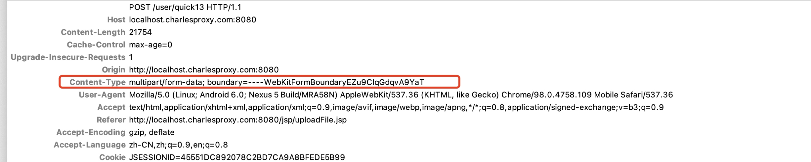
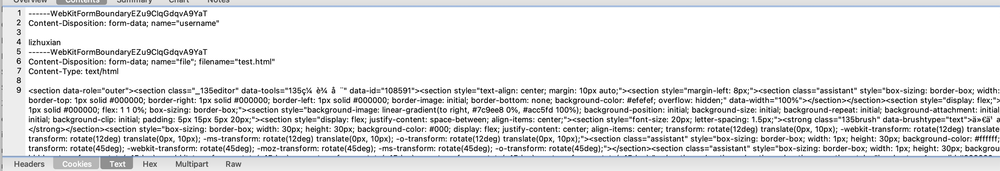
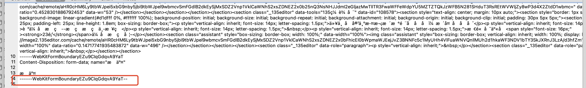

#资源文件开放
在外部访问webapp文件夹里资源时, 也是通过localhost/resourcesPath这样的
路径访问, DispatcherServlet会认为他要去寻找Controller里的RequestMapping方法
所以要配置资源文件开放, 不用去到Controller上去寻找映射
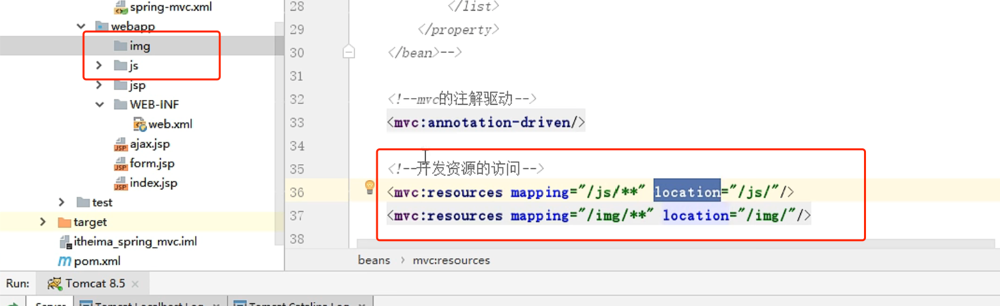
mapping表示访问url的路径

location表示类文件地址

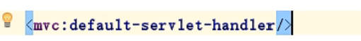
上述配置表示: 外部访问有限走Controller的映射, 如果找不到, 使用Tomcat内部机制去寻找资源
 

 

## 多个文件上传
只要form里有多个字段一样的, 然后再java那边用数据类型来接收这些字段即可
```xml
    <input type="file" name="file"/> 
    <input type="file" name="file"/> 
    <input type="file" name="file"/> 
```
```java
private void func(MultiPartFile[] file){
    for (MultiPartFile f : file) {
    }
}
```


# JDBCTemplate
是Spring的框架`spring-jdbc` 和 `Spring-tx`

## 使用
```java
ComboPooledDataSource dataSource = new ComboPooledDataSource();
        dataSource.setDriverClass("com.mysql.jdbc.Driver");
        dataSource.setJdbcUrl("jdbc:mysql://localhost:3306/lzm_db_test");
        dataSource.setUser("root");
        dataSource.setPassword("qq123123");

        JdbcTemplate jdbcTemplate = new JdbcTemplate();
        jdbcTemplate.setDataSource(dataSource);

        int row = jdbcTemplate.update("insert into user(name, phone) values (?,?)", "tom", "3123123");
        System.out.println(row);
```

## 查询
```java
List<User> userList = jdbcTemplate.query(selectSQL, new BeanPropertyRowMapper<User>(User.class))

User user = jdbcTemplate.queryForObject(selectSQL, new BeanPropertyRowMapper<User>(User.class), userId)

Long count = jdbcTemplate.query
```