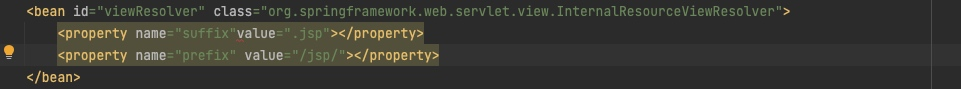

# TomcatServlet


#注解
@Scope("prototype|singleton")
@Component("beanId")
@Repository("beanId") //Dao层
@Service("beanId") //Service层
@Controller("beanId") //web层
@Autowired //自动注入，根据成员类型
@Qualifier(name="beanId") //指定beanId注入（需要跟Autowired一起用）
@Resources(name="beanId") //指定beanId注入（可单独使用，但需要导库：javax.annotation-api）
@POSTConstruction //在函数上用，用于指定bean的初始方法
@PreDestroy //指定bean的销毁方法

@Configuration //指定配置类
@ComponentScan("package") //指定扫描的包
@PropertySource("classpath:fileName") //指定加载的property
@Bean("beanId") //用于函数，返回的对象，作为容器中的bean
@Value("@{propertyKey}") //用于注入


#Spring框架
##spring-context
spring的主框架，主要是实现spring容器，配置`applicationContext.xml`

* ClassPathXMLApplicationContext
* SystemFileApplicationContext 
* AnnotationApplicationContext
##spring-web
是spring对web的封装
ContextLoaderListener，是spring对web的服务启动的监听器。只要做好web.xml相关配置，在web服务启动的时候，就会创建好spring容器
配置：指定applicationContext.xml
```xml
<context-param>
    <param-name>contextConfigLocation</param-name>
    <param-value>classpath:applicationContext.xml</param-value>
  </context-param>
```
##spring-webmvc
DispatcherServlet: 前端控制器
主要用于转发请求到指定的Servlet。需要给他配置spring容器，来让他知道他转发到哪个容器的哪个方法。

###DispatcherServlet 工作原理

1. 浏览器发送请求给Tomcat服务器，Tomcat引擎把请求封装，转发给DispatcherServlet处理
2. DispatcherServlet收到请求后，转发给`HandlerMapping`
3. HandlerMapping收到请求，生成HandlerExecutionChain（执行链），返回给DispatcherServlet
4. DispatcherServlet把HandlerExecutionChain转发给HandlerAdapter
5. HandlerAdapter负责根据HandlerExecutionChain来执行，使用处理器Handler来执行。
6. 处理器Handler处理，结果返回给HandlerAdapter，这里就是我们编写的@Controller逻辑
7. 根据Handler处理的结果，生成ModelAndView，返回给DispatcherServlet
8. DispatcherServlet转发ModelAndView给ViewResolver（视图解析器）
9. ViewResolver处理，返回View对象给DispatcherServlet
10. DispatcherServlet拿到view对象，进行渲染视图，得到jsp
11. 然后返回给浏览器

@Controller: 在指定的类，表明这里是web的控制器，在spring-context库里


@RequestMapping("/path"): 用来匹配请求路径。在函数上注解。在spring-web库里

#ModelAndView使用
在通过`modelAndView.addObject("key","value")`给request域设置入参的时候，
如果在jsp使用`el表达式`没效果的话，在%>前面加`isELIgnored="false"`

@RequestMapping("/path"): 
1. 用来匹配请求路径。在函数上注解。在spring-web库里
2. 也可以用在类上，表示路径前缀。（"/user/quick")
3. 入参
    1. value： 字符串，缺省值，表示路径
    2. params： 数组，要求入参一定要有指定入参
    3. method：枚举（RequestMethod.GET), 指定请求方法
    4. @RequestMapping(value="/path", method=ReqeustMethod.POST, params={"username", "age!20"}h
    5. 表示路径/path, 一定要用POST请求，入参一定要有username，age，age不能是20

```java
@RequestMapping("/user")
class controller {

@RequestMapping("/quick")
public void func1() {
    return "success.jsp" //如果前面不加/，则表示jsp在/user路径下
    return "/success.jsp" //前面加/, 则表示在类加载路径下的jsp
}

}

```

###ViewResolver 源码
在spring-mvc的源码库里。寻找DispatcherServlet.properties文件，里面有告知你哪个类是ViewResolver。

找到父类

默认的是foward前缀，可以换成redirect前缀


还有这个set方法

用来表示前缀和后缀
我们可以用spring注入的方式，给这个类成员变量进行赋值

这样，你方法返回值就可以省略前缀和后缀了。
