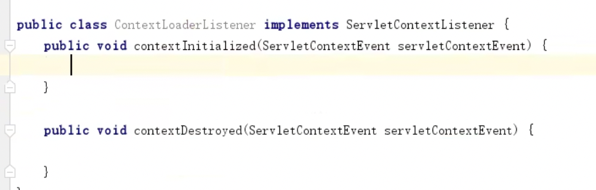
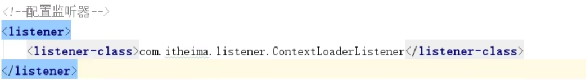
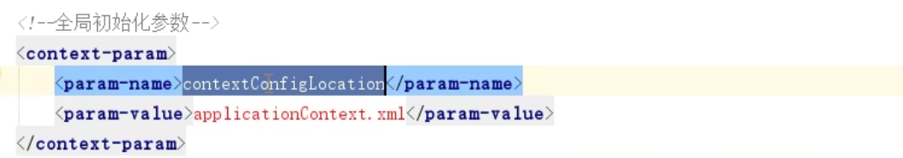
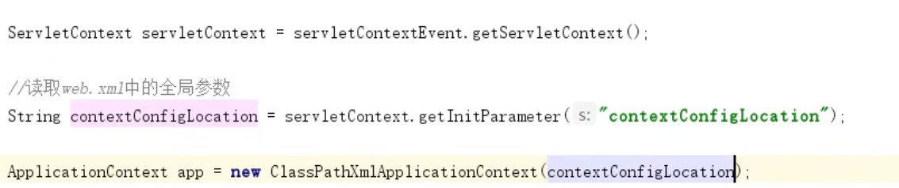
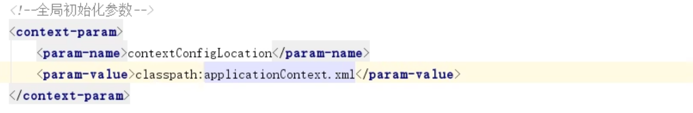
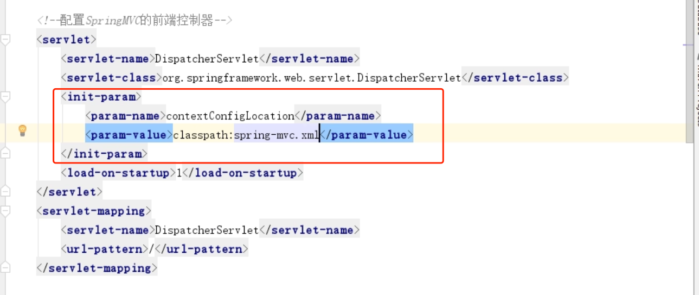

#监听web启动, 把Spring容器放到最大域当中:ServletContext
由于外部每个请求都对应着httpServlet里每一个方法, 总不能每个方法都
创建一个Spring容器, 消耗太大. Spring容器创建一次就够了. 每次使用
都用固定地方拿过来用即可. 
1. 可以放在静态变量, 可以用单例对象来持有
2. 本次使用ServletContext来存储这个Spring容器
   1. 先监听web启动, 在启动的时候创建容器, 并存储到servletContext中
   2. 监听器(ServletContextListener)
3. 
4. 说是监听web启动, 其实就是监听ServletContext的初始化和销毁
5. 在上述Context初始化和销毁方法里执行Spring容器的生命周期
6. 完成Listener之后, 需要配置到web里. 在web.xml里进行配置监听器
7. 

##把applicationContext.xml名字配置到web.xml上, 在listener上进行读取
web.xml配置全局参数

在listener上读取全局参数

#Spring-web
上述手动实现的内容, 在Spring-web已经有实现, 只需要下面两步, 即可获得Spring容器
1. 在web.xml中配置Spring-web提供的监听器ContextLoaderListener
2. 在web.xml中配置ApplicationContext的位置, 即上述的:全局变量contextConfiguration, 但跟上述不一样的是需要加classPath
3. 
4. 使用WebApplicationContextUtils获取容器对象(ApplicationCon  ext)

#配置DispatcherServlet
这个类在spring-webmvc包里

我们写的Controller就是DispatcherServlet的handler处理器

1. DispatcherServlet首先是配置在web.xml上的, 配上全局路径"/"
2. 新建spring-mvc.xml来与applicationContext.xml区分开, spring-mvc.xml专门用来配置spring-mvc框架所需的
3. 在spring-mvc上进行注解扫描, 扫描Controller包
4. DispatcherServlet需要寻找他的Controller, 所以告诉DispatcherServlet, spring-mvc.xml文件在哪.让DispatcherServlet加载这个配置文件
5. 
