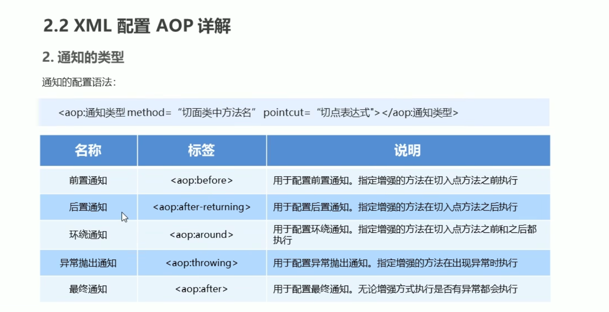

# aop的概念

#动态代理简单实现

1. JDK动态代理是条件是目标对象比如要有接口, 通过接口创建出目标对象的"兄弟对象"即代理对象
2. cglib代理是通过以目标对象为父类, 创建出目标对象, 但不是继承. 是兄弟关系 
##jdk动态代理

Advice: 是普通继承Object的类, 里面有简单的前置方法和后置方法
TargetInterface: 就只有一个简单的方法声明

Target: 对Interface的实现

使用Proxy.newProxyInstance来创建代理对象,代理对象调用方法时就对调用invoke方法

##cglib代理

#快速入门

1. 引入aspectjweave包
2. 在sppringContext.xml上添加aop命名空间, 进行aop配置

##切点表达式的抽取

#使用注解方式写AOP

##1. 目标对象

##2. 切面对象

##3. 配置springContext

##切面表达式抽取
