# 内容回顾
@ComponentScan()
1. 默认不写入参, 扫描范围则是当前配置类所在包及其子包

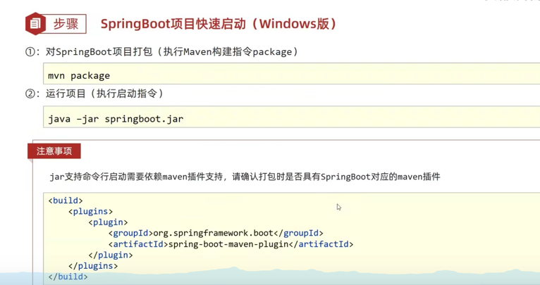
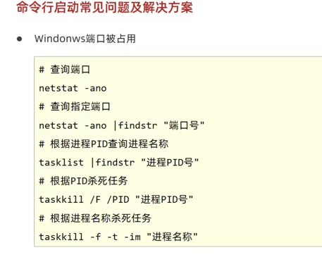

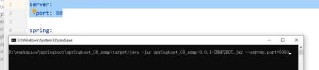

临时入参(临时属性)
`java -jar xxx.jar --server.port=8080`

加载顺序
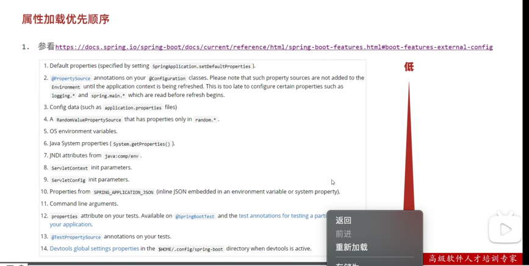
其中6: Java System properties则需要以下这么

idea调试命令行临时属性
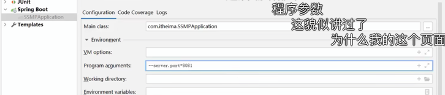

多配置文件, 在resource下config目录的配置优先级高于外面的
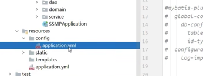
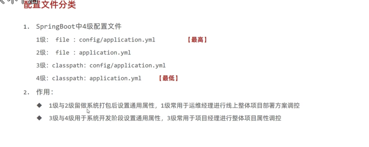

`--spring.config.name=ebank`
临时属性, 设置配置文件名, 不需要加扩展名

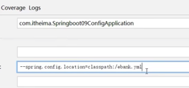
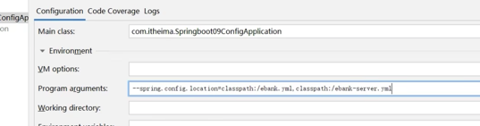

#多环境开发
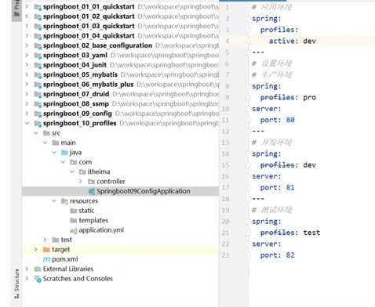

同个环境, 多个文件(分业务)
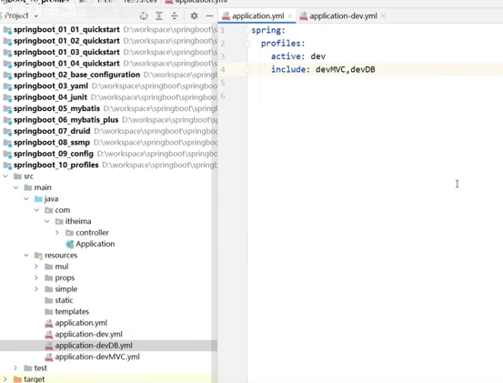
使用group代替, dev 对应着devMVC, devDB
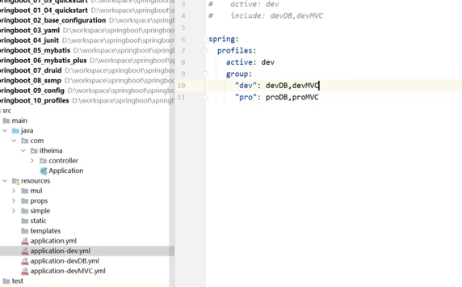

@EnableConfigurationProperties
加上这个注解, 那可以不用再加@Component
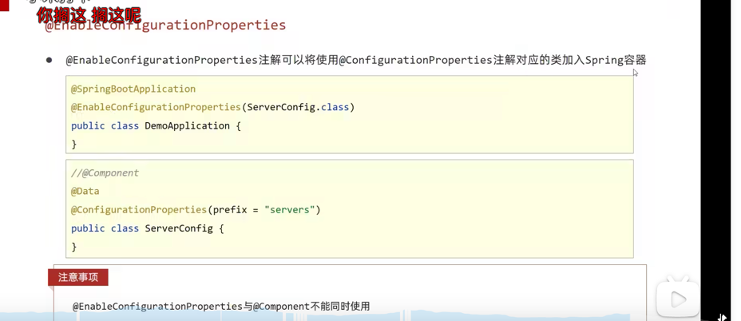

松散绑定
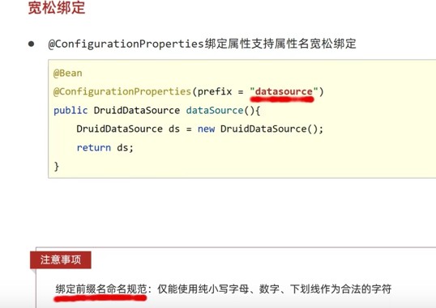

给Bean添加属性校验
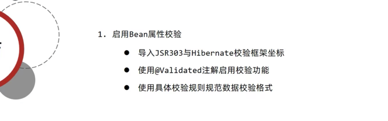
