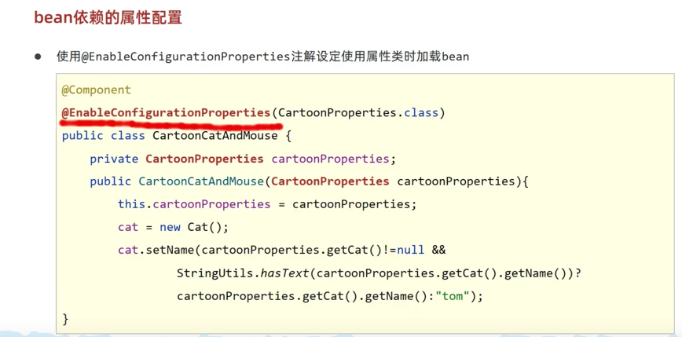

#八种bean加载方式

#@Configuration讲解

##proxyBeanMethods
proxyBeanMethods默认为true

意思是利用`CGClib`来给配置类生成代理对象, 给`@Bean`标记的方法做增强(Enhance)

达到效果: 每次调用`@Bean`标记的方法获取bean时, 返回的都是同一个对象(从容器中取出来), 而不是重新创建新的对象

#ImportSelector

自己创建一个类, 实现ImportSelector, 可以动态指定加载哪些类到Spring容器里面

通过在配置类里, `@Import`来导入这个实现类

#ImportBeanDefinitionRegistrar 

#BeanDefinitionRegistryPostProcessor

使用这个定义的, 可以覆盖ImportSelector的

#Bean的加载控制
 

#使用Spring的几个细节
1. 使用ConfigurationProperty来注入配置文件数据时, 要用getter和setter, 且要加入到容器当中, @Component才行
2. 当确定Spring容易有对应的bean时, 使用自动装配@Autowire来进行注入
   1. 或者使用有参构造方法, Spring会自动注入入参

#bean依赖属性配置

