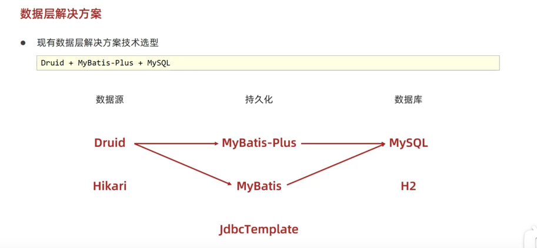

#JDBCTemplate
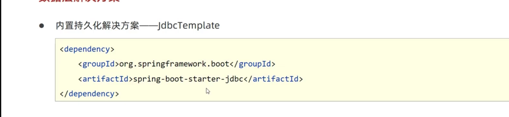
导入pom
直接注入即可 

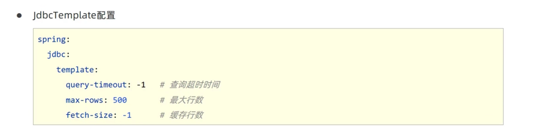

#Redis
`src/redis-server`运行服务器
`./redis-cli`运行客服端
```
set key value
get key
hset BigKey key value
hget BigKey key
```
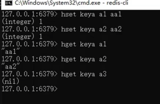
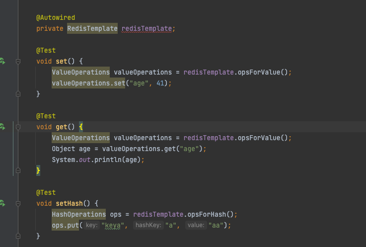

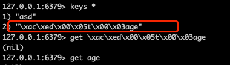
上述出现这种字符串, 是因为在RedisTemplate客户端里, 默认使用Object来进行序列化
想要正常读取, 要使用StringRedisTemplate才行  
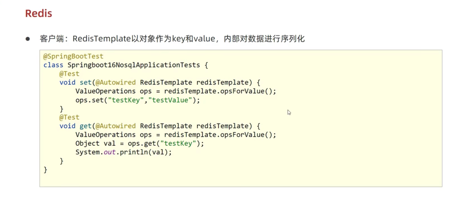
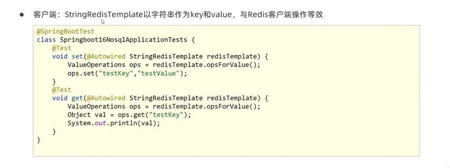

#Springboot缓存

先启动`@EnableCaching`注解
在对应表现层方法上, 启用`@Cacheable(value="namesapce", key=#id)`来缓存返回值

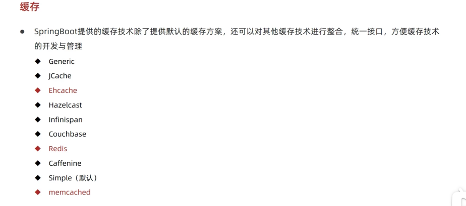

`@CachePut(value="", key="")`
只是放入缓存, 但不从缓存获取值
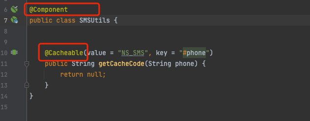
受SpringiOC容器管理的bean才能使注解生效, 如果不加入容器里或者不用Autowire来注入, 则无效

Spring-cache-Redis的配置
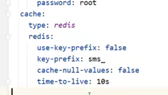

#JetCache
由于第三方缓存库太多, JetCache是一套缓存集合, 类似Spring-Cache, 用来继承其他第三方库. 不过他支持的第三方比较少, 分为远程缓存和本地缓存, 
远程缓存支持: Redis, xxx没记
本地缓存: xxxx没记

使用缓存思想
获取数据库数据时, 使用@Cached缓存, 指定命名空间, key
更新数据库时, 使用@CacheUpdating, 更新缓存
删除数据时, 使用@CacheInvali, 删除缓存
但有时候会是别的服务, 把数据库更新了, 但本地服务未更新缓存, 所以有个缓存刷新机制@CacheReFresh, 指定多久刷新一次, 即从数据库更新到缓存