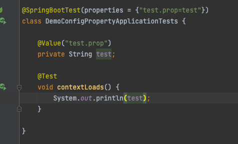
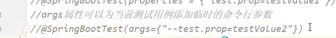
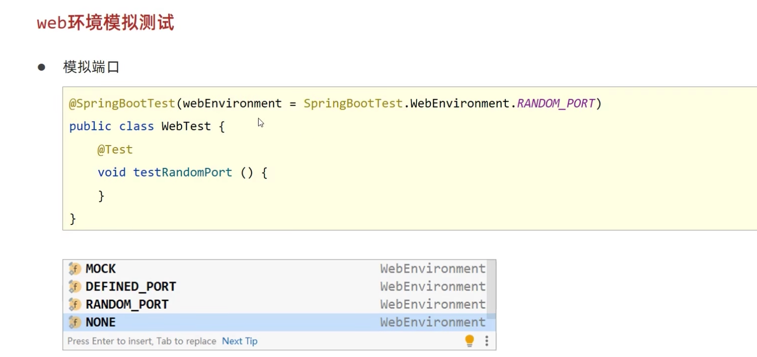
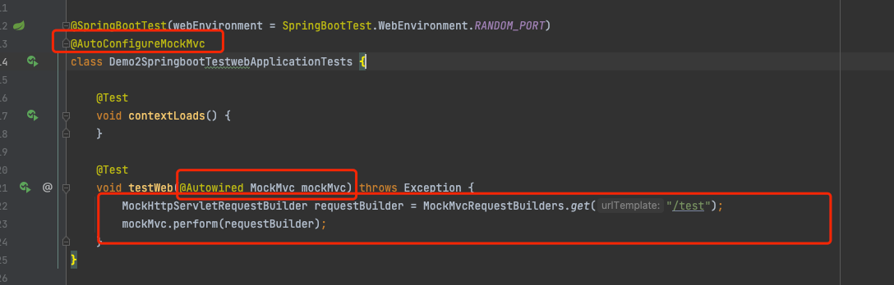
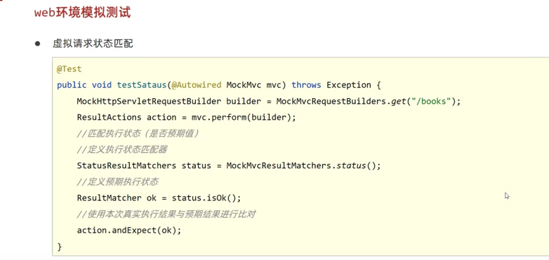
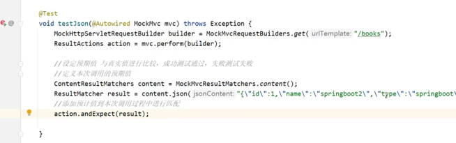
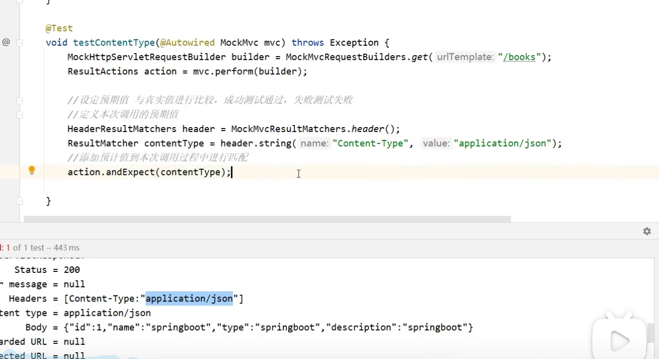
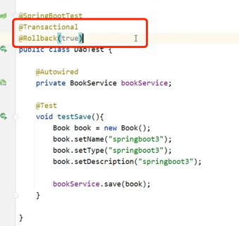
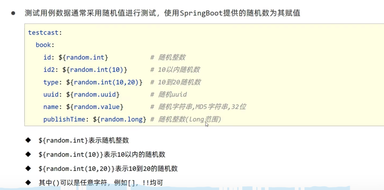

# 在测试时. 临时给测试添加配置属性

相当于在application.yml里配置的属性, 拿到测试那边去配临时属性

也是临时配置属性

在web环境中测试
pom文件`spring-boot-start`改成`spring-boot-start-web`

发送虚拟请求

通过判断status去匹配是否正确执行

匹配响应体

匹配header值

每次打包的时候. 都会走一遍测试. 万一测试里给数据库留下测试数据. 就不好
所以给测试代码设置. 只留测试结果. 不插入数据库
就是设置事务. 默认回滚

