#消息
同步消息
异步消息
 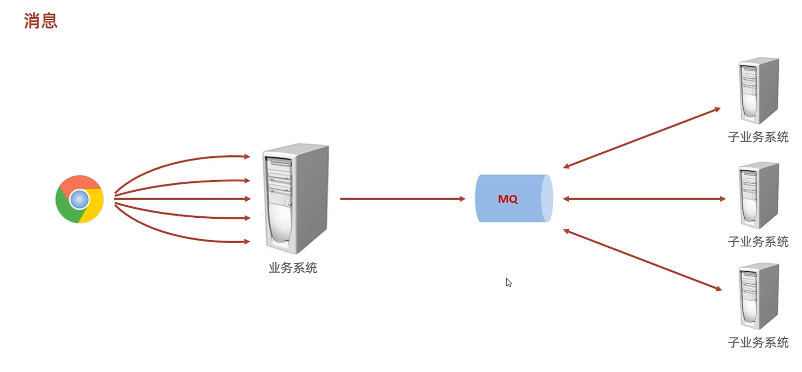

##消息传播技术

JMS: JAVA Message Service
规范消息的api, 实现由各个第三方库实现
类似JDBC, 规范数据库api, 但实现由各个厂家(mysql, oracle, SQLServer)实现

AMQP: advanced Message queuing protocol 高级消息队列协议
规范了消息的数据格式

MQTT: Message Queuing Telemetry Transport 消息队列遥测传输
用于跟小型设备通讯

Kafka: 高吞吐量的分布式发布订阅消息系统, 提供实时消息功能

##ActiveMQ
在Destination(消息队列)里, 把消息塞入队列里, 

加入消息时, 自动执行处理消息方法(监听)
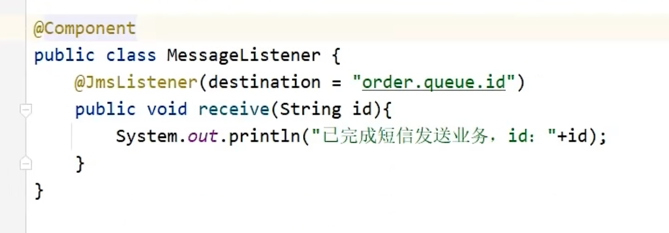
1. 已发送消息, 就会马上处理, 会阻塞当前发送消息的线程. 等处理完了. 才会返回.继续执行

@SendTo: 将当前方法返回值, 塞入另外一个消息队列里
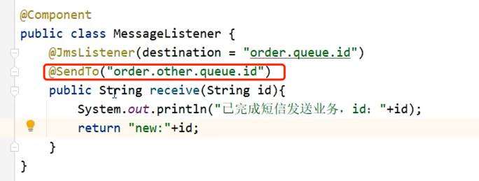

默认使用点对点模式
如果要使用发布订阅模式(一对多模式)则要如下配置
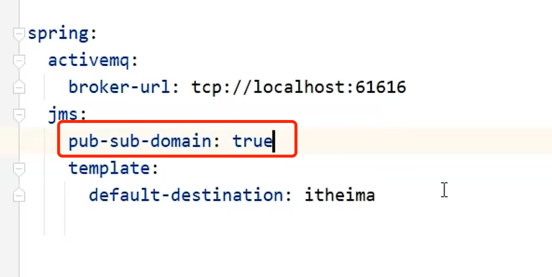

#RabbitMQ 
##DirectExchange
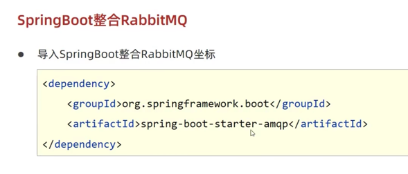
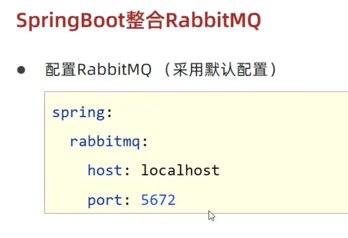
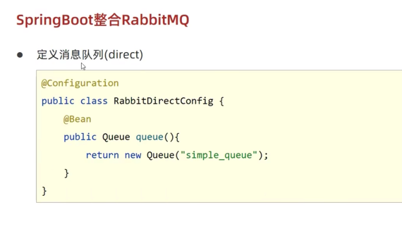
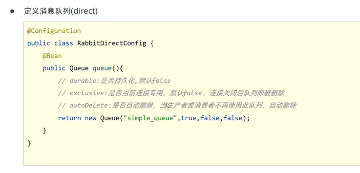
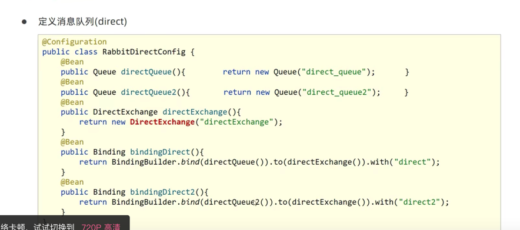
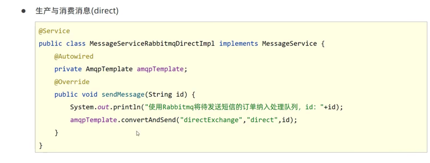
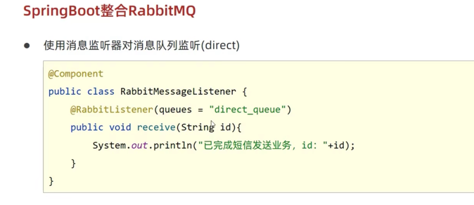
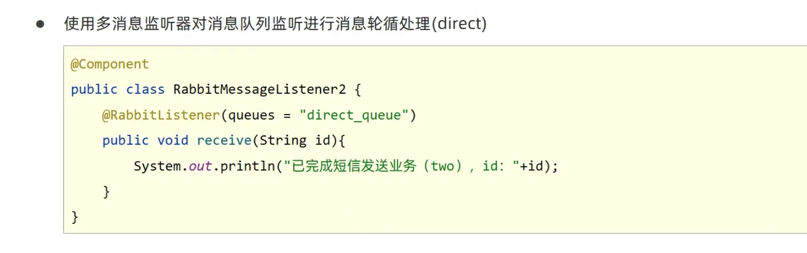
##TopicExchange
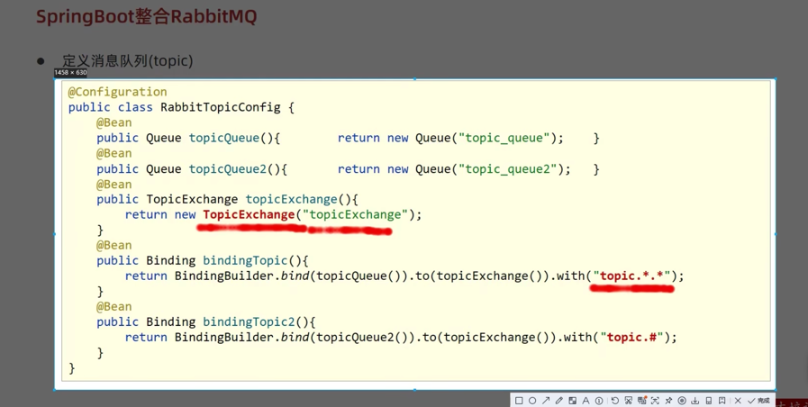
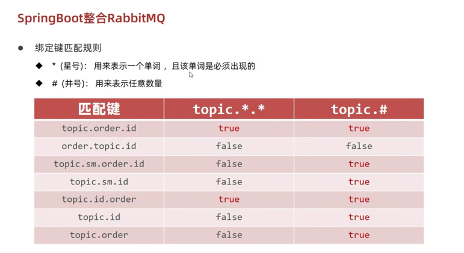
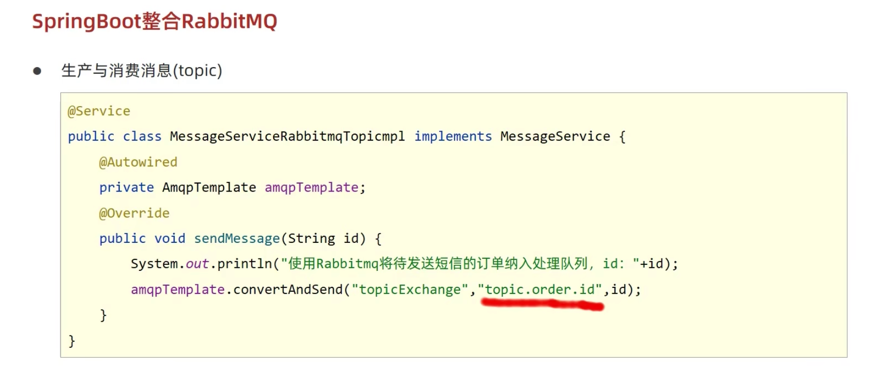
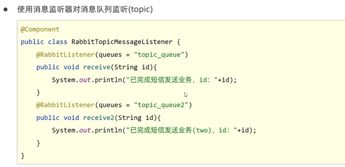

#RocketMQ
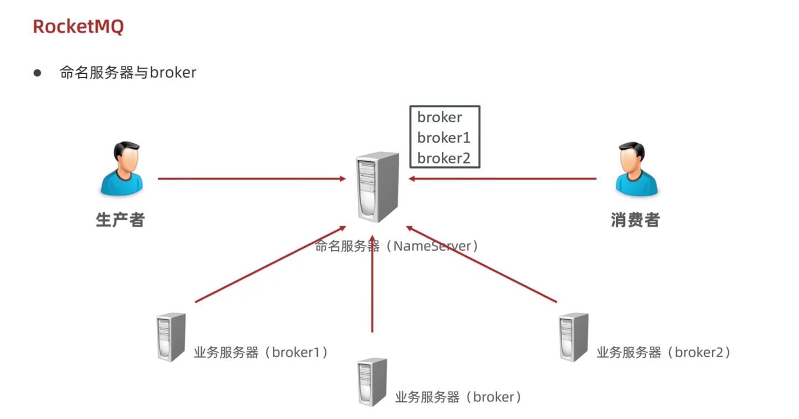
命名服务器, 统一管理各个业务服务器的消息

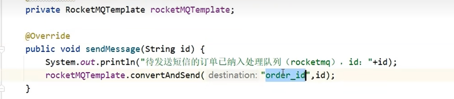
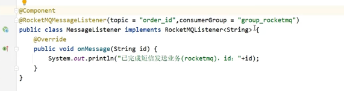