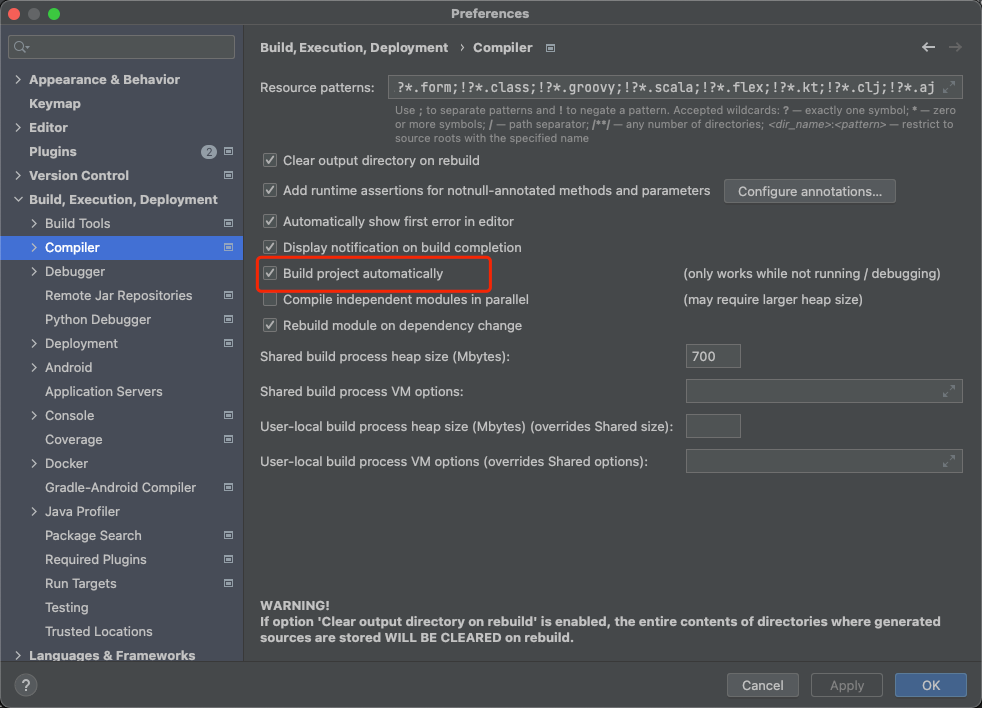
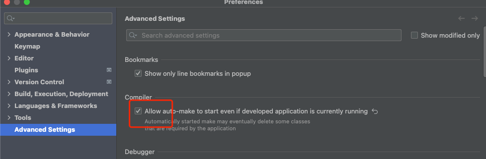
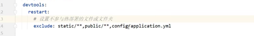
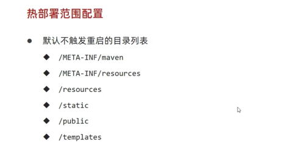

# 热部署

要依赖框架: spring-boot-devtools

修改完程序之后. 需要去Build那边点击构建(Build Project), 才会生效

热部署是restart的过程, 而重新启动时reload+restart的过程
reload是包括重新加载jar包(包括第三方库)
restart就是重新加载自定义代码

自动热部署(勾选下面两个即可)

设置不参与热部署的文件或文件夹

