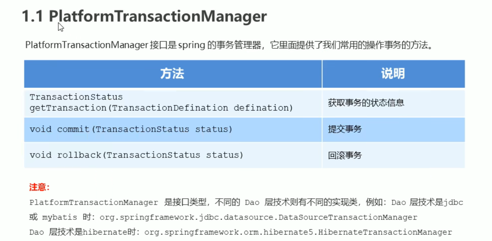
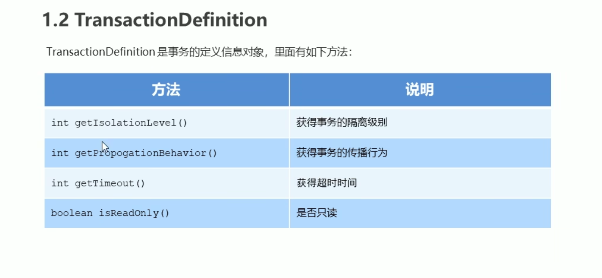
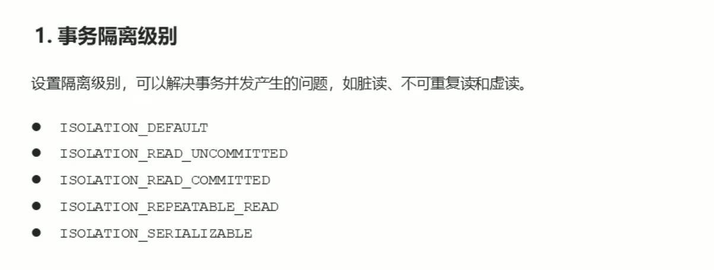
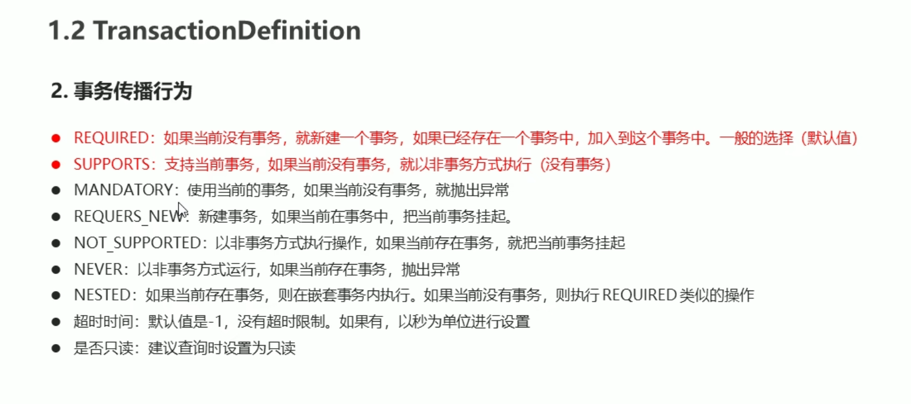
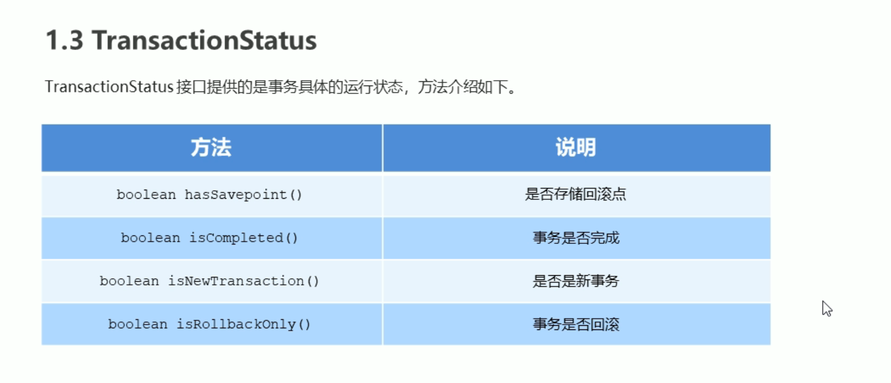
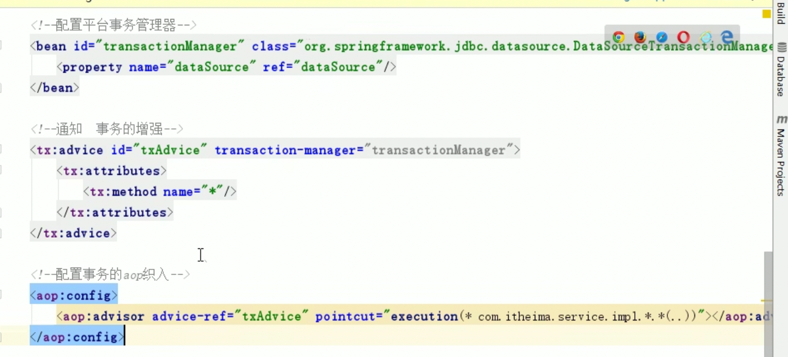
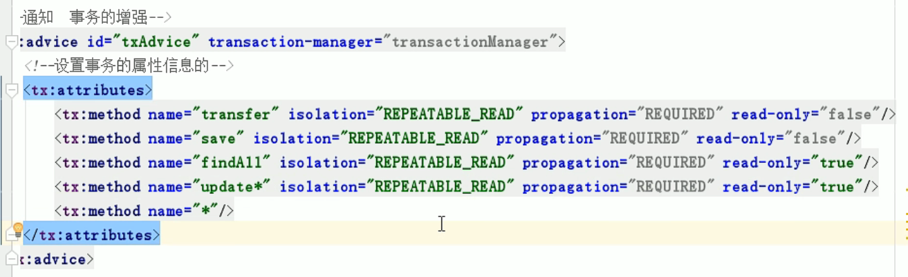
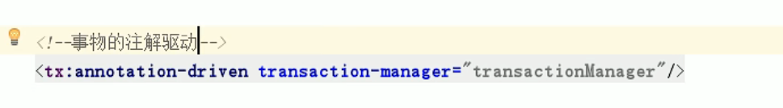

#编程式事务三大件
##1. PlatformTransactionManager

##2. TransactionDefinition

###隔离级别

###传播行为

##3. TransactionStatus

#基于XML的Spring事务声明式编程

需要注意:
1. 如果Dao层用的不是jdbc或mybatis, 则TransactionManager要改

##配置事务的属性

1. method: 表示切面表达式里方法的名称, 可以使用通配符update*, 表示updateUser, updateRole...

#基于注解方式编写Spring事务

1. 主要是写@Transactional这个注解
2. 接着写组件扫描
3. 接着写tx的注解驱动

