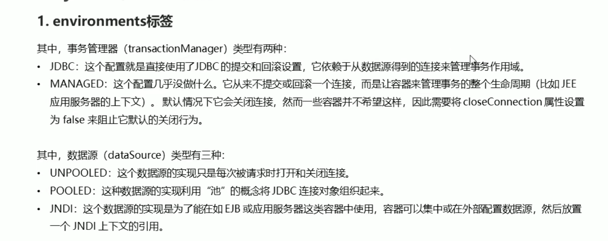

# 导包

# 配置Mapper.xml
```xml
<?xml version="1.0" encoding="UTF-8"?>
<!DOCTYPE mapper PUBLIC "-//mybatis.org//DTD Mapper 3.0//EN" "http://mybatis.org/dtd/mybatis-3-mapper.dtd">
<mapper namespace="UserMapper">

</mapper>
```

1. 在MyBatis代码中, 通过userMapper.findAll()来执行语句
2. 

# 配置MyBatis核心文件


# 编写代码
 

# 编写更新操作代码


1. 注意要提交事务, MyBatis默认是不提交事务的.
2. 或者可以rollback


## 同理更新操作也一样


#核心配置文件
```xml
<?xml version="1.0" encoding="UTF-8" ?>
<!DOCTYPE configuration PUBLIC "-//mybatis.org//DTD Config 3.0//EN" "http://mybatis.org/dtd/mybatis-3-config.dtd">

```


##environment标签

 

##mapper标签


##property标签

注意: 这里加载property文件和之前学Spring容器加载property文件方式不一样

1. 因为命名空间的不一样, MyBatis的是在configuration标签下的命名空间,只用properties来加载文件
2. 在SpringContext命名空间下, 使用context:property-placeholder来加载文件

##typeAliases标签(核心配置文件的)
