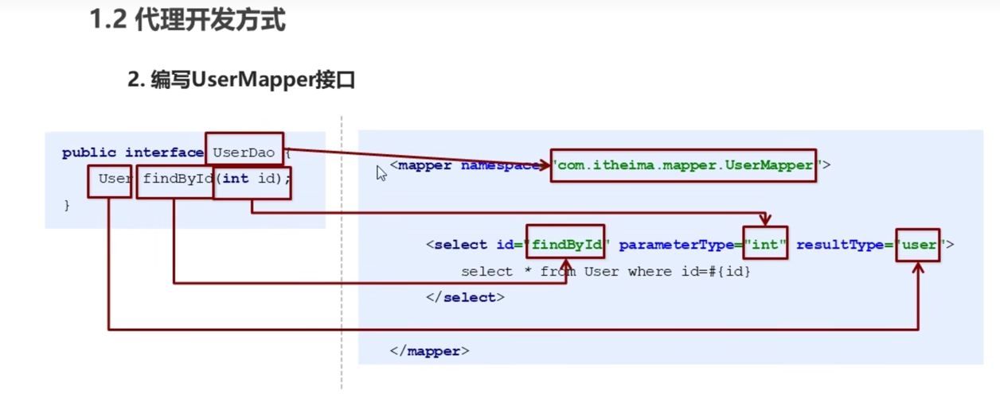
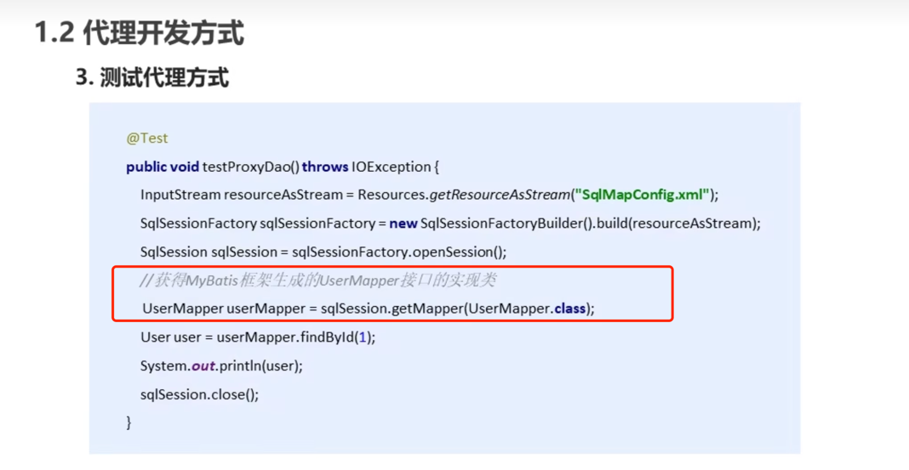
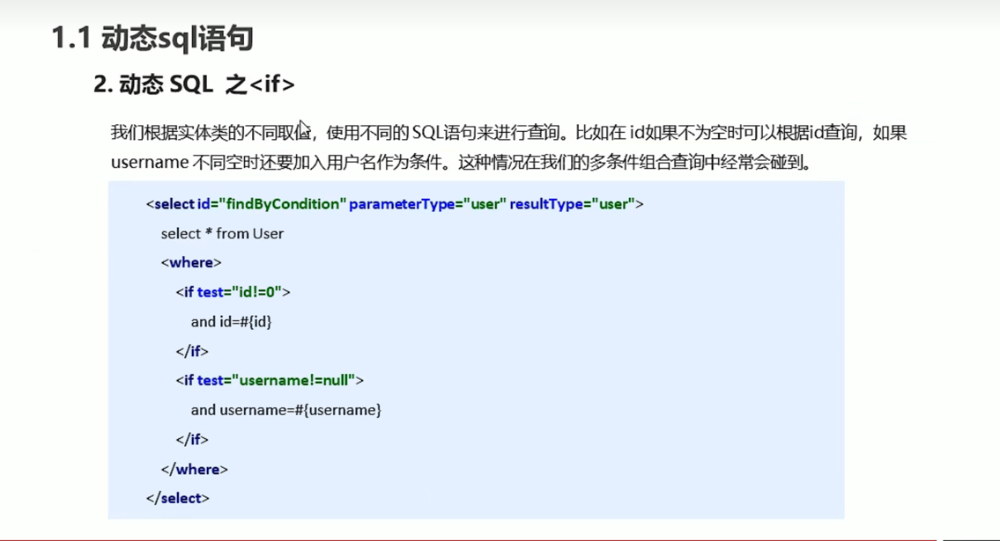
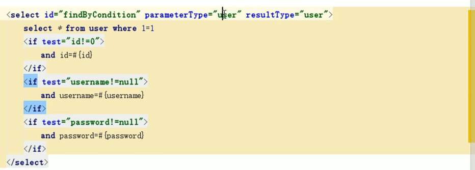
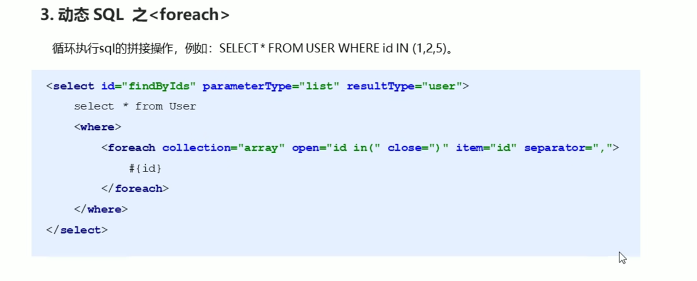
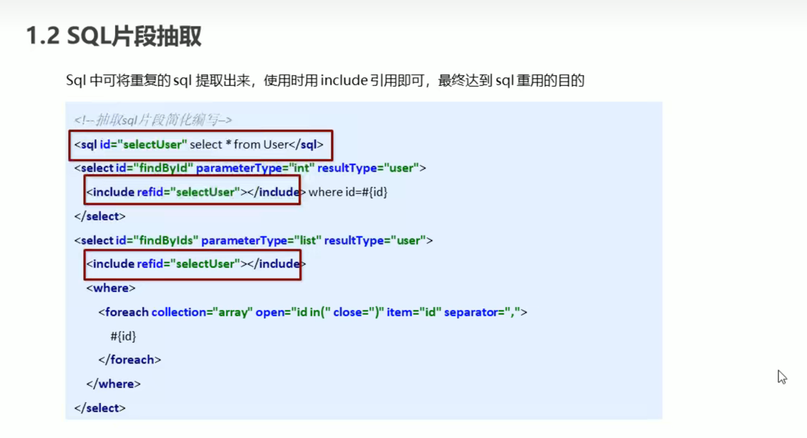
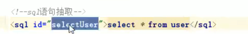
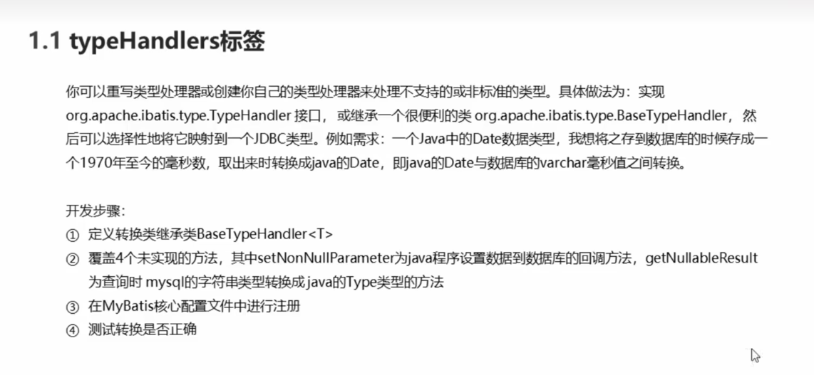

# MyBatis代理开发模式

# 动态sql标签
##if

##foreach 

collection: 根据参数类型, 如果是list: 则填list, 如果是array,则填array
open: 表示开头
close: 表示结束
item: 定义变量名
separator: 分隔符

##sql语句抽取

# MyBatis核心配置文件标签
## typeHandlers标签
