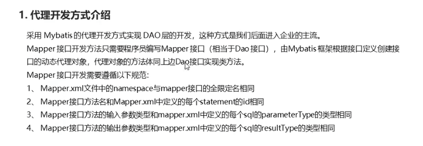
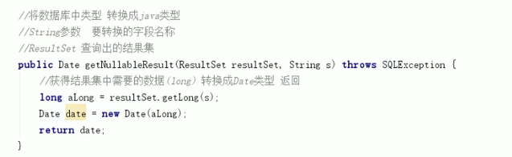
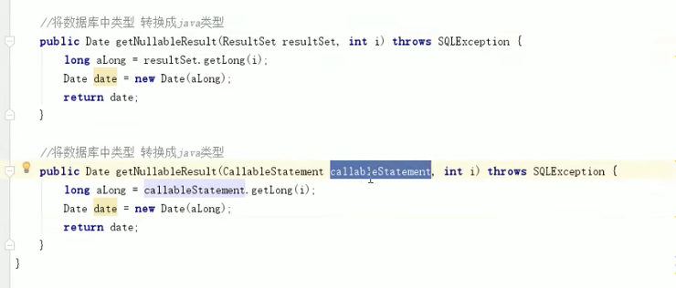
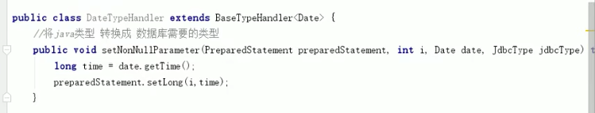
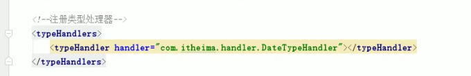
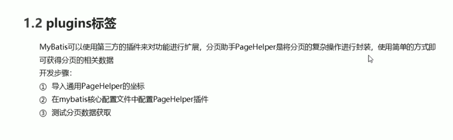
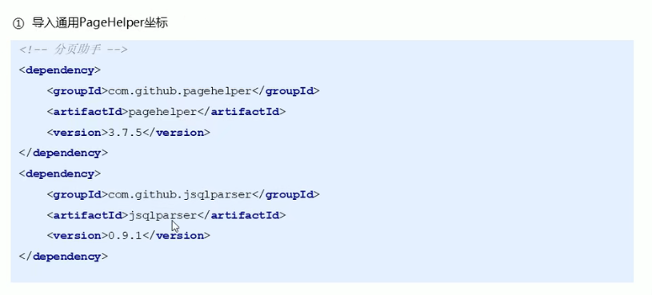
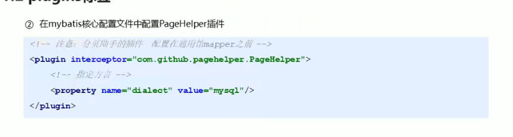
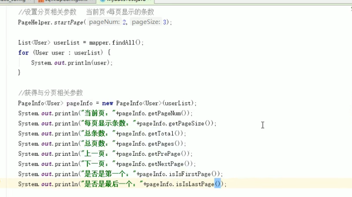
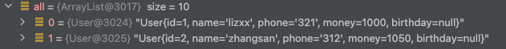

# MyBatis代理开发模式
> 由Mybatis根据接口定义，创建接口的动态代理对象，代理对象的方法同接口方法一直
> 

# 动态sql标签
##if

##foreach 

collection: 根据参数类型, 如果是list: 则填list, 如果是array,则填array
open: 表示开头
close: 表示结束
item: 定义变量名
separator: 分隔符

##sql语句抽取

# MyBatis核心配置文件标签
## typeHandlers标签
1. 自定义转换器：继承BaseTypeHandler<Date>
2. 配置核心文件，typeHandlers标签

 

> 注意： 编写BaseTypeHandler的时候，Date是java.util.Date, 不是java.sql.Date
> 如果写错了，则不生效。
> 

## plugin标签

## 导坐标

## 配置mybatis

## 说明

1. 插件即增强，估计也是面向aop，在mybatis的基础上对功能增强
2. 增强，即又包一层代理对象来强化
3. 如上图所述，增强前是array，增强后是page对象
4. 
5. PageHelper.startPage(1,2);第一页是1开始，不是0.填0的话就什么都没了

