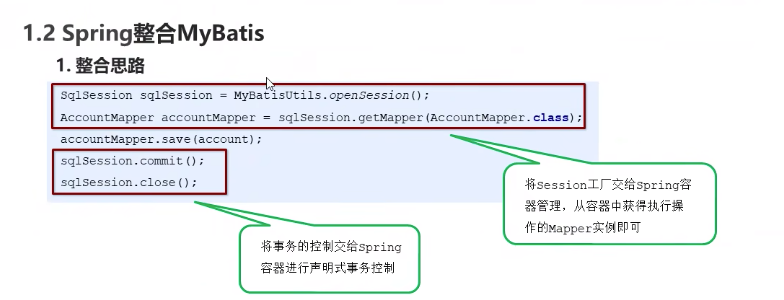
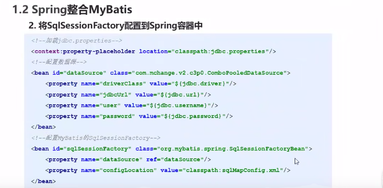
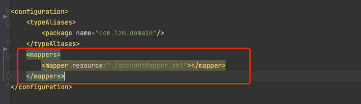
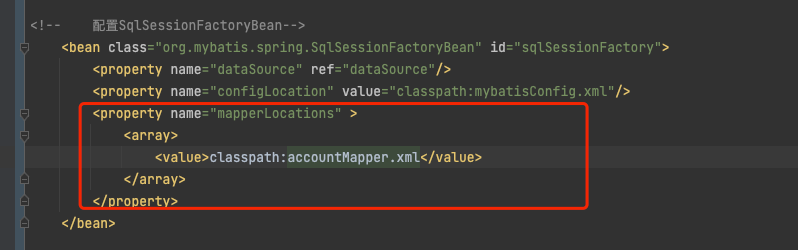
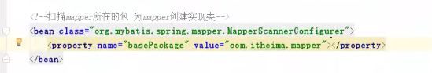

#mybatis&Spring结合
导入包
```xml
<!-- https://mvnrepository.com/artifact/org.mybatis/mybatis-spring -->
    <dependency>
      <groupId>org.mybatis</groupId>
      <artifactId>mybatis-spring</artifactId>
      <version>1.3.1</version>
    </dependency>
```


1. 需要配置数据源
2. SqlSessionFactoryBean是属于mybatis-spring库的，该类需要数据源和mybatis配置XML



1. 上述mapper要留着，因为要读取mapper.xml
2. 上述两种配置都行，一个是配在mybatisConfig.xml里一个是配在applicationContext.xml里


1. 这里是扫描包，包是代码里mapper的接口类，扫了之后，代码才可以使用Autowire注入成员变量
2. 
  