# 使用mybatisPlus

> 使用了mybatisPlus时候，不能引用mybatis，否则会报错：java.lang.NoClassDefFoundError: org/mybatis/logging/LoggerFactory

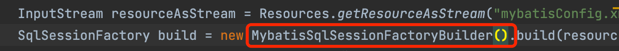
> 使用`MybatisSqlSessionFactoryBuilder`就已经把mybatis和mybatisPlus整合起来了

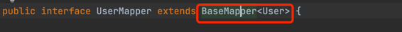
> 使用`BaseMapper<T>`则继承了他很多查询方法
> 
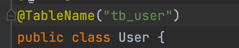
> 使用`@TableName`指定改POJO对应的表
> 

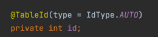
> `使用@TableId来指定主键`
> 
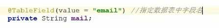
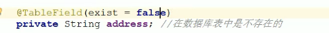
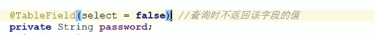

# 条件更新
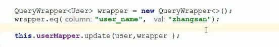
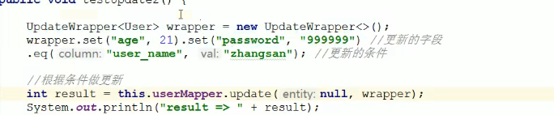

# 删除
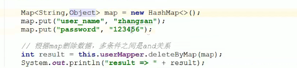
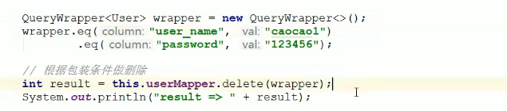
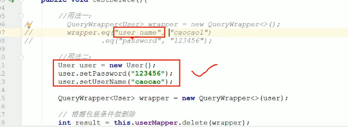
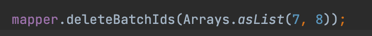

# 查询
## 大于20岁
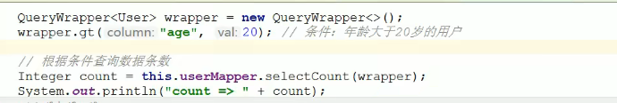
## 模糊查询
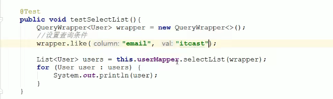