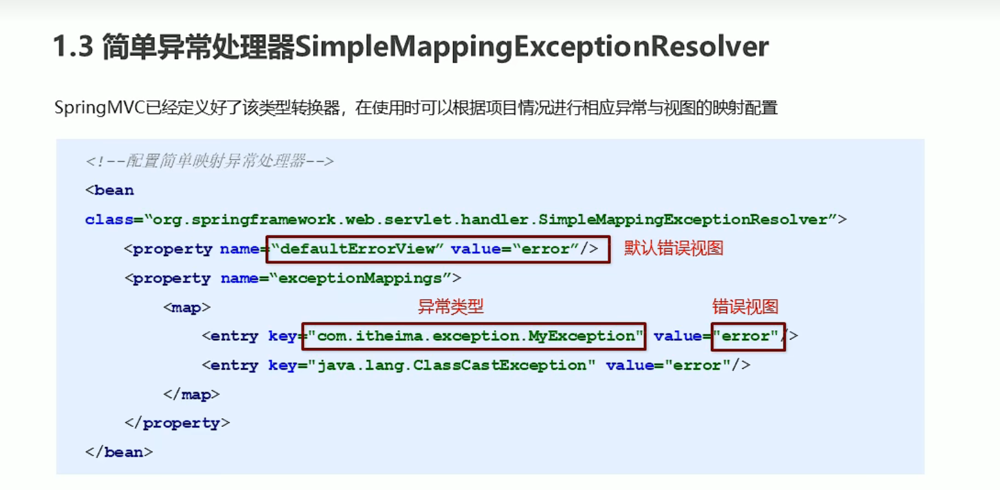
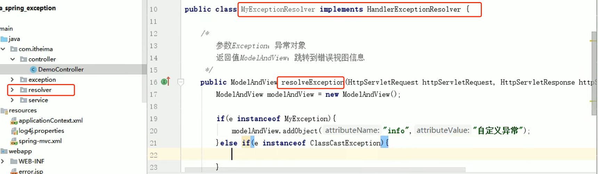
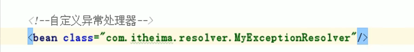

#异常处理
> 当然是使用了Springwebmvc框架才能使用

异常处理器是给前端控制器配的, 当在Controller, service, dao层处理过程中
发现异常, 则一层层的往上报, 最终报给DispatcherServlet, 让他来寻找处理器来处理

1. 上述配置配置在springmvc.xml里. 当匹配的异常属于上述2个类, 则分别跳转对应的页面
否则跳转默认处理的页面
2. value值是web下的资源路径. 因为上述是配了前后缀, 所以只写jsp的名称即可:error, 否则就是:/error.jsp

#自定义异常处理器
实现接口HandlerExceptionResolver

把这个自定义类配到容器当中,即可. id都不需要. 估计前端控制器通过类来获取Bean
