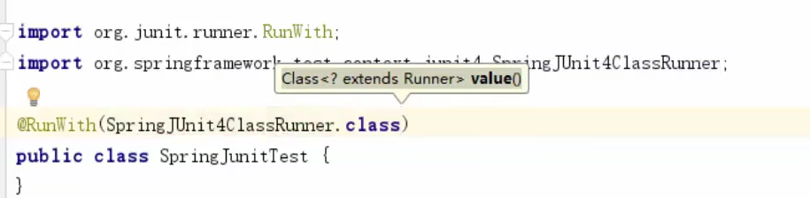
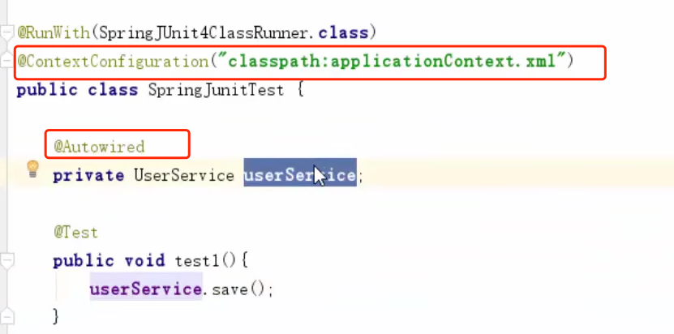
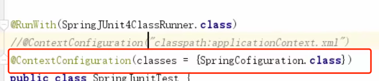
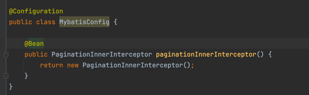
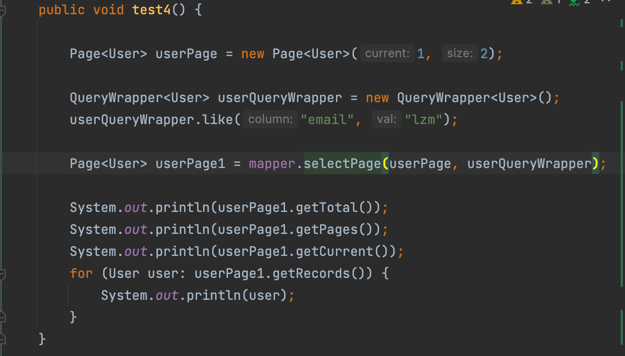

#Spring继承Junit

使用Spring-test框架, 可以在运行Junit之前, 提前设置好配置类, 
和注入需要测试的实例对象, 从而进行测试.

1. 导坐标: spring-context, spring-test, Junit
2. 编写注解@RunWith
3. 
   (根据spring-test运行流程, Junit是由spring-test运行的, 所以要给Junit配置: 由谁来运行. 这里配置一个spring-test的runner类
4. 指定context.xml
5. 注入所需对象
6. 执行测试

指定配置类

# 配置分页（失败了=。=）

