#Bean标签的配置

scope: singleton(单利), prototype(默认)
`<bean id="asd" class="com.lzx.class" scope="singleton"/>`
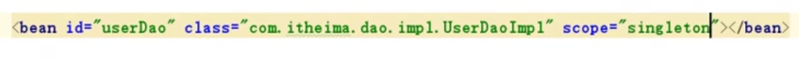

创建时期: singleton的在容器创建的时候创建, prototype是在使用的时候创建
销毁时期: singleton是容器被销毁的时候销毁,  

#监听bean初始化方法和销毁方法
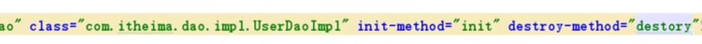
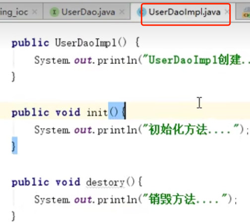

#bean实例化的方法
1. 无参构造
2. 工厂静态实例
   1. 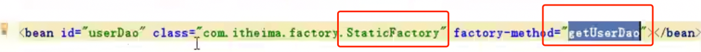
   2. 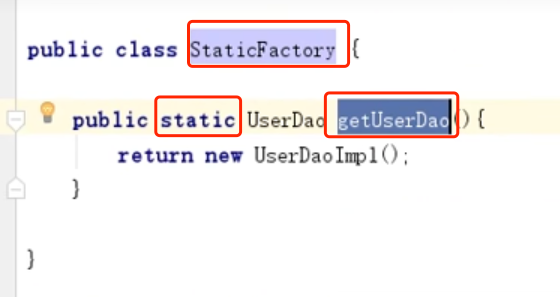
3. 工厂动态实例
   1. 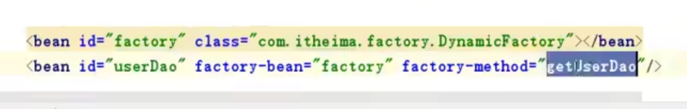
   2. 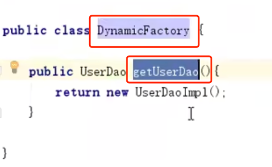

#dao层和service层
dao层主要是实体类的interface, 和实体类的implement

service层主要是实体service的interface, 实体service的implement

service层通过spring容器, 拿到dao层的实例, 进行调用. 所以service层用到的dao层的interface类.

#Bean的依赖注入(Dependency Injection)
注入: 在同一个容器中, 有各种实例, 如果用到Service实例, 但service实例里引用的是Dao实例
所以在使用Service实例时, 让容器把service实例里的dao实例给实例化, 就不用在service里写代码(获取dao实例, 赋值给成员变量)

注入方式有2种: 
1. 通过setter方法注入
2. 通过有参构造方法输入

##Setter方法注入
1. 给Service类加上所需成员变量, 并生成setter方法. 然后在对应方法直接调用成员变量即可
2. 如下配置, ref对应Id, name是成员变量名字
3. 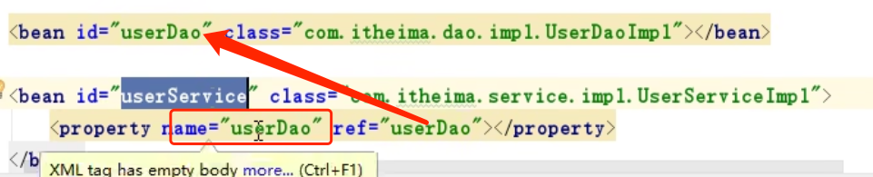

###P命名空间注入(也是利用setter)
1. 先生命P命名空间
2. 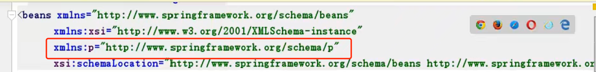
3. 在配置如下即可
4. 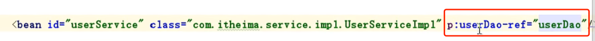

##有参构造函数注入
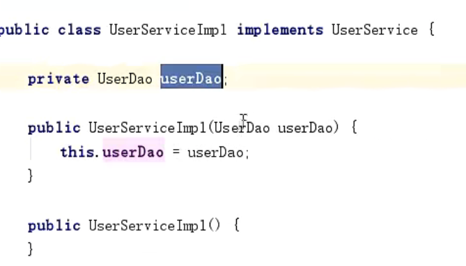
配置容器
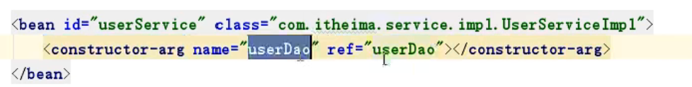
name是构造函数的入参, ref是beanId

##普通数据类型注入(字符串, 数字)
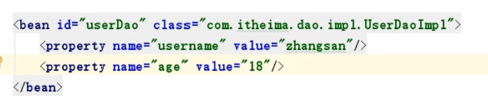

##集合数据类型注入
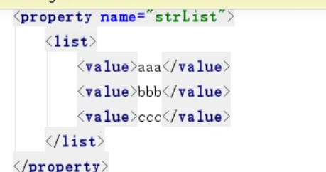
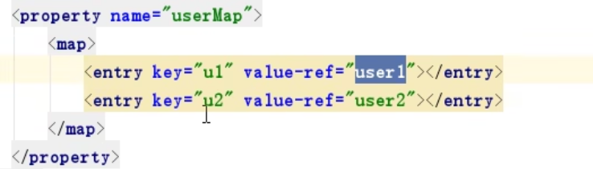
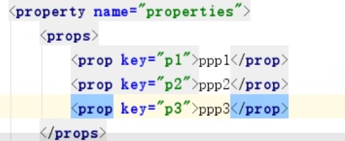

#模块开发, 引入其他spring配置文件
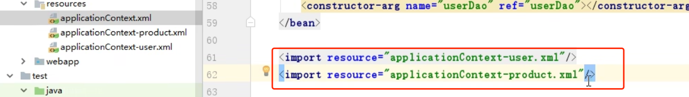