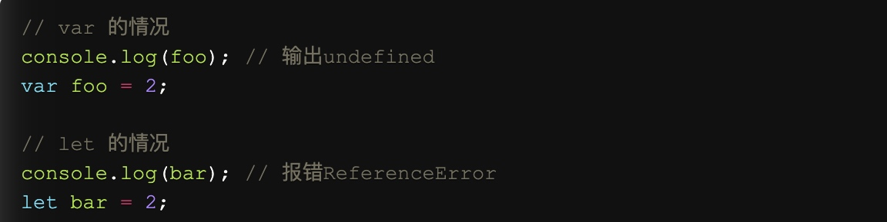

# let(const) | var



```js
var a = [];
for (let i = 0; i < 10; i++) {
  a[i] = function () {
    console.log(i);
  };
}
a[6](); // 6
```
---
```js
var a = [];
for (var i = 0; i < 10; i++) {
  a[i] = function () {
    console.log(i);
  };
}
a[6](); // 10
```

let(const)出现, 使得块级作用域的出现, 替代IIFE(Immediately-Invoked Function Expression)立即执行方法:
(function(){}())

ES6允许块级作用域声明函数, ES5是不允许的, 声明后的函数跟let变量一样.

```js
//这种叫块级作用域的"函数声明"
{
    function f() {}
}

//这叫块级作用域"函数表达式" (推荐)
{
    let f = function() {};
}
```

##const
如果const一个对象, 该对象的内部结构是可以改变的, 但你想内部解构都不能变, 则使用freeze
`let obj = Object.freeze({})`
在use strict模式下, `obj.a = '1'`, 会报错
在正常模式下, `obj.a = '1'`, 不起作用

##ES6的6种声明变量的方法
var | function | import | class  | let | const 

##顶层对象
在浏览器上, 则是window
在node上, 则是global

###"顶层对象的属性赋值"与"全局变量的赋值"是同一件事
```js
window.a = 1;
console.log(a); // 1
a = 2;
console.log(window.a) // 2
```

ES6新加特性: 在全局作用域, var|function变量是属于顶层对象属性, let|const|class变量则不是
```js
var a = 1;
// 如果在 Node 的 REPL 环境，可以写成 global.a
// 或者采用通用方法，写成 this.a
window.a // 1

let b = 1;
window.b // undefined
```

#解构
只有变量===undefined, 才会使用默认值
```js
let [a = 'a'] = [undefined] //a = 'a'
let [a = 'a'] = [null] // a = null
```
---
默认值是惰性赋值
```js
let [a = f()] = ['1'] //a = 1, f不会执行
```
---
深层解构
```js
let obj = {
  p: [
    'Hello',
    { y: 'World' }
  ]
};

let { p: [x, { y }] } = obj;
x // "Hello"
y // "World"
p // undefined
```

```js
let obj = {
  p: [
    'Hello',
    { y: 'World' }
  ]
};

let { p, p: [x, { y }] } = obj;
x // "Hello"
y // "World"
p // ["Hello", {y: "World"}]
```
特殊解构:
```js
let arr = [1, 2, 3];
let {0 : first, [arr.length - 1] : last} = arr;
first // 1
last // 3
```
字符串解构:
```js
const [a, b, c, d, e] = 'hello';
a // "h"
b // "e"
c // "l"
d // "l"
e // "o"

let {length : len} = 'hello';
len // 5
```
遍历Map解构
```js
const map = new Map();
map.set('first', 'hello');
map.set('second', 'world');

for (let [key, value] of map) {
  console.log(key + " is " + value);
}
// first is hello
// second is world

// 获取键名
for (let [key] of map) {
  // ...
}

// 获取键值
for (let [,value] of map) {
  // ...
}
```

#模板字符串
```js
`${}${}sad${}`
```

#字符串
```js
let s = 'Hello world!';

s.startsWith('Hello') // true
s.endsWith('!') // true
s.includes('o') // tru

let s = 'Hello world!';

s.startsWith('world', 6) // true
s.endsWith('Hello', 5) // true
s.includes('Hello', 6) // false
```
上面代码表示，使用第二个参数n时，endsWith的行为与其他两个方法有所不同。它针对前n个字符，而其他两个方法针对从第n个位置直到字符串结束。
##repeat 重复
```js
'x'.repeat(3) // "xxx"
'hello'.repeat(2) // "hellohello"
'na'.repeat(0) // ""
```

##padStart | padEnd  填充
```js

'abc'.padStart(10, '0123456789')// '0123456abc'

'1'.padStart(10, '0') // "0000000001"
'12'.padStart(10, '0') // "0000000012"
'123456'.padStart(10, '0') // "0000123456"

'12'.padStart(10, 'YYYY-MM-DD') // "YYYY-MM-12"
'09-12'.padStart(10, 'YYYY-MM-DD') // "YYYY-09-12"
```

##trim | trimStart | trimEnd 消除空格, 换行, tab
```js
let s = '    abc    '
trim(s) //"abc"
trimStart(s) //"    abc"
trimEnd(s) //"abc   "
```

#正则表达式
```js
var s = 'aaa_aa_a';
var r1 = /a+/g;
var r2 = /a+/y;

r1.exec(s) // ["aaa"]
r2.exec(s) // ["aaa"]

r1.exec(s) // ["aa"]
r2.exec(s) // null

var s = 'aaa_aa_a';
var r = /a+_/y;

r.exec(s) // ["aaa_"]
r.exec(s) // ["aa_"]
```

#数值Number
##Math.trunc 除去小数点
```js
Math.trunc(4.1) // 4
Math.trunc(4.9) // 4
Math.trunc(-4.1) // -4
Math.trunc(-4.9) // -4
Math.trunc(-0.1234) // -0
```

##Math.sign 判断是正数, 负数, 零
```js
Math.sign(-5) // -1
Math.sign(5) // +1
Math.sign(0) // +0
Math.sign(-0) // -0
Math.sign(NaN) // NaN
```

##指数运算符 **
```js
2 ** 3  // 8
2 ** 10 // 1024
```

#函数
##解构赋值
```js
function foo({x, y = 5}) {
  console.log(x, y);
}

foo({}) // undefined 5
foo({x: 1}) // 1 5
foo({x: 1, y: 2}) // 1 2
foo() // TypeError: Cannot read property 'x' of undefined

function foo({x, y = 5} = {}) {
  console.log(x, y);
}

foo() // undefined 5
```

###找区别
```js
// 写法一
function m1({x = 0, y = 0} = {}) {
  return [x, y];
}

// 写法二
function m2({x, y} = { x: 0, y: 0 }) {
  return [x, y];
}


// 函数没有参数的情况
m1() // [0, 0]
m2() // [0, 0]

// x 和 y 都有值的情况
m1({x: 3, y: 8}) // [3, 8]
m2({x: 3, y: 8}) // [3, 8]

// x 有值，y 无值的情况
m1({x: 3}) // [3, 0]
m2({x: 3}) // [3, undefined]

// x 和 y 都无值的情况
m1({}) // [0, 0];
m2({}) // [undefined, undefined]

m1({z: 3}) // [0, 0]
m2({z: 3}) // [undefined, undefined]
```

##箭头函数
###特点
* this指向的固定化

###注意事项
箭头函数有几个使用注意点。

（1）函数体内的this对象，就是定义时所在的对象，而不是使用时所在的对象。

（2）不可以当作构造函数，也就是说，不可以使用new命令，否则会抛出一个错误。

（3）不可以使用arguments对象，该对象在函数体内不存在。如果要用，可以用 rest 参数代替。

（4）不可以使用yield命令，因此箭头函数不能用作 Generator 函数。

上面四点中，第一点尤其值得注意。this对象的指向是可变的，但是在箭头函数中，它是固定的。

###嵌套:
```js
let insert = (value) => ({into: (array) => ({after: (afterValue) => {
  array.splice(array.indexOf(afterValue) + 1, 0, value);
  return array;
}})});

insert(2).into([1, 3]).after(1); //[
```

Reduce用法
```js
const pipeline = (...funcs) =>
  val => funcs.reduce((a, b) => b(a), val);

const plus1 = a => a + 1;
const mult2 = a => a * 2;
const addThenMult = pipeline(plus1, mult2);

addThenMult(5)
// 12

const plus1 = a => a + 1;
const mult2 = a => a * 2;

mult2(plus1(5))
// 12
```

#数组
##扩展运算符
`[...arr]`
###浅拷贝
```js
const a1 = [{ foo: 1 }];
const a2 = [{ bar: 2 }];

const a3 = a1.concat(a2);
const a4 = [...a1, ...a2];

a3[0] === a1[0] // true
a4[0] === a1[0] // true
```
以上都是"浅拷贝", 既成员里的都是指向之前数据的地址.

##实现Iterator 接口的对象
```js
Number.prototype[Symbol.iterator] = function*() {
  let i = 0;
  let num = this.valueOf();
  while (i < num) {
    yield i++;
  }
}

console.log([...5]) // [0, 1, 2, 3, 4]
```

##Array.from
把类似数组, iterator对象(可遍历对象)转成数组.
```js
Array.from(arrayLike, x => x * x);
// 等同于
Array.from(arrayLike).map(x => x * x);

Array.from([1, 2, 3], (x) => x * x)
// [1, 4, 9]
```

##Array.of
用于把一组值转成数组
用来弥补Array的不足:
```js
Array() // []
Array(3) // [, , ,]
Array(3, 11, 8) // [3, 11, 8]
Array.of() // []
Array.of(undefined) // [undefined]
Array.of(1) // [1]
Array.of(1, 2) // [1, 2]
```
##find() | findIndex()
```js
//find函数
[1, 5, 10, 15].find(function(value, index, arr) {
  return value > 9;
}) // 10

//findIndex函数
[1, 5, 10, 15].findIndex(function(value, index, arr) {
  return value > 9;
}) // 2

//第二个参数, 绑定this
function f(v){
  return v > this.age;
}
let person = {name: 'John', age: 20};
[10, 12, 26, 15].find(f, person);    // 26
```

##fill
```js
//fill会覆盖原值
['a', 'b', 'c'].fill(7)
// [7, 7, 7]

new Array(3).fill(7)
// [7, 7, 7]


//如果fill的是一个对象, 则是都是指向这个对象!!
let arr = new Array(3).fill({name: "Mike"});
arr[0].name = "Ben";
arr
// [{name: "Ben"}, {name: "Ben"}, {name: "Ben"}]

let arr = new Array(3).fill([]);
arr[0].push(5);
arr
// [[5], [5], [5]]
```

##flat 
拉平数组
```js
[1, 2, [3, [4, 5]]].flat()
// [1, 2, 3, [4, 5]]

[1, 2, [3, [4, 5]]].flat(2)
// [1, 2, 3, 4, 5]
```

#对象
##super关键字
* this指向函数所在的当前对象
* super指向当前对象的原型对象
* super只能在对象成员方法中, 不能在属性上
* super.func = Object.getPrototypeOf(this).func
* super.func = Object.getPrototypeOf(this).foo.call(this)

```js
const proto = {
  x: 'hello',
  foo() {
    console.log(this.x);
  },
};

const obj = {
  x: 'world',
  foo() {
    super.foo();
  }
}

Object.setPrototypeOf(obj, proto);

obj.foo() // "world"

```

##对象的扩展运算符, 不能复制继承的属性
```js
let o1 = { a: 1 };
let o2 = { b: 2 };
o2.__proto__ = o1;
o2.a// 1
let { ...o3 } = o2;
o3 // { b: 2 }
o3.a // undefined
```
o3只是复制o2的属性, 原型对象的并没复制

如果想要继承原型对象属性, 以下方式可以:
```js
// 写法一(不推荐)
const clone1 = {
  __proto__: Object.getPrototypeOf(obj),
  ...obj
};

// 写法二
const clone2 = Object.assign(
  Object.create(Object.getPrototypeOf(obj)),
  obj
);

// 写法三
const clone3 = Object.create(
  Object.getPrototypeOf(obj),
  Object.getOwnPropertyDescriptors(obj)
)

```

##属性的可枚举性Enumerable
```js
Object.getOwnPropertyDescriptor(object, 'property')

let obj = { foo: 123 };
Object.getOwnPropertyDescriptor(obj, 'foo')
//  {
//    value: 123,
//    writable: true,
//    enumerable: true,
//    configurable: true
//  }
```

for...in循环：只遍历对象自身的和继承的可枚举的属性。
Object.keys()：返回对象自身的所有可枚举的属性的键名。
JSON.stringify()：只串行化对象自身的可枚举的属性。
Object.assign()： 忽略enumerable为false的属性，只拷贝对象自身的可枚举的属性。

##深度克隆对象
```js
//普通克隆
const source = {
  set foo(value) {
    console.log(value);
  }
};

const target1 = {};
Object.assign(target1, source);

Object.getOwnPropertyDescriptor(target1, 'foo')
// { value: undefined,
//   writable: true,
//   enumerable: true,
//   configurable: true }

//深度克隆
const source = {
  set foo(value) {
    console.log(value);
  }
};

const target2 = {};
Object.defineProperties(target2, Object.getOwnPropertyDescriptors(source));
Object.getOwnPropertyDescriptor(target2, 'foo')

//方法二
const clone = Object.create(Object.getPrototypeOf(obj),
  Object.getOwnPropertyDescriptors(obj));


```

##原型对象操作
Object.setPrototypeOf()（写操作）、Object.getPrototypeOf()（读操作）、Object.create()（生成操作）代替。

##对象操作
Object.keys()，Object.values()，Object.entries()
成员是参数对象自身的（不含继承的）所有可遍历（enumerable）属性的键名。
```js
const obj = { foo: 'bar', baz: 42 };
Object.entries(obj)
// [ ["foo", "bar"], ["baz", 42] ]

//生成Map对象
const obj = { foo: 'bar', baz: 42 };
const map = new Map(Object.entries(obj));
map // Map { foo: "bar", baz: 42 }
```

#Symbol
* 防止对象里, 与别的属性名冲突, 创建独一无二的属性名
* 是第7种数据类型

```js
const sym = Symbol('foo');

sym.description // "foo"

let mySymbol = Symbol();

//作为属性赋值
// 第一种写法
let a = {};
a[mySymbol] = 'Hello!';

// 第二种写法
let a = {
  [mySymbol]: 'Hello!'
};

// 第三种写法
let a = {};
Object.defineProperty(a, mySymbol, { value: 'Hello!' });

// 以上写法都得到同样结果
a[mySymbol] // "Hello!"
```
以下遍历不会遍历symbol属性:
for...in | for...of | Object.keys | Object.getOwnPropertyNames | JSON.stringify

使用`Object.getOwnPropertySymbols`返回当前对象所有symbol属性keys

###返回对象所有属性(包括symbol属性)
`Reflect.ownKeys`

###重用symbol
Symbol.for()
```js
let s1 = Symbol.for('foo');
let s2 = Symbol.for('foo');

s1 === s2 // true
```

Symbol.for()与Symbol()这两种写法，都会生成新的 Symbol。它们的区别是，前者会被登记在全局环境中供搜索，后者不会。

Symbol.keyFor()
Symbol.keyFor方法返回一个已登记的 Symbol 类型值的key。

###Symbol.hasInstance
类的这个方法,在调用instanceOf的时候系统自动调用.
```js
class MyClass {
  [Symbol.hasInstance](foo) {
    return foo instanceof Array;
  }
}

[1, 2, 3] instanceof new MyClass() // true
```

###Symbol.isConcatSpreadable
对象的Symbol.isConcatSpreadable属性等于一个布尔值，表示该对象用于Array.prototype.concat()时，是否可以展开。

```js
let arr1 = ['c', 'd'];
['a', 'b'].concat(arr1, 'e') // ['a', 'b', 'c', 'd', 'e']
arr1[Symbol.isConcatSpreadable] // undefined

let arr2 = ['c', 'd'];
arr2[Symbol.isConcatSpreadable] = false;
['a', 'b'].concat(arr2, 'e') // ['a', 'b', ['c','d'], 'e']
```

如果是类似数组的对象时, 默认是不展开的, 需要设置为true
```js
let obj = {length: 2, 0: 'c', 1: 'd'};
['a', 'b'].concat(obj, 'e') // ['a', 'b', obj, 'e']

obj[Symbol.isConcatSpreadable] = true;
['a', 'b'].concat(obj, 'e') // ['a', 'b', 'c', 'd', 'e']
```


#Map
* NaN是同一个键
* 基本数据类型也是同一个键
* 对象地址不同, 键不同

##WeakMap
* 只接受对象做键
* WeakMap 弱引用的只是键名，而不是键值。键值依然是正常引用。

#Proxy
做勾子, 在执行某个方法前, 先执行自己的逻辑
```js
var obj = new Proxy({}, {
  get: function (target, key, receiver) {
    console.log(`getting ${key}!`);
    return Reflect.get(target, key, receiver);
  },
  set: function (target, key, value, receiver) {
    console.log(`setting ${key}!`);
    return Reflect.set(target, key, value, receiver);
  }
});

obj.count = 1
//  setting count!
++obj.count
//  getting count!
//  setting count!
//  2
```

###set不能修改writtable属性

#Reflect
* Reflect对象的方法与Proxy对象的方法一一对应, 实现Proxy时, 可以使用Reflect完成默认行为.

```js
Reflect.apply(target, thisArg, args)
Reflect.construct(target, args)
Reflect.get(target, name, receiver)
Reflect.set(target, name, value, receiver)
Reflect.defineProperty(target, name, desc)
Reflect.deleteProperty(target, name)
Reflect.has(target, name)
Reflect.ownKeys(target)
Reflect.isExtensible(target)
Reflect.preventExtensions(target)
Reflect.getOwnPropertyDescriptor(target, name)
Reflect.getPrototypeOf(target)
Reflect.setPrototypeOf(target, prototype)
```

具体如何使用, 参考[阮一峰Reflect](http://es6.ruanyifeng.com/#docs/reflect)

#Promise
* 如果promise里还有promise, 只有两个都resolve了, 才会resolve, 否则都是reject
    * 既两个promise嵌套的时候, 只有整体成功才算成功, 否则一个promise失败了, 最外面的promise也会报失败
    * 最外面的promise会等待所有的promise都有结果了才会执行reject或者resolve
    * 类似Promise.all(p1 p2 p3(
* 就算不声明catch, 出错了也不会中断程序!!

#Generator
* function后面带*号, `let f = function* (){}`
* 执行generator不会执行逻辑, 而是返回iterator对象`let iterator = f()`
* 函数里yield是表示暂停, 并返回后面的值.

可以快速简单创建Symbol.iterator属性
```js
var myIterable = {};
myIterable[Symbol.iterator] = function* () {
  yield 1;
  yield 2;
  yield 3;
};

[...myIterable] // [1, 2, 3]
```

* next设置参数, 是设置yield表达式的值
* 由于next方法的参数表示上一个yield表达式的返回值，所以在第一次使用next方法时，传递参数是无效的

```js
function* foo(x) {
  var y = 2 * (yield (x + 1));
  var z = yield (y / 3);
  return (x + y + z);
}

var a = foo(5);
a.next() // Object{value:6, done:false}
a.next() // Object{value:NaN, done:false}
a.next() // Object{value:NaN, done:true}

var b = foo(5);
b.next() // { value:6, done:false }
b.next(12) // { value:8, done:false }
b.next(13) // { value:42, done:true }
```

* 便捷通过generator让object可以遍历

```js
function* objectEntries(obj) {
  let propKeys = Reflect.ownKeys(obj);

  for (let propKey of propKeys) {
    yield [propKey, obj[propKey]];
  }
}

let jane = { first: 'Jane', last: 'Doe' };

for (let [key, value] of objectEntries(jane)) {
  console.log(`${key}: ${value}`);
}
// first: Jane
// last: Doe
```

* 或者加到Symbol.iterator属性上

```js
function* objectEntries() {
  let propKeys = Object.keys(this);

  for (let propKey of propKeys) {
    yield [propKey, this[propKey]];
  }
}

let jane = { first: 'Jane', last: 'Doe' };

jane[Symbol.iterator] = objectEntries;

for (let [key, value] of jane) {
  console.log(`${key}: ${value}`);
}
// first: Jane
// last: Doe
```

## Generator.ProtoType.throw
* generator生成的iterator执行throw会自动执行一次next
* 当执行throw时, 上一次yield代码必须在try里面, 否则会被外部try获取, 再不行就直接中断程序.
* 如果在generator方法内部执行全局命令throw, 则直接跟return一样, 以后执行都是{value: undefined, done: true}


## Generator.ProtoType.return
```js
function* gen() {
  yield 1;
  yield 2;
  yield 3;
}

var g = gen();

g.next()        // { value: 1, done: false }
g.return('foo') // { value: "foo", done: true }
g.next()        // { value: undefined, done: true }
```

* 如果return的时候, yield在try里, 会先执行完finally, 再执行return

```js
function* numbers () {
  yield 1;
  try {
    yield 2;
    yield 3;
  } finally {
    yield 4;
    yield 5;
  }
  yield 6;
}
var g = numbers();
g.next() // { value: 1, done: false }
g.next() // { value: 2, done: false }
g.return(7) // { value: 4, done: false }
g.next() // { value: 5, done: false }
g.next() // { value: 7, done: true }
```

##yield*
后面跟一个iterator, 表示遍历这个遍历器, 一个个yield出去
```js
yield* iterator;

//等同与
for (let i of iterator) {
    yield i;
}
```

#Generator异步
##Thunk
通过传名赋值, 就是Thunk, 本来传值赋值, 然后变成传函数

例如: `readFile(fileName, callback)`
通过用Thunk包裹: `let thunkFile = Thunk(readFile)`
就可以这样子使用: `thunkFile(fileName)(callback)`

* Thunk总结: 就是在多参的函数, 把callback分离出来. 生成一个通过传入函数才能执行的方法.

然后通过编写Generator方法, 来实现同步的编写异步逻辑
```js
function* gen() {
let data1 = yield ayncThunk1();
let data2 = yield ayncThunk2();
let data3 = yield ayncThunk3();
}

function runGen(gen) {
    let g = gen()
    
    function next(data) {
        let g1 = g.next(data);
        if g1.done  return ;
        g1.value(next)
    }
    
    next();
}

runGen(gen)
```
* 上述代码, 通过runGen自动执行gen方法
* 所以同步的编写gen, 便可实现异步的同步编写.
* 总结: 通过Thunk把异步方法的callback分离出来, 通过自动RunGenerator的方法, 来实现自动执行generator. 然后再generator里编写异步代码

##co库
这是一个自动执行generator的库, 相当于runGenerator
yield后面需要跟Thunk方法或者Promise对象
然后co就是执行Thunk或者Promise, 当异步结束, 再通过callback把数据传回generator
* Generator是异步操作的容器

#async
* async是generator语法糖!

async的几个特点
* 内置Generator执行器
* async 函数可以保留运行堆栈。

让async里的await同时出发, 只要没有先后关系顺序
```js
// 写法一
let [foo, bar] = await Promise.all([getFoo(), getBar()]);

// 写法二
let fooPromise = getFoo();
let barPromise = getBar();
let foo = await fooPromise;
let bar = await barPromise;
```

#class
* class也是个语法糖

```js
//ES5
function Point(x, y) {
  this.x = x;
  this.y = y;
}

Point.prototype.toString = function () {
  return '(' + this.x + ', ' + this.y + ')';
};

var p = new Point(1, 2);
//ES6
class Point {
  constructor(x, y) {
    this.x = x;
    this.y = y;
  }

  toString() {
    return '(' + this.x + ', ' + this.y + ')';
  }
}
```

```js
class Point {
  constructor() {
    // ...
  }

  toString() {
    // ...
  }

  toValue() {
    // ...
  }
}

// 等同于

Point.prototype = {
  constructor() {},
  toString() {},
  toValue() {},
};
```

##判断继承
`Object.getPrototypeOf(ColorPoint) === Point
// true`

###super 指向父类的原型对象

```js
class A {
}

class B extends A {
}

B.__proto__ === A // true
B.prototype.__proto__ === A.prototype // true
```
```js
class A {
}

class B {
}

// B 的实例继承 A 的实例
Object.setPrototypeOf(B.prototype, A.prototype);

// B 继承 A 的静态属性
Object.setPrototypeOf(B, A);

const b = new B();
```

#严格模式
ES6 的模块自动采用严格模式，不管你有没有在模块头部加上"use strict";。

严格模式主要有以下限制。

* 变量必须声明后再使用
* 函数的参数不能有同名属性，否则报错
* 不能使用with语句
* 不能对只读属性赋值，否则报错
* 不能使用前缀 0 表示八进制数，否则报错
* 不能删除不可删除的属性，否则报错
* 不能删除变量delete prop，会报错，只能删除属性delete global[prop]
* eval不会在它的外层作用域引入变量
* eval和arguments不能被重新赋值
* arguments不会自动反映函数参数的变化
* 不能使用arguments.callee
* 不能使用arguments.caller
* 禁止this指向全局对象
* 不能使用fn.caller和fn.arguments获取函数调用的堆栈
* 增加了保留字（比如protected、static和interface）
* 上面这些限制，模块都必须遵守。由于严格模式是 ES5 引入的，不属于 ES6，所以请参阅相关 ES5 书籍，本书不再详细介绍了。

其中，尤其需要注意this的限制。ES6 模块之中，顶层的this指向undefined，即不应该在顶层代码使用this。

#import 与 require区别
* 一个是ES6, 一个是CommonJS
* 一个编译时执行, 一个是运行时执行
* 一个是模块的引用(可以修改, 影响全局), 一个是模块的拷贝

##import加载规则
如果脚本文件省略了后缀名，比如import './foo'，Node 会依次尝试四个后缀名：./foo.mjs、./foo.js、./foo.json、./foo.node。如果这些脚本文件都不存在，Node 就会去加载./foo/package.json的main字段指定的脚本。如果./foo/package.json不存在或者没有main字段，那么就会依次加载./foo/index.mjs、./foo/index.js、./foo/index.json、./foo/index.node。如果以上四个文件还是都不存在，就会抛出错误。

> Node 的import命令是异步加载