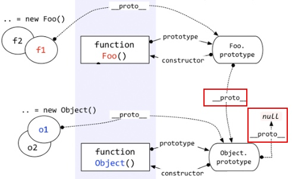
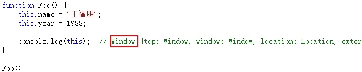

#JavaSript
## ProtoType
1. 除了undefined, Boolean, number, string这些值类型, 其他都是引用类型都是对象(function, array, object, null)
2. 一切对象都是由方法创建的
    1. `let a = {a: '1'} `
        1. 这个是语法糖: `let a = new Object(); a.a = 1;`
    2. `let a= ['1', '2']`
        1. 也是语法糖, 相当于: `let a = new Object(); a[0]='1'; a[1]='2'`
3. Object也是个方法(函数)
4. 对象是一个"属性的集合"
5. 每个方法都有一个属性protoType
6. 每个对象都有一个__proto__属性, 指向创建该对象函数的protoType
    1. {}, 自定义function的__proto__指向Object.protoType, 因为他们都是Object创建的
    2. <font color='red'>Object.protoType.__proto__指向null!!切记!!</font>
    3. 
    4. 自定义function, 是由Function创建出来的, `let fn = new Function('x', 'y', 'return x + y')`


1. foo.__proto__ = Function.protoType
2. Function.__proto__ = Function.protoType //顶端的环形结构
3. Object.__proto__ = Function.protoType
4. obj.__proto__ = Object.protoType


A instanceOf B:
沿着A.__proto__, 同时沿着B.protoType, 两者装上了就是true
所以:
Object instanceOf Function : true
Function instanceOf Object: true
Function instanceOf Function: true

## 原型链
```
let f = function() {};
let a = new f();
a.a = 10;
f.protoType.a = 100;
f.protoType.b = 200;
console.log(a.a); // 10
console.log(a.b); // 200
```
原型链: 当寻找一个对象的属性, 现在当前对象里找有没有, 没有再沿着__proto__去找.

###区分是自己属性还是"父类"属性


## 执行上下文
准备工作:
* 为变量, 函数表达式声明变量
* this--赋值
* 函数声明--赋值

每当执行一个函数时, 就会产生一个新的上下文

每个函数的arguments都不一样, 是准备工作产生的


函数在定义的时候, 就已经确定函数内部自由变量

----
####执行上下文
每次条用函数, 都会产生上下文, 调用完之后, 上下文会被释放. 再次回到全局的上下文. 
* 处于活动状态的上下文环境只有一个(类似一个压栈过程), 上下文栈

##this
 在函数中this到底如何取值, 是在函数真正被调用的时候才确定的!!
 因为this的取值是确定上下文的一部分, 每次调用函数都会产生新的上下文.
 
###1. 构造函数

this指向new出来的对象, 仅限Foo函数为"构造对象的时候"
如果直接调用Foo, 则this指向window, 如下: 


###2. 函数作为对象的属性

fn作为obj的属性, 并通过obj调用fn, 则这里的this指向obj

如果把fn赋值出去, 直接调用, 那fn1的this还是指向window, this.x为undefined

###3. 函数调用call或者apply
这两个函数直接决定this的值, 传什么是什么


###4. 全局 & 普通调用函数
全局环境下, this指向window, 不过以下代码需要注意!

函数f虽然是在obj.fn内部定义的，但是它仍然是一个普通的函数，this仍然指向window。

###5. 构造函数protoType的函数

以上代码, this指向f1, 
* !!!其实，不仅仅是构造函数的prototype，即便是在整个原型链中，this代表的也都是当前对象的值。!!!

## 闭包


1. 当执行17行时, 执行fn函数, 创建fn的上下文, 并处于活动状态
2. 执行完fn函数, 执行18行时, fn上下文未被销毁, 因为bar函数用到fn上下文的max变量(自由变量), 但是当前活动上下文回到全局上下文, fn还在栈内
3. 执行20行, 创建bar的上下文, 并处于活动状态.

