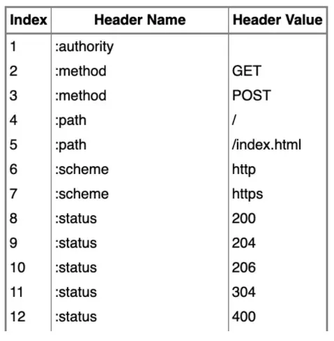

# HTTP 2.0讲解
https://zhuanlan.zhihu.com/p/89471776

1. 只允许https协议. 
2. 兼容http1.x

与http1.x区别
1. 2.0使用二进制分帧: 提高传输性能, 实现低延迟, 高吞吐量.
   1. 2.0会将所有传输信息分割成一个个帧, 对他们进行二进制编码
2. 多路复用/共享连接
   1. 1.x中, 一个连接里. 只能一次次信息交换, 2.0一个链接里. 随便发包. 包身上有标志符. 到目的后会则根据标识符拼接
   2. 允许一次连接中, 同时发起多次请求和响应多次, 直接实现并行. 1.X需要开多个TCP连接实现并行
3. 头部压缩
   1. 通用不变的头部, 只发送一次 .后面带的都是要变的
   2. 使用HPACK算法压缩: 通用字段和值, 进行编码. 
   3. 
   4. 如果key或者value不在表里. 则使用霍夫曼编码压缩字符串
      1. 这里value, 不在static Table里. 就会存在dynamic Table里. 并赋予新的索引值, 下次客户端直接发送这索引值即可
4. 请求优先级（Request Priorities）
   1. 就是各种独立帧有一个31bit的空间,做优先级字段描述
   2. 但不是决定的遵守优先级. 
   3. ●优先级最高：主要的html
   ●优先级高：CSS文件
   ●优先级中：js文件
   ●优先级低：图片
5. 服务器推送(Server Push)
   1.客户端不要发送多次请求. 服务器端可以直接推请求所需要的东西. 比如请求了HTML, 服务器连同css和js等资源一起推送给客户端
6. 