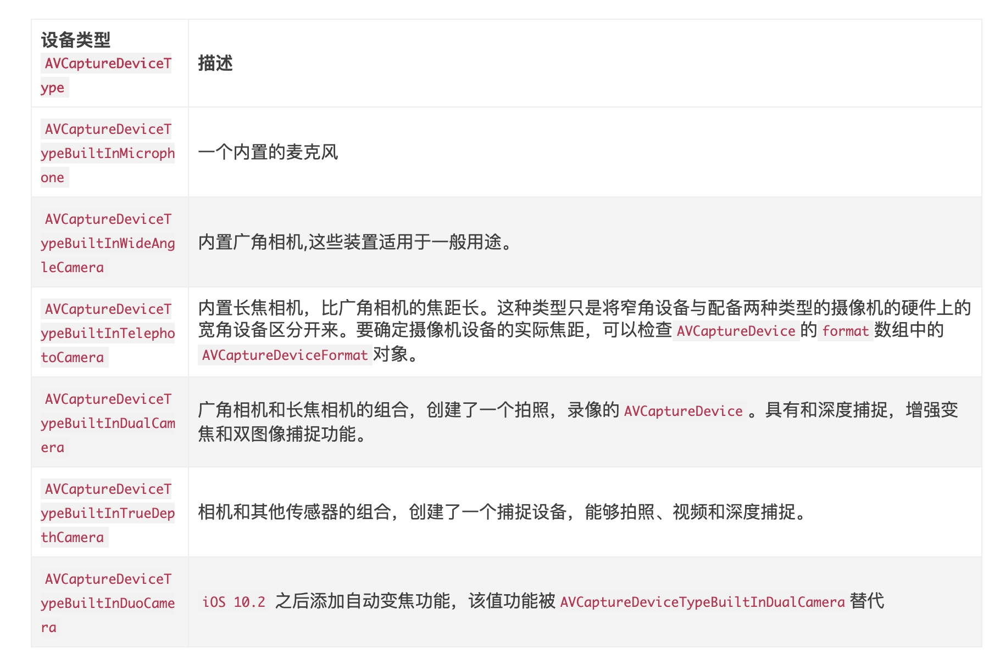

#LZMCamera类实现
初始化`+ (instancetype)getCameraWithCaptureSession:(void(^)(AVCaptureVideoPreviewLayer *previewLayer))getPreviewLayer`
1. 使用类方法初始化, 传入callback, 回传一个previewLayer, 这个是用来展示相机流的一个layer
2. 初始化(init)的时候, 因为要返回layer, 所以初始化的时候就基本上把相机所有要做的事情做好, 请求相机授权-生成session/input/output/previewLayer
3. 得到授权之后, 就去创建session
    1. 创建session使用`AVCaptureSession`
    2. 创建input使用`@interface AVCaptureDeviceInput : AVCaptureInput`
    3. output: `@interface AVCapturePhotoOutput(iOS10) : AVCaptureOutput` / `@interface AVCaptureStillImageOutput : AVCaptureOutput`
    4. previewLayer: `AVCaptureVideoPreviewLayer`
# 实现相机功能

创建session, input, output
## 授权
获取相机权限
1. 通过`UIImagePickerController`查看硬件是否支持, 这个类可以提供照片浏览器和拍照功能
2. 通过`AVCaptureDevice`查看相机权限
    1. AVAuthorizationStatusNotDetermined = 0//没决定
    2. AVAuthorizationStatusRestricted    = 1,//受限制, 官方说一般不会出现
    3. AVAuthorizationStatusDenied        = 2,//拒绝
    4. AVAuthorizationStatusAuthorized    = 3,//授权
3. 如果是没决定, 则调用`AVCaptureDevice requestAccessForMediaType`请求授权

```
LZXAuthRequest

+ (void)requestCameraAuthorizationHandlerCompletion:(void (^)(HZAuthStatus status))completion{
    if (![UIImagePickerController isSourceTypeAvailable:UIImagePickerControllerSourceTypeCamera]){
        // s硬件不支持
        dispatch_async(dispatch_get_main_queue(), ^{
            [HZHud showText:@"摄像机不支持"];
            completion(HZAuthStatusUnvaliable);
        });
        return;
    }
    
    AVAuthorizationStatus status = [AVCaptureDevice authorizationStatusForMediaType:AVMediaTypeVideo];
    if (status == AVAuthorizationStatusDenied || status == AVAuthorizationStatusRestricted){
        // 无权限
        dispatch_async(dispatch_get_main_queue(), ^{
            [HZAlert alertForCameraUnAuth];
            completion(HZAuthStatusUnAuth);
        });
        return;
    }
    
    if (status == AVAuthorizationStatusAuthorized){
        // 已允许
        dispatch_async(dispatch_get_main_queue(), ^{
            completion(HZAuthStatusAuthorized);
        });
        return;
    }
    
    // 请求权限
    [AVCaptureDevice requestAccessForMediaType:AVMediaTypeVideo completionHandler:^(BOOL granted) {
        dispatch_async(dispatch_get_main_queue(), ^{
            if (granted){
                // 同意访问
                completion(HZAuthStatusAuthorized);
            }else{
                // 拒绝访问
                [HZAlert alertForCameraUnAuth];
                completion(HZAuthStatusUnAuth);
            }
        });
    }];
}

```
##加入input
1. 使用`AVCaptureDeviceInput`作为input, 创建的时候需要`AVCaptureDevice`入参对象
2. 所以要获取`AVCaptureDevice`对象(这个对象表示设备对象, 所以是获取, 而不是创建)
    1. 传入position: `AVCaptureDevicePosition`得到所需的device
```
    NSArray *devices ;
    if (@available(iOS 10.0, *)){
    AVCaptureDeviceDiscoverySession *deviceSession = [AVCaptureDeviceDiscoverySession discoverySessionWithDeviceTypes:@[AVCaptureDeviceTypeBuiltInWideAngleCamera] mediaType:AVMediaTypeVideo position:AVCaptureDevicePositionUnspecified];
        devices = [NSArray arrayWithArray:deviceSession.devices];
    }else{
        devices = [AVCaptureDevice devicesWithMediaType:AVMediaTypeVideo];
    }
     for (AVCaptureDevice *device in devices ){
        if ( device.position == position )
            return device;
    }
    return nil;
```
ios10后, 改了获取方式.
1. 

2. 创建好input后 ,加入session就算完成这一步了
```
if ([self.captureSession canAddInput:self.captureInput]) {
       [self.captureSession addInput:self.captureInput];
   }
```

##加入outPut
创建output都没啥特别, ios10就用`AVCapturePhotoOutput`, 不然用`AVCaptureStillImageOutput`
```
if (@available(iOS 10.0, *)){
        self.capturePhoteOutput = [AVCapturePhotoOutput new];
        if ([self.captureSession canAddOutput:self.capturePhoteOutput]) {
            [self.captureSession addOutput:self.capturePhoteOutput];
        } else {
            [HZHud showText:@"加入Output流失败"];
            LZMLog(@"加入Out流失败");
            return;
        }
    } else {
        self.captureStillImageOutput = [AVCaptureStillImageOutput new];
        [self.captureStillImageOutput setOutputSettings:@{AVVideoCodecKey: AVVideoCodecJPEG}];
        if ([self.captureSession canAddOutput:self.captureStillImageOutput]) {
            [self.captureSession addOutput:self.captureStillImageOutput];
        } else {
            [HZHud showText:@"加入Output流失败"];
            LZMLog(@"加入Out流失败");
            return;
        }
    }
```

##创建previewLayer
```
self.previewLayer = [[AVCaptureVideoPreviewLayer alloc] initWithSession:self.captureSession];
    self.previewLayer.frame = CGRectMake(0, 0, LZMDevWidth, LZMDevHeight);
```

##session的启停
```
- (void)startRunningCapture{
    if (self.captureSession.running) {
        return;
    }
    [self.captureSession startRunning];
}

- (void)stopRunningCapture{
    if (self.captureSession.running) {
        [self.captureSession stopRunning];
    }
}
```


##获取照片
如果iOS10以上, 使用了`AVCapturePhotoOutput`的话, 用他来获取照片就简单的`AVCapturePhotoOutput capturePhotoWithSettings:delegate:`
设置代理对象, 在方法`- (void)captureOutput:(AVCapturePhotoOutput *)output didFinishProcessingPhoto:(AVCapturePhoto *)photo error:(nullable NSError *)error`里拿照片
1. 每次获取照片都调一次这个方法, 然后会走一次代理方法
2. 调用这个方法的时候会传一个setting对象, 这个对象可以设置图片的输出格式, 防抖功能等等, 还有什么自己去上网查

实例如下:
```
if (@available(iOS 10.0, *)){
        AVCapturePhotoSettings *setting = [AVCapturePhotoSettings photoSettings];
        if ([self.capturePhoteOutput.availablePhotoCodecTypes containsObject:AVVideoCodecJPEG]) {
            NSDictionary *format = @{AVVideoCodecKey: AVVideoCodecJPEG};
            setting = [AVCapturePhotoSettings photoSettingsWithFormat:format];
        }
        // 防抖
        setting.autoStillImageStabilizationEnabled = YES;
        self.photoSetting = setting;
        [self.capturePhoteOutput capturePhotoWithSettings:setting delegate:self];
    }else{
        AVCaptureConnection *connect = [self.captureStillImageOutput connectionWithMediaType:AVMediaTypeVideo];
        [self.captureStillImageOutput captureStillImageAsynchronouslyFromConnection:connect completionHandler:^(CMSampleBufferRef  _Nullable imageDataSampleBuffer, NSError * _Nullable error) {
            [self stopRunningCapture];
            NSData *imageData = [AVCaptureStillImageOutput jpegStillImageNSDataRepresentation:imageDataSampleBuffer];
            UIImage *image = [UIImage imageWithData:imageData];
            [self cropImage:image];
        }];
    }

```

###CapturePhotoDelegate
```
- (void)captureOutput:(AVCapturePhotoOutput *)output didFinishProcessingPhoto:(AVCapturePhoto *)photo error:(nullable NSError *)error{
    [self stopRunningCapture];
    CGImageRef imageRef = [photo CGImageRepresentation];
    UIImage *image = [UIImage imageWithCGImage:imageRef];
    
    [self cropImage:image];
}
```

由于获取到的照片需要旋转.所以加旋转
```
- (void)cropImage:(UIImage *)originImage{
    // 旋转
    if (!originImage){
        [HZHud showText:@"拍照失败，请重试"];
        [self startRunningCapture];
        return ;
    }
    CGRect rect = CGRectMake(0, 0, originImage.size.width, originImage.size.height);
    CGImageRef imageRef = CGImageCreateWithImageInRect(originImage.CGImage, rect);
    UIImage *image = [UIImage imageWithCGImage:imageRef scale:1 orientation:UIImageOrientationRight];
    UIImage *cutImage = [self cutImage:image];
    BLOCK_EXEC(self.getCaptureImageBlock, cutImage);
}

- (UIImage*)cutImage:(UIImage *)oldImage{
    CGFloat minLength  = MIN(oldImage.size.width, oldImage.size.height);
    CGFloat length = minLength;
    CGFloat centerX = length * 0.5;
    CGFloat centerY = length * 0.5;
    UIGraphicsBeginImageContextWithOptions(CGSizeMake(length, length), NO, 0.0);
    CGFloat imageX = centerX - oldImage.size.width * 0.5;
    CGFloat imageY = centerY - oldImage.size.height * 0.5;
    [oldImage drawInRect:CGRectMake(imageX, imageY, oldImage.size.width, oldImage.size.height)];
    UIImage* newImage = UIGraphicsGetImageFromCurrentImageContext();
    UIGraphicsEndImageContext();

    return newImage;
}
```

获取到layer的时候的代码, 照片宽高比是9:16
```
_camera = [LZMCamera getCameraWithCaptureSession:^(AVCaptureVideoPreviewLayer * _Nonnull previewLayer) {
            
            STRONG_SELF(self);
            CGFloat cameraWidth = self.cameraView.mj_w;
            CGFloat cameraHeight = cameraWidth/9*16;
            previewLayer.videoGravity = AVLayerVideoGravityResizeAspect;
            previewLayer.bounds = CGRectMake(0, 0, cameraWidth, cameraHeight);
            [self.cameraView.layer addSublayer:previewLayer];
            CGPoint p = previewLayer.position;
            CGFloat  offsetX = (LZMDevWidth-cameraWidth)/2;
            p.x -= offsetX;
            
            p.y -= (LZMDevHeight-cameraHeight)/2.0+cameraWidth/9*3.5;
            previewLayer.position = p;
        }];
```


#大神写的二维码有效区域

```
// 该方法中，_preViewLayer指的是AVCaptureVideoPreviewLayer的实例对象，_session是会话对象，_metadataOutput是扫码输出流
- (void)coverToMetadataOutputRectOfInterestForRect:(CGRect)cropRect {
    CGSize size = _previewLayer.bounds.size;
    CGFloat p1 = size.height/size.width;
    CGFloat p2 = 0.0;

    if ([_session.sessionPreset isEqualToString:AVCaptureSessionPreset1920x1080]) {
        p2 = 1920./1080.;
    }
    else if ([_session.sessionPreset isEqualToString:AVCaptureSessionPreset352x288]) {
        p2 = 352./288.;
    }
    else if ([_session.sessionPreset isEqualToString:AVCaptureSessionPreset1280x720]) {
        p2 = 1280./720.;
    }
    else if ([_session.sessionPreset isEqualToString:AVCaptureSessionPresetiFrame960x540]) {
        p2 = 960./540.;
    }
    else if ([_session.sessionPreset isEqualToString:AVCaptureSessionPresetiFrame1280x720]) {
        p2 = 1280./720.;
    }
    else if ([_session.sessionPreset isEqualToString:AVCaptureSessionPresetHigh]) {
        p2 = 1920./1080.;
    }
    else if ([_session.sessionPreset isEqualToString:AVCaptureSessionPresetMedium]) {
        p2 = 480./360.;
    }
    else if ([_session.sessionPreset isEqualToString:AVCaptureSessionPresetLow]) {
        p2 = 192./144.;
    }
    else if ([_session.sessionPreset isEqualToString:AVCaptureSessionPresetPhoto]) { // 暂时未查到具体分辨率，但是可以推导出分辨率的比例为4/3
         p2 = 4./3.;
    }
    else if ([_session.sessionPreset isEqualToString:AVCaptureSessionPresetInputPriority]) {
        p2 = 1920./1080.;
    }
    else if (@available(iOS 9.0, *)) {
        if ([_session.sessionPreset isEqualToString:AVCaptureSessionPreset3840x2160]) {
            p2 = 3840./2160.;
        }
    } else {
        
    }
    if ([_previewLayer.videoGravity isEqualToString:AVLayerVideoGravityResize]) {
        _metadataOutput.rectOfInterest = CGRectMake((cropRect.origin.y)/size.height,(size.width-(cropRect.size.width+cropRect.origin.x))/size.width, cropRect.size.height/size.height,cropRect.size.width/size.width);
    } else if ([_previewLayer.videoGravity isEqualToString:AVLayerVideoGravityResizeAspectFill]) {
        if (p1 < p2) {
            CGFloat fixHeight = size.width * p2;
            CGFloat fixPadding = (fixHeight - size.height)/2;
            _metadataOutput.rectOfInterest = CGRectMake((cropRect.origin.y + fixPadding)/fixHeight,
                                                        (size.width-(cropRect.size.width+cropRect.origin.x))/size.width,
                                                        cropRect.size.height/fixHeight,
                                                        cropRect.size.width/size.width);
        } else {
            CGFloat fixWidth = size.height * (1/p2);
            CGFloat fixPadding = (fixWidth - size.width)/2;
            _metadataOutput.rectOfInterest = CGRectMake(cropRect.origin.y/size.height,
                                                        (size.width-(cropRect.size.width+cropRect.origin.x)+fixPadding)/fixWidth,
                                                        cropRect.size.height/size.height,
                                                        cropRect.size.width/fixWidth);
        }
    } else if ([_previewLayer.videoGravity isEqualToString:AVLayerVideoGravityResizeAspect]) {
        if (p1 > p2) {
            CGFloat fixHeight = size.width * p2;
            CGFloat fixPadding = (fixHeight - size.height)/2;
            _metadataOutput.rectOfInterest = CGRectMake((cropRect.origin.y + fixPadding)/fixHeight,
                                                        (size.width-(cropRect.size.width+cropRect.origin.x))/size.width,
                                                        cropRect.size.height/fixHeight,
                                                        cropRect.size.width/size.width);
        } else {
            CGFloat fixWidth = size.height * (1/p2);
            CGFloat fixPadding = (fixWidth - size.width)/2;
            _metadataOutput.rectOfInterest = CGRectMake(cropRect.origin.y/size.height,
                                                        (size.width-(cropRect.size.width+cropRect.origin.x)+fixPadding)/fixWidth,
                                                        cropRect.size.height/size.height,
                                                        cropRect.size.width/fixWidth);
        }
    }
}
```