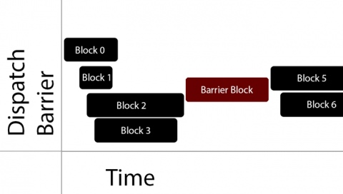

# Grand Central Dispatch 
队列: 串行队列, 并发队列, 主队列, 全局队列
同步 | 异步

优点:
1. 代码紧凑
2. 线程复用
3. 自动管理线程声明周期

##队列
1. 以`先进先出`方式, 顺序调度队列中的任务执行

###串行队列
1. 只有前一个任务彻底完成了, 还会执行下一个任务

###并发队列
1. 下一个任务用等待前一个任务完成才执行, 而是有资源就执行, 但调度顺序还是先进先出

###同步
1. 阻塞当前线程, 在当前线程执行完队列任务后, 继续执行
    1. 不一定在当前线程执行, 如果在子线程中, 同步的是主队列, 那就是在主线程中执行, 但还是会阻塞当前线程, 只有在主线程执行完同步任务, 子线程才会继续执行

###异步
1. 不阻塞当前线程, 在任务加入到队列后, 继续执行当前线程任务
2. 加入队列的任务根据队列的类型, 开启一条或者多条线程


#不同队列不同执行方式
##串行队列 | 异步执行:
1. 加入队列之后, 马上执行下一句代码
2. 开一条子线程, 顺序执行任务

##串行队列 | 同步执行:
1. 阻塞当前线程. 直到任务执行完成.
2. 不开线程, 在原线程上, 顺序执行, 

##并发队列 | 异步执行:
1. 加入队列后, 马上执行下一句代码
2. 开启多条子线程, 无序完成队列里的任务

##并发队列 | 同步执行:
1. 加入队列后, 阻塞当前线程
2. 不开线程, 在原线程上, 顺序执行, 
3. 解释:
    1. 因为并发, 所以下一个任务不用等上一个任务结束就可以调度
    2. 但因为同步, 所以只能在当前线程执行, 切不开线程
    3. 由于任务先进先出, 只有一条线程, 所以只能顺序执行, 等上一个任务结束后, 当前线程空闲了, 才能执行下一个任务


#全局队列
1. 全局队列没有名称, 并发队列有名称
2. MRC环境下, 全局队列不需要手动管理生命周期, 并发队列则需要手动管理
3. 使用barrier异步时, 一定要使用自己创建的并发队列

第一个参数Identify
* 服务质量(队列对任务调度的优先级)/iOS 7.0 之前，是优先级
    * iOS 8.0(新增)
        * QOS_CLASS_USER_INTERACTIVE 0x21, 用户交互(希望最快完成－不能用太耗时的操作)
        * QOS_CLASS_USER_INITIATED 0x19, 用户期望(希望快，也不能太耗时)
        * QOS_CLASS_DEFAULT 0x15, 默认(用来底层重置队列使用的，不是给程序员用的)
        * QOS_CLASS_UTILITY 0x11, 实用工具(专门用来处理耗时操作！)
        * QOS_CLASS_BACKGROUND 0x09, 后台
        * QOS_CLASS_UNSPECIFIED 0x00, 未指定，可以和iOS 7.0 适配
    * iOS 7.0
        * DISPATCH_QUEUE_PRIORITY_HIGH 2 高优先级
        * DISPATCH_QUEUE_PRIORITY_DEFAULT 0 默认优先级
        * DISPATCH_QUEUE_PRIORITY_LOW (-2) 低优先级
        * DISPATCH_QUEUE_PRIORITY_BACKGROUND INT16_MIN 后台优先级


#barrier: 防止多个线程执行时, 同时对非线程安全的对象操作, 导致崩溃
使用`dispatch_barrier_async`添加的block, 会在之前添加的block全部运行结束之后, 同一在一个线程顺序执行, 从而保证对非线程安全的对象进行正确的操作
1. 是意思在一个队列中, 全部任务执行完毕之后, 会在一个子线程中, 顺序完成barrier里的任务, 从而保证对非线程安全的对象进行正确的操作.(就是单线程操作)
2. 一定要是使用自己的queue, 不能使用Global, 否则没有效果



注意：dispatch_barrier_async 必须使用自定义队列，否则执行效果和全局队列一致
1. 在barrierBlock之前, 会执行block0123, 然后再执行block56

##dispatch_barrier_sync 与 dispatch_barrier_async
1. sync是在block0,1,2,3执行完成之后, 在执行barrierBlock
    1. 
2. async是在block0,1,2,3完成调度之后, 在调度barrierBlock

##使用的关键在于, 在什么位置添加barrierBlock
```
for (int i = 0; i < 100; i++){
    dispatch_async(queue, ^{
        downloadCode;
        dispatch_barrier_async(queue, ^{
            barrier_code;
            //操作非线程安全的对象
        });
    });
}
```
1. 如果downloadCode延迟很低很低, 则queue里的情况会是
    1. download0 - barrier0 - download1 - download2 - barrier1 - download34567... - barrier2 - download10...99 - barrier3...99
    2. 所以download和barrier的顺序会乱的, 但可以保证, barrierCode0-99都是串行执行. 
2. 如果上述async改为sync, 那会发生死锁
    1. 因为download0未完成, 不会执行barrier0, 而barrier0不执行, download0不会完成

    
#dispatch_once
1. 线程安全
2. 效率比互斥锁高


```c
static int i ;
dispatch_one(&i, ^{
    onceCode;
})
// i = 0;

```
如果第五行代码实现, 那dispatch_once将无效, 会不断的调用

#dispatch_after
1. 第二个入参是纳秒
2. 异步的

#调度组
dispatch_group_notify(group, queue, groupBlock);
当调度组中的任务全部执行完成之后, 再执行groupBlock
两种方式的使用:
第一种
```c
dispatch_group_async(group, queue, block1);
dispatch_group_async(group, queue, block2);
dispatch_group_async(group, queue, block3);
dispatch_group_notify(group, queue, groupBlock);
```

第二种:
```c
dispatch_group_enter(group);
dispatch_async(queue, ^{
    block1();
    dispatch_group_leave(group);
});

dispatch_group_enter(group);
dispatch_async(queue, ^{
    block2();
    dispatch_group_leave(group);
});

dispatch_group_enter(group);
dispatch_async(queue, ^{
    block3();
    dispatch_group_leave(group);
});

dispatch_group_notify(group, queue, groupBlock);

```


    The dispatch_group_async() convenience function behaves like so:

     void
     dispatch_group_async(dispatch_group_t group, dispatch_queue_t queue, dispatch_block_t block)
     {
             dispatch_retain(group);
             dispatch_group_enter(group);
             dispatch_async(queue, ^{
                     block();
                     dispatch_group_leave(group);
                     dispatch_release(group);
             });
     }

##dispatch_group_wait(group, time)
1. 同步执行, 阻塞当前线程
2. 等待time(纳秒), 在这之前, 如果group里的任务全部执行完成, 则不阻塞, 继续执行
3. 如果在time之后, group还没执行完, 则不阻塞, 继续执行.
4. 如果time设置成DISPATCH_TIME_FOREVER, 则永远等待, 直至group里任务全部完成