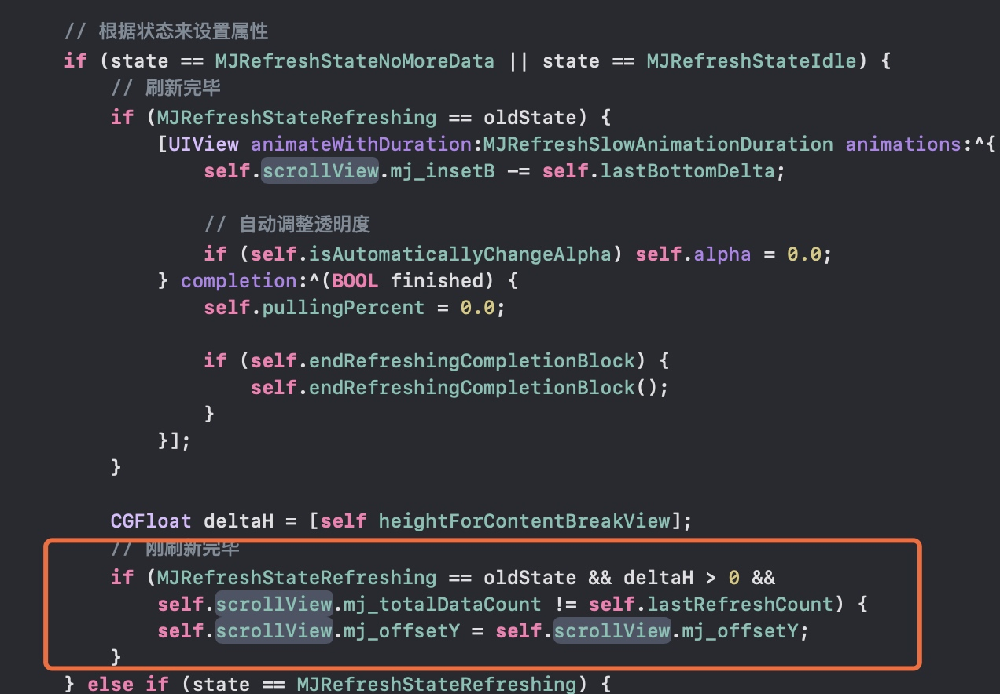

# MJRefresh_HEADER

#MJRefreshComponent
1. moveToSuperView的时候开启监听contentSize, contentOffset
2. beginRefreshing
    1. state = refreshing
3. endRefreshing
    1. state = idle

##deprecate注释
```
// 过期提醒
#define MJRefreshDeprecated(instead) NS_DEPRECATED(2_0, 2_0, 2_0, 2_0, instead)

MJRefreshDeprecated("过期了");
```

##要求调用super
```
NS_REQUIRES_SUPER

/** 初始化 */
- (void)prepare NS_REQUIRES_SUPER;
```

##先给UIScrollView写了分类(MJRefresh)
1. 添加mj_header和mj_footer的属性和成员变量
##MJRefreshComponent
1. .h文件定义了
    1. 组件的state(刷新的前后的状态)
    2. 刷新begin和end的block / target&action
2. 重写willMoveToSuperView的方法得到superView, 如果不是UIScrollView则不作为
3. 得到SuperView(ScrollView)之后, 通过KVO监听ScrollView的contentOffset和contentSize, scrollView的panGesture的state属性
    1. .h暴露方法: scrollViewContentOffsetDidChange/ scrollViewContentSizeDidChange/ scrollViewPanStateDidChange方法给子类重写
##实现下滑刷新的动画
1. 核心属性: contentInset
2. 实现scrollViewDelegate, 在endDrag方法里, 判断offset是否到达指定高度(如: 60), 如果到了, 则设置scrollView.contentInset = UIEdgeMake(60,0,0,0)
3. 然后异步执行freshCallback, 结束时使用UIView animate来执行动画`scrollView.contentInset = UIEdgeZero`
4. 如果在刷新过程中, 不允许下拉, 则加个属性, 是否在刷新中, 在scrollDidScroll中实现offset固定住, 不给下拉
5. PS: 如果不设置contentInset, 就算设置offset也没用, 他还是会滚会offset=0的.

###MJ的实现下拉刷新(主要逻辑: MJRefreshHeader:MJRefreshComponent)
1. 全在scrollViewDidScroll里做事情
2. 子类集成MJRefreshComponent, 实现scrollViewContentOffsetDidChange, 来监听ContentOffset属性
    1. 先判断是否在刷新中, 如果是刷新中, 则不允许下拉超过freshHeader, 但允许bounce出去
        1. 通过contentInset实现, 设置好包含的freshHeader的contentInset即可. 
    2. 如果不是刷新中, 判断是否下滚, 则不关fresh事, 如果露出header了, 判断是否(scrollView.isDragging)
        1. 如果是, 则判断offset是否超过header, 是则置statePulling, 否则置stateIdle
        2. 如果不在dragging, 则判断state是否pulling, 是则直接调freshCallback, 否则设置pullingPercent.
3. SetState
    1. 当state=refresh的时候
        1. inset设置为header的高度
        2. 设置offset=-header.height(让刚好滚到显示完全header)
        3. 以上动画执行完后,执行freshCallback
    2. 当freshCallback执行完后, 调用方主动执行endFresh, 把state置回idle
    3. 当state=idle的时候
        1. 把当前insetTop+=insetTopDelta(这里的insetTopDelta意思是恢复原样的值, 在scrollViewDidScroll的时候记录的, 当state变成fresh的时候)
        2. 当inset恢复原样的时候, scrollView的机制, 自然会恢复原来的offset.
        3. 以上2点都是在UIView animate里实现, 才会有动画效果.
        4. 动画结束后执行endRefreshCompleteBlock
    
##view.window
这个属性是当view出现在屏幕的时候才会有值. 
自己的实验: 
1. 在viewDidLoad的时候, 就算加入subView了, 也不会马上出现. 因为屏幕还没出现. =.=
2. 在TouchBegin的时候, view.window有值, 马上removeFromSuperView后, 马上没值了.


##willMoveToSuperView里
1. 记录originScrollInset

##在scrollViewDidScroll中设置contentInset(实现scrollView上下无限滚动)
如果在scrollViewDidScroll中设置contentInset = UIEdgeMake(-offset.y,0,0,0)
然后scrollView.alwaysBounceVertical = YES, 则实现了scrollView上下无限滚动


#MJRefresh_Footer

##willChangeValueForKey & didChangeValueForKey
KVO监听的时候, 好像默认只能监听系统设置好的属性
如果是自己分类加属性, 或者自己子类的属性, 就要在setter里加这个
```
- (void)setXXX:(id)xxx {
    self willChangeValueForKey:xxx
    _xxx = xxx;
    self didChangeValueForKey:xxx
}
```

##MJRefreshBackFooter
主要布局在这个类里实现, 通过实现监听contentSize
当contentSize发生变化的时候, footer的y值发生变化, 要跟在contentSize之后
###这里有个问题: 
1. 如果是tableView, 则footer跟在最后一个cell的后面
2. 但是在iPhoneX系列中, tableView滚到最底下的时候, 最后一个cell不是贴低, 而是在贴在safeBottomArea的上面
3. 所以这个时候贴在最后一个cell的后面的footer就会漏出来=.=
4. 解决这个问题就要使用属性ignoredScrollViewContentInsetBottom, 他会影响footer的Y值, 这个值会加载contentSize上, tableView的contentSize多出这么多的size
5. 当内容少的时候, 就会取scrollView_height作为footer的y值

##setState
> deltaH: contentSize和scrollView.height的差值, >0则表示可以滚, <0表示滚不了. >0时, 表示滚动deltaH值,到达footer的可视位置(即底部)

1. 当normal->refresh的时候
    1. 同样设置contentInset, bottom = footer.height
        1. 这里的bottom需要计算当contentSize<scrollView.height的时候
    2. 设置contentOffset, 需要在原来基础上家伙加上footer.height, 这样显得自然, 刷新完后不会发生滚动.
2. 当refresh->normal的时候
    1. contentInset恢复原状(即footer要消失)
    2. 
    3. 他这里重新刷新了offsetY, 不知道为什么.=.=

##监听ContentSize
1. 监听contentSize决定footer的Y值.

##监听contentOffset
1. 如果offset<deltaH, 则直接return
2. 否则-> 判断state == noMoreData, 是则return
3. 否则-> 是否还在dragging(scrollView.isDragging), 
    1. 如果是设置好pullingPercent((offset-deltaH)/footer.height)
        1. 判断state是否是idle且offset-deltaH > footer.height
            1. 是->state=pulling(松手即可刷新)
        2. 否则->判断state==pulling且offset-deltaH < footer.height
            1. 是->state=idle
        3. done;
    2. done
4. 否则->(不在dragging), 判断state
    1. 是否为pulling, 是则beginRefreshing
    2. 否则->设置好pullingPercent

    
#MJRefreshAutoFooter: MJRefreshFooter
直接把contentInset设置成footer.height, 让footer一直在content里面
    
##监听contentSize
通过监听contentSize, 设置footer.Y = contentSize.height
    
##监听contentOffset
要state == idle && 自动加载 && Y值!=0 && 
content > scrollview.height &&
offsetY >= contentH - scrollViewH + footerH * triggerAutomaticallyRefreshPercent(超过footer百分之多少加载)

满足上述条件, 则beginRefreshing
###这里有个问题
由于contentOffset调用频次很高, 所以可能会出现多次调用beginRefreshing的情况
: 没得到解决, 有可能会多次调用beginRefresh

##监听scrollView.panGesture.state
当state == End的时候, 表示手松开了, 这个时候判断contentH是否大于scrollViewH, 如果是, 则判断offset是否大于contentH+footerH, 如果是则refresh
    
    