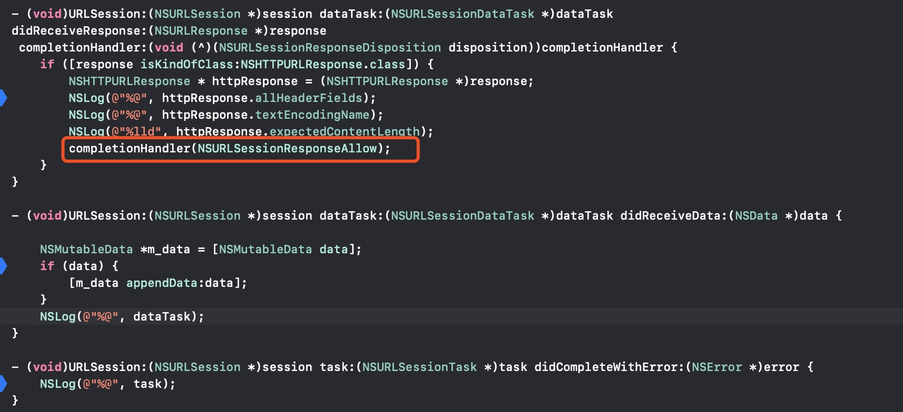

#iOS原生的网络请求
使用NSURLSession
使用Request或者URL, 创建SessionTask, 一般常用DataTask
* 如果只是创建普通的Task, 不带completionHandler的, 就通过session的Delegate捕获request结果
* 如果是使用completionHandler的, 则直接用这个block处理结果

* 图上红框是关键代码, 必须要填, 才会跳到对应的其他Delegate回调
