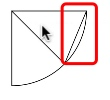
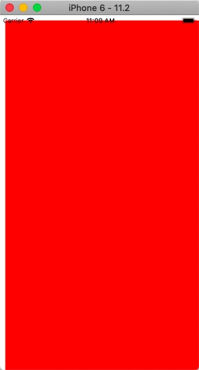
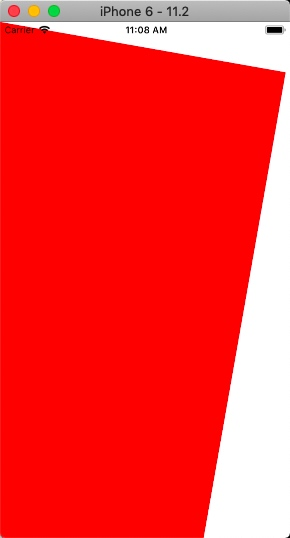
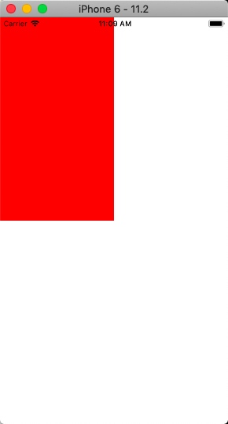
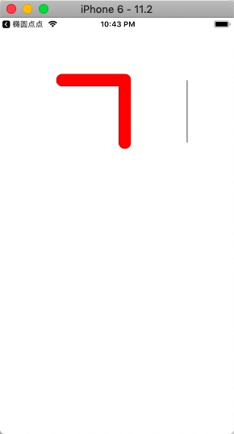
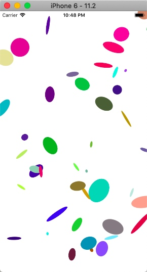
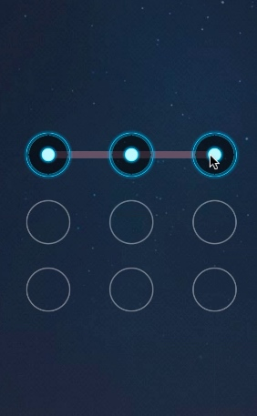
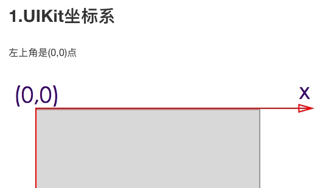
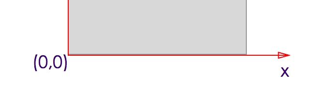

# DrawRect
* 是UIView的方法, 有一个入参rect, 只有width, height, 没有x, y(都是0)
* 在这里可以获取图形上下文, 系统在某个时候会调用该方法, 来渲染view
* 画图步骤
    * 获取图形上下文
    * 在图形上下文画画(线条, 圆圈, 矩行, 弧等)
    * 将图形上下文渲染到view上
* 有3种画图方式
    * 使用C
    * 使用CGPath
    * 使用UIBezierPath

第一种:
```c
CGContextRef ctx = UIGraphicsGetCurrentContext();
//把点移动到
CGContextMoveToPoint(ctx, 100, 0);
//加入线, 与上一个点连线
CGContextAddLineToPoint(ctx, 200, 200);
    
//加入弧,     
CGContextAddArc(ctx, 100, 100, 100, M_PI_4, M_PI_2, 1);
//加入矩形(正方形/长方形)
CGContextAddRect(ctx, CGRectMake(0, 0, 100, 100));
//根据上一个点, 和现在2个点, 连城2条直线, 根据radius, 画弧, 切于两条直线
CGContextAddArcToPoint(ctx, 100, 100, 200, 200, 100);
//画圆/椭圆
CGContextAddEllipseInRect(ctx, CGRectMake(0, 0, 100, 200));
//闭合路径, (最新的moveToPoint)
CGContextClosePath(ctx);
//渲染路径
CGContextStrokePath(ctx);
```    

第二种:(需要注意释放path, C语言创建对象, 要自己释放)
```
CGContextRef ctx = UIGraphicsGetCurrentContext();
CGMutablePathRef path = CGPathCreateMutable();
CGPathMoveToPoint(path, NULL, 100, 100);
CGPathAddLineToPoint(path, NULL, 200, 200);
CGPathAddArc(path, NULL, 200, 200, 100, M_PI_4, M_PI_2, 1);
CGPathAddRect(path, NULL, CGRectMake(0, 0, 100, 100));
CGPathAddArcToPoint(path, NULL, 100, 100, 200, 200, 100);
CGPathAddEllipseInRect(path, NULL, CGRectMake(0, 0, 100, 100));
    
CGContextAddPath(ctx, path);
CGContextStrokePath(ctx);

//释放path
CGPathRelease(path); 
//或者: CFRelease(path);
```

第三种:
```c
CGContextRef ctx = UIGraphicsGetCurrentContext();
UIBezierPath *path = [UIBezierPath bezierPath];
[path moveToPoint:CGPointMake(100, 100)];
[path addLineToPoint:CGPointMake(200, 200)];
[path addArcWithCenter:CGPointMake(100, 100) radius:100 startAngle:M_PI_4 endAngle:M_PI_2 clockwise:1];
UIBezierPath *rectPath = [UIBezierPath bezierPathWithRect:CGRectMake(0, 0, 100, 100)];
UIBezierPath *ovalPath = [UIBezierPath bezierPathWithOvalInRect:CGRectMake(0, 0, 100, 100)];
    
//通过CGContext画图
//CGContextAddPath(ctx, path.CGPath);
//CGContextAddPath(ctx, rectPath.CGPath);
//CGContextAddPath(ctx, ovalPath.CGPath);
//CGContextStrokePath(ctx);

//直接画
[path stroke];
[rectPath stroke];
[ovalPath stroke];
```


##奇偶填充
当使用`CGContextDrawPath(ctx, kCGPathEOFill)`的时候(使用这个方法, 并且使用这个枚举), 当两个以上的区域重叠, 并进行渲染的时候, 看重叠的次数是多少, 奇数则渲染, 偶数则不渲染

##非零饶数(nonzero winding number rule)
当使用`CGContextDrawPath(ctx, kCGPathFill)`的时候(使用这个方法, 并且使用这个枚举), 当画圆的时候, 若里面也画圆, 若都是同一个方向话(都是顺时针, 或者都是逆时针)就没问题, 如果是不同的方向, 则有可能出现不渲染的区域.
* 假设顺时针为+1, 逆时针为-1
* 在渲染的区域里, 为0, 则不渲染, 其他都渲染.

#饼状图
## CGContextStrokePath
* 会把原点初始化, 如下:



```c
//画个扇形
CGContextRef ctx = UIGraphicsGetCurrentContext();
CGContextAddArc(ctx, centerX, centerY, 100, 0, M_PI_4, 0);
CGContextAddLineToPoint(ctx, centerX, centerY);
CGContextClosePath(ctx);

//如果不加这句, 则会有问题, 加了之后, 原点重置. 则不会连线
CGContextStrokePath(ctx);

CGContextAddArc(ctx, centerX, centerY, 100, M_PI_4, M_PI_2, 0);
CGContextAddLineToPoint(ctx, centerX, centerY);
CGContextClosePath(ctx);

CGContextStrokePath(ctx);


```

#重绘
UIView.h
`- (void)setNeedDisplays;`
`- (void)setNeddDisplaysInRect:(CGRect)rect`
* 以上都是通知系统重绘UIView, 在重绘之前, 会先清空区域, 前者则清空全部区域, 后者清空rect区域. 然后根据DrawRect重绘. 
* 所以drawRect里要有变量. 重绘才有意义

#矩阵操作
```c
- (void)drawRect:(CGRect)rect {
//     Drawing code
    CGContextRef ctx = UIGraphicsGetCurrentContext();
    
    //矩阵操作: 位移, 旋转, 缩放, 对应以下效果
//    CGContextTranslateCTM(ctx, 10, 10);
//    CGContextRotateCTM(ctx, M_PI /180 * 10);
    CGContextScaleCTM(ctx, 0.5, 0.5);
    
    CGContextAddRect(ctx, rect);
    [UIColor.redColor set];
    
    CGContextFillPath(ctx);
    
}
```






#上下文操作
##线条样式入栈出栈
一套套的线条样式(颜色, 线宽等等)可以进行保存和使用. 但是是以出入栈的形式操作.
`CGContextSaveGState`为入栈, 入栈之后就可以设置当前的样式, 然后再画图
`CGContextRestoreGState`为出栈, 出栈后就使用上一次的样式, 然后画图
下面例子为话一条自定义样式的线, 之后再话一条系统默认的样式的线
```c
- (void)drawRect:(CGRect)rect {
    // Drawing code
    CGContextRef ctx = UIGraphicsGetCurrentContext();
    
    //入栈
    CGContextSaveGState(ctx);
    
    //线宽, 颜色, 头部和交点部位的样式.
    CGContextSetLineWidth(ctx, 20);
    [UIColor.redColor set];
    CGContextSetLineCap(ctx, kCGLineCapRound);
    CGContextSetLineJoin(ctx, kCGLineJoinRound);
    
    CGContextMoveToPoint(ctx, 100, 100);
    CGContextAddLineToPoint(ctx, 200, 100);
    CGContextAddLineToPoint(ctx, 200, 200);
    
    CGContextStrokePath(ctx);
    
    //出栈
    CGContextRestoreGState(ctx);
    
    CGContextMoveToPoint(ctx, 300, 100);
    CGContextAddLineToPoint(ctx, 300, 200);
    
    CGContextStrokePath(ctx);
    
}
```

因此可以实现如下效果, 画各种各样的椭圆, (随机位置, 随机旋转, 随机缩放, 随机颜色)

```c
- (void)drawRect:(CGRect)rect {
    // Drawing code
    
    /*
     1. 获取上下文
     2. 每话一个椭圆都用不同的上下文
        2.1 不同的颜色
        2.2 上下文不同的位移, 旋转, 缩放
     3. 每个椭圆都同样大小80 * 60
     
     */
    
    CGContextRef ctx = UIGraphicsGetCurrentContext();
    
    for (int i = 0; i < 100; i++) {
        CGContextSaveGState(ctx);
        
        CGContextTranslateCTM(ctx, arc4random_uniform(rect.size.width), arc4random_uniform(rect.size.height));
        CGContextRotateCTM(ctx, M_PI /180 * arc4random_uniform(360));
        CGContextScaleCTM(ctx, arc4random_uniform(10)/10.0, arc4random_uniform(10)/10.0);
        
        CGContextAddEllipseInRect(ctx, CGRectMake(arc4random_uniform(rect.size.width), arc4random_uniform(rect.size.height), 60, 80));
        
        [[self randomColor] set];
        
        
        CGContextFillPath(ctx);
        
        CGContextRestoreGState(ctx);
    }
}
```

#补充
##设置线条颜色
`[UIColor.redColor setStroke]`


#手势解锁

##要点
1. 主要使用Quartz2D, 根据不同的坐标划线, 先设置好线宽, 交点样式等等
2. 划线要知道坐标, 所以要有数组知道哪几个固定坐标, 最后一个变量来记录当前手指的坐标, 画最后的线
3. 以上是画线的要点.(drawRect), 下面要如何记录这些坐标
4. 监听母View的touchMove, 拿到UITouch对象, 来判断是否在某个圈里
    1. `[UITouch locationInview:btn]`拿到CGPoint
    2. `[UIView pointInside: withEvent:]`判断point是否在view里
    3. 或者还有第二种方法, 判断点是否在圈里
        1. `[UITouch locationInView:母View]`拿到point
        2. `CGRectContainsPoint(btn.frame, point)`判断point是否在frame里
    4. 然后把view的centerPoint放进数组里, 使用setNeedsDisplay来刷新图片
        1. 因为touchMove方法调用的比较快, 如果母View没设置背景颜色, 则会出现很多条线的bug.
5. 设置UI, 在initWithCoder & initWithFrame里创建9个btn, 设置好不同ControlState下的背景图片. 在layoutSubView上布置
    1. PS: 这里最好让btn宽高都固定, 不同尺寸屏幕用不用margin, 因为这样图片才不会变形或者模糊.!

#绘制文字(只能在drawRect里使用)

```
//在一个区域内写字, 自动换行, 超过区域不显示后面的内容
[@"asd" drawInRect:CGRectMake(0, 0, 100, 100) withAttributes:nil];
//在一个点开始写字, 不换行, 一行超出view的范围就不显示
[@"asd" drawAtPoint:CGPointMake(0, 0) withAttributes:nil];
```
以上都是NSString方法, OC的方法, 不需要使用CGContext
```
文字属性在 UIKit 框架的 NSAttributedString.h 中

NSFontAttributeName  字体
NSParagraphStyleAttributeName  设置段落样式
NSForegroundColorAttributeName  字体颜色
NSBackgroundColorAttributeName  背景色
NSLigatureAttributeName 
NSKernAttributeName  调整字句 kerning 字句调整
NSStrikethroughStyleAttributeName  删除线
NSUnderlineStyleAttributeName  下划线
NSStrokeColorAttributeName  设置文字描边颜色，需要和NSStrokeWidthAttributeName设置描边宽度，这样就能使文字空心.
NSStrokeWidthAttributeName  设置描边宽度
NSShadowAttributeName 设置阴影，单独设置不好使，必须和其他属性搭配才好使。和这三个任一个都好使，NSVerticalGlyphFormAttributeName，NSObliquenessAttributeName，NSExpansionAttributeName
NSTextEffectAttributeName
NSAttachmentAttributeName
NSLinkAttributeName
NSBaselineOffsetAttributeName
NSUnderlineColorAttributeName  下划线颜色
NSStrikethroughColorAttributeName   删除线颜色
NSObliquenessAttributeName  设置字体倾斜
NSExpansionAttributeName  设置文本扁平化
NSWritingDirectionAttributeName
NSVerticalGlyphFormAttributeName 该属性所对应的值是一个 NSNumber 对象(整数)。0 表示横排文本。1 表示竖排文本。在 iOS 中，总是使用横排文本，0 以外的值都未定义。
```
#绘制图片(只能在drawRect里使用)
```
UIImage *image = [UIImage ...];
//在某个点开始绘制, 原比例方式绘制!(即图片多大的像素, 就用屏幕多少个点绘制!)
[image drawAtPoint:point];
//在某个区域内绘制, 拉伸或压缩图片
[image drawInRect:rect];

//平铺, 铺满整个区域(适合小像素图片), 也是原比例绘制
[image drawAsPatternInRect:rect]

//使用某个模式绘制图片
[image drawAtPoint:point blendMode:CGBlendMode alpha:]
[image drawInRect:rect blendMode:CGBlendMode alpha:];
``` 
//以上都是UIImage方法, OC方法, 不需要用到CGContext
```
kCGBlendModeNormal,  正常；也是默认的模式。前景图会覆盖背景图
 kCGBlendModeMultiply,  正片叠底；混合了前景和背景的颜色，最终颜色比原先的都暗
 kCGBlendModeScreen,   滤色；把前景和背景图的颜色先反过来，然后混合
 kCGBlendModeOverlay,  覆盖；能保留灰度信息，结合kCGBlendModeSaturation能保留透明度信息，在imageWithBlendMode方法中两次执行drawInRect方法实现我们基本需求
 kCGBlendModeDarken,  变暗
 kCGBlendModeLighten,  变亮
 kCGBlendModeColorDodge, 颜色变淡
 kCGBlendModeColorBurn,  颜色加深
 kCGBlendModeSoftLight,  柔光
 kCGBlendModeHardLight,  强光
 kCGBlendModeDifference,  插值
 kCGBlendModeExclusion,  排除
 kCGBlendModeHue,  色调
 kCGBlendModeSaturation, 饱和度
 kCGBlendModeColor,  颜色
 kCGBlendModeLuminosity,  亮度

 //Apple额外定义的枚举
 //R: premultiplied result, 表示混合结果
 //S: Source, 表示源颜色(Sa对应透明度值: 0.0-1.0)
 //D: destination colors with alpha, 表示带透明度的目标颜色(Da对应透明度值: 0.0-1.0)

kCGBlendModeClear,  R = 0
kCGBlendModeCopy,  R = S
kCGBlendModeSourceIn,  R = S*Da
kCGBlendModeSourceOut,  R = S*(1 - Da)
kCGBlendModeSourceAtop,  R = S*Da + D*(1 - Sa)
kCGBlendModeDestinationOver,  R = S*(1 - Da) + D
kCGBlendModeDestinationIn,  R = D*Sa；能保留透明度信息
kCGBlendModeDestinationOut,  R = D*(1 - Sa)
kCGBlendModeDestinationAtop,  R = S*(1 - Da) + D*Sa
kCGBlendModeXOR,  R = S*(1 - Da) + D*(1 - Sa)
kCGBlendModePlusDarker,  R = MAX(0, (1 - D) + (1 - S))
kCGBlendModePlusLighter  R = MIN(1, S + D)（最后一种混合模式）
```

##使用C来绘制图片
```
//先获取CGContext, CGImage
//绘制到某个区域上, 拉伸或者压缩
CGContextDrawImage(ctx, rect, CGImage)
//以rect的区域, 铺满整个view
CGContextDrawTiledImage(ctx, rect, CGImage)
```

###用C语言绘制的图片, 都是倒着的
原因: 因为坐标系不一样. UIKit的坐标原点在左上角, CoreFoundation坐标原点在左下角


Quartz2D的坐标系


所以使用Quartz2D画出来的图片, 都是倒立的, 只要把图片绕着X轴旋转一圈, 然后平移到原位, 即可恢复原状
```
//1.上下文向下偏移一个高度的距离
CGContextTranslateCTM(ctx, 0, rect.size.height);
//2.上下文翻转
CGContextScaleCTM(ctx, 1, -1);
```

> PS: 小技巧, 通过放缩来进行旋转

#剪切圆形图片
```c
CGContextAddArc(ctx, centerX, centerY, 100, M_PI * 2, 1)
CGContextClip(ctx)

UIImage *img = getImageObject();
[img drawInRect:rect];

UIImage *resultImage = UIGraphicsGetImageFromCurrentContext();
```
顺序不能变, 先把上下文给裁了, 再进行绘图!
最后得到的resultImage的大小还是和Context一样!

#使用图片上下文
##获取图片上下文
1. 一般在drawRect上, 上下文都是框架帮你生成好, 只需要调用`UIGraphicsGetCurrentContext()`就行了
2. 或者使用

```c
/*
Params:
size: 上下文大小
opaque: 背景是否不透明, YES则不透明, NO则透明, 默认为白色背景.
scale: 比例, 1则按size大小输出像素, 2的按2x输出像素, 3则按3x输出像素, 在后面从上下文中获取图片后, 保存到相册中, 图片的像素大小
*/
UIGraphicsBeginImageContextWithOptions(CGSizeMake(533, 307), NO, 0);
```
    
3. 但是在drawRect以外的方法, 则可以使用图片上下文, 来生成一张我们自己的图片

```c
//创建图片上下文
UIGraphicsBeginImageContext(CGSize);

//获取图片上下文
CGContextRef ctx = UIGraphicsGetCurrentContext();

//释放图片上下文
UIGraphicsEndImageContext();
```

##可以进行常规的划线
```c
//创建图片上下文
UIGraphicsBeginImageContext(CGSizeMake(200, 200));
//获取图片上下文    
CGContextRef ctx = UIGraphicsGetCurrentContext();

//画图
CGContextMoveToPoint(ctx, 0, 0);
CGContextAddLineToPoint(ctx, 200, 200);
CGContextStrokePath(ctx);
    
//获取当前图片上下文, 得到UIImage对象    
UIImage *img = UIGraphicsGetImageFromCurrentImageContext();

//释放图片上下文
UIGraphicsEndImageContext();
    
_imgView.image = img;
    
```
关于Size需要注意几点
1. `UIGraphicsBeginImageContext` 和 `CGContextAddLineToPoint`等画图操作, 都是针对像素点, 而最后赋值给imageView的时候, 会根据当前设备进行压缩, 
2. 上述例子, 画出来的是200*200的pixel, imgView是100\*100, 如果在设备iPhone6就正常使用, 如果在iPhone6 plus, 则会被拉伸, 模糊.

##可以进行给图片添加水印
与上述画路线同样道理, 加水印, 就是画多个图的意思
```c
//创建图片上下文
UIGraphicsBeginImageContext(CGSize);

UIImage *bgImage = getBgImage();
UIImage *logoImg = getLogoImg();

[bgImage drawInRect:rect];
//添加图片水印
[logoImg drawInPoint:point];
//添加文字水印
[@"logoStr" drawInPoint:pointA]

UIImage *resultImg = UIGraphicsGetImageFromCurrentImageContext();

imgView.image = resultImg;

//释放图片上下文
UIGraphicsEndImageContext();
```
同样道理, 图片上下文开启的是像素点, 所以上下文里画图还是水印的坐标, 都是像素点, 最后生成图片就是上下文的大小, 只是最后赋值给imgView的时候, 会根据ImgView的配置来显示.

###保存图片到相册
```c
UIImageWriteToSavedPhotosAlbum(ImageObject, self, @selector(image:didFinishSavingWithError:contextInfo:), nil);
```
使用这个方法去保存图片到相册上, 成功或者失败会回调给target的selector
文档里提到, 一定要用这样子的selector, `- (void)image:(UIImage *)image didFinishSavingWithError:(NSError *)error contextInfo:(void *)contextInfo`
但不一定, 系统是使用NSInvocation来实现的, 一定要有3个入参, 入参类型和顺序要跟上述一样即可, 名字什么的可以随便取

#清空上下文
`CGContextClearRect(ctx, CGRectMake(0, 0, 531, 309));`

#截取屏幕
确切的说是应该是截取view的UI, 如果截取Window, 那就是屏幕截图, 但是状态栏没有截取到.

```c
...获取context
//把view的UI画到上下文上
[view.layer renderInContext:context];

//通过上下文拿到图片, 再保存到相册上
UIImage *img = UIGraphicsGetImageFromCurrentContext()
UIImageWriteToSavedPhotosAlbum(img, target, selector, context);

```

#截图圆形图片, 并画圆环
1. 在一次上下文当中, 截取圆形图片, 拿到图片
2. 重新创建上下文, 使用奇偶填充, 创建圆环


```c
    UIGraphicsBeginImageContextWithOptions(CGSizeMake(533, 307), YES, 0);
    
    //获取中心rect
    CGRect centerRect = CGRectMake(533/2.0, 307/2.0, 0, 0);
    centerRect = CGRectInset(centerRect, -100, -100);
    
    CGContextRef ctx = UIGraphicsGetCurrentContext();
    CGContextAddEllipseInRect(ctx, centerRect);
    
    CGContextClip(ctx);
    
    UIImage *bgImg = [UIImage imageNamed:@"asd"];
    [bgImg drawAtPoint:CGPointZero];
    
    UIImage *resultImg = UIGraphicsGetImageFromCurrentImageContext();
    
    UIGraphicsEndImageContext();
    
    UIGraphicsBeginImageContextWithOptions(CGSizeMake(533, 307), YES, 0);
    
    [resultImg drawAtPoint:CGPointZero];
    
    ctx = UIGraphicsGetCurrentContext();
    
//    CGContextMoveToPoint(ctx, 0, 0);
//    CGContextAddLineToPoint(ctx, 100, 100);
//    [UIColor.redColor setStroke];
//    CGContextDrawPath(ctx, kCGPathStroke);
    //画圆环
    CGContextAddEllipseInRect(ctx, centerRect);
    CGContextAddEllipseInRect(ctx, CGRectInset(centerRect, -10, -10));
    [UIColor.redColor set];
    CGContextDrawPath(ctx, kCGPathEOFill);
    
    
    resultImg = UIGraphicsGetImageFromCurrentImageContext();
    
    UIImageWriteToSavedPhotosAlbum(resultImg, self, @selector(image:didFinishSavingWithError:contextInfo:), nil);
    
    UIGraphicsEndImageContext();
    
    NSLog(@"%s", __FUNCTION__);
```

###简易版:
1. 确定圆环宽度margin
2. 创建图片大小的大小的上下文
3. 取Min(长宽)为半径,画圆, 并截取上下文
4. 然后把图片写入到上下文
5. 在上述半径画圈, 线宽为margin;
6. 即可得到带圆环的图片

#学习心得
1. CGContextClip | CGContextClear
    1. 当使用了这个方法去截取上下文, 并获取了图片之后
    2. 使用CGContextClear之后, 并不能再clip之外的区域继续画图. 此时需要重新释放上下文, 并重新创建
    3. CGContextClip使用非零饶数规则截取
2. 画图片圆环时, 可以有多种方法, 要记住一个要点, 就是路径或者图片一但绘制出去, 再执行clip也不会剪切掉已经绘制的图片
    1. UIImage, NSString drawInRect, drawAtPoint
    2. CGContextDrawPath(..,..)
    3. 等等都是绘制出去
3. 话图片圆环, 可以有多种方法
    1. 话粗线圆线 - 剪切上下文 - 绘图
    2. 画大圆饼 - 剪切上下文 - 绘图
    3. 切上下文 - 画图 - 重建上下文 - 画圆环

    
#保存到沙盒
获取沙盒路径:
```c
NSString *path= NSSearchPathForDirectoriesInDomains(NSDocumentDirectory, NSUserDomainMask, YES).lastObject
path = [path stringByAppendingPathComponent:@"xxx.png"];

```
写入沙盒:
```c
NSData *data = UIImagePNGRepresentation(imageObject);
[data writeToFile:path atomically:YES];
```

#给任意角制圆角
```
UIBezierPath *path = [UIBezierPath bezierPathWithRoundedRect:_view.bounds byRoundingCorners:UIRectCornerTopLeft | UIRectCornerTopRight cornerRadii:CGSizeMake(20, 20)];
CAShapeLayer *maskLayer = [[CAShapeLayer alloc] init];
maskLayer.frame = _view.bounds;
maskLayer.path = path.CGPath;
_view.layer.mask = maskLayer;
```
1. 不用上下文
2. 利用view.layer.mask, 制作一个指定圆角的layer, 覆盖到view上面
3. CAShapeLayer是根据CGPath来画图的layer
    1. 就是画出如何的path, layer就如何
        1. 都是在一次性画出图的情况下, 画圆形, 矩形, 圆角矩形等等
        2. 多画几条线没有试