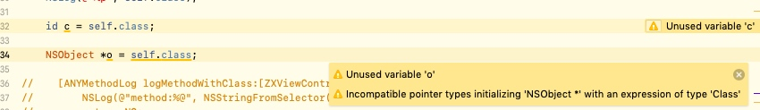
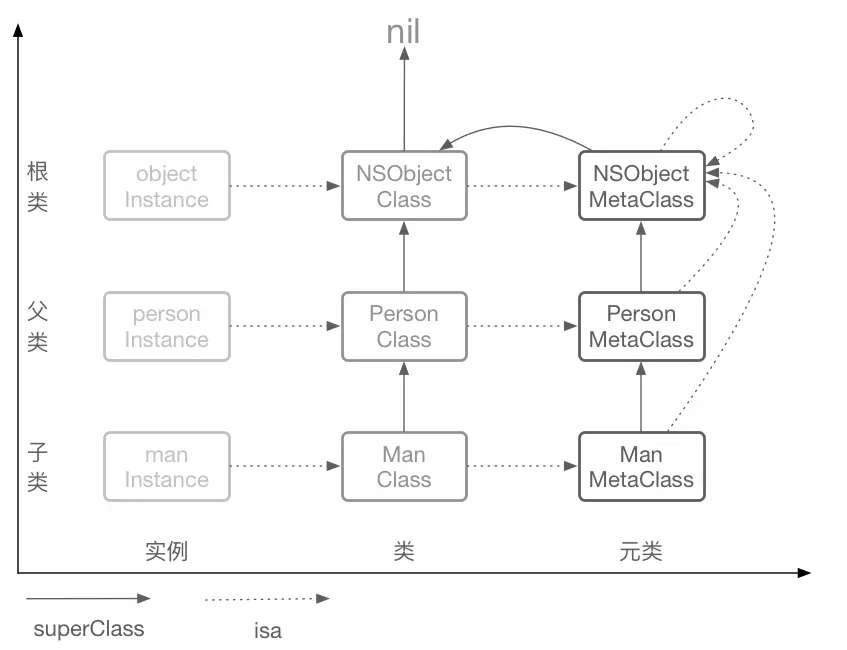
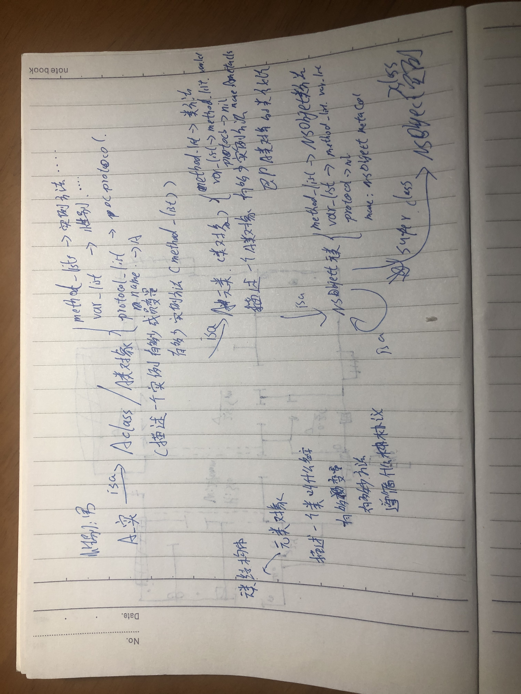
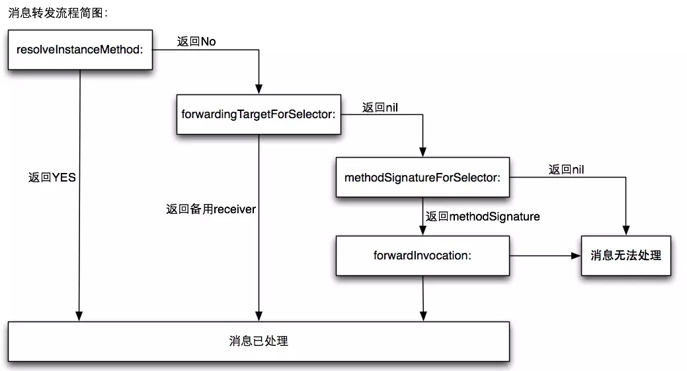

# RunTime
##id和NSObject* 区别
```c
typedef struct objc_object *id
struct objc_object {
    Class isa
}
typedef struct objc_class *Class;

```

id 可以指着Class对象
NSObject *不能

综上所述:
* id是C的指针, NSObject是OC的指针
* NSObject能指的, id都能指
* struct objc_object 与 NSObject的区别, 一个是C的结构体, 一个是OC对象, OC对象多了很多类方法和实例方法

```c
unsigned int i = 0;
Ivar* ivar = class_copyIvarList(NSClassFromString(@"NSObject"), &i);
NSLog(@"%s", ivar_getName(ivar[0])); //isa
```
上述论证了NSObject没有属性但有成员变量, 是`isa`


---

```
struct objc_class {
    Class _Nonnull isa  OBJC_ISA_AVAILABILITY;

#if !__OBJC2__
    Class _Nullable super_class                              OBJC2_UNAVAILABLE;
    const char * _Nonnull name                               OBJC2_UNAVAILABLE;
    long version                                             OBJC2_UNAVAILABLE;
    long info                                                OBJC2_UNAVAILABLE;
    long instance_size                                       OBJC2_UNAVAILABLE;
    struct objc_ivar_list * _Nullable ivars                  OBJC2_UNAVAILABLE;
    struct objc_method_list * _Nullable * _Nullable methodLists                    OBJC2_UNAVAILABLE;
    struct objc_cache * _Nonnull cache                       OBJC2_UNAVAILABLE;
    struct objc_protocol_list * _Nullable protocols          OBJC2_UNAVAILABLE;
#endif

} OBJC2_UNAVAILABLE;
```

OC每一个类, 都是对象, 是单例. 是objc_class结构体的实例. 每一个实例都有相同的isa指针, 指向objc_class.




类对象保存着创建类实例的相关信息, 那么类对象和类方法是由谁来创建的呢. 是由元类(MetaClass)

* 所有对象理解对key-value形式的map数据结构
* 方法只是一个key为method_list里的key-value数据结构的一组数据, 最终凭着selector找到函数指针来执行方法

###从属链(自创, isa链)
* man对象只有成员属性, 他的成员方法保存在Man_Class的类对象里method_list
* Man_Class类对象是由Man_Meta_Class实例化出来的
* Man_Class的成员方法 = Man对象的类方法 = Man_Meta_Class的method_list
* Man_Meta_Class元类对象是由NSObject_Meta_Class实例化出来的.
* NSObject_Meta_Class的method_list存的是NSObject的类方法

###继承链(super_class)
* man类对象的super_class是person类对象, 意思是person类对象里的method_list, 在man对象里也可以用, 或者说, 在man对象里找不到的实例方法可以去person类对象里找
* man元类对象的super_class是person元类对象, 意思同理与上一条, person的类方法, man类对象也能调用, 或者说, man类对象找不到的类方法, 可以去person的元类对象里找
* NSObject对象是一个最纯净的对象
* NSObject类对象有描述类所需要的属性, method_list, var_list等等
* NSObject_Meta_Class对象的super_class是NSObject类对象. 说明NSObject_Meta_Class的method_list里找不到的selector可以去NSObject类对象的method_list里找.
* NSObject类对象的super_class为nil, 也就是说在NSObject类对象里method_list都找不到的selector就可以不用找了.


#Method
```
typedef struct objc_method *Method;
struct objc_method {
    SEL method_name                                          OBJC2_UNAVAILABLE;
    char *method_types                                       OBJC2_UNAVAILABLE;
    IMP method_imp      
```

##Selector
对Selector的解释:
A method selector is a C string that has been registered (or “mapped“) with the Objective-C runtime. Selectors generated by the compiler are automatically mapped by the runtime when the class is loaded.

* Selector是一个C字符串
* Selector由编译器生成的
* Selector会被mapped到method_list里, 被RunTime框架mapped, 当class被加载的时候.

###OC没有方法重载
* 方法重载: 根据入参类型不同, 而有不同的方法
    * `- (void)calculate:(int)num`
    * `- (void)calculate:(CGFloat)num`
    * 以上就是方法重载
* 由于Selector是字符串, 导致`同一个类, Selector不能重复`, 导致方法不能重载. 在同一个类里, 上述的是同一个Selector

##IMP
```
/// A pointer to the function of a method implementation.  指向一个方法实现的指针
typedef id (*IMP)(id, SEL, ...); 
```
就是指向最终实现程序的内存地址的指针

##类缓存objc_cache
为了加速方法的调用, 每次查询method_list那么多可能有点麻烦, 也许只用一小部分的方法, 所以每次检索完method_list都会把结果缓存到objc_cache里, 每次执行objc_msgSend的时候都首先检索objc_cache

##Category(objc_category)
表示一个分类的结构体
```c
struct category_t { 
    const char *name; 
    classref_t cls; 
    struct method_list_t *instanceMethods; 
    struct method_list_t *classMethods;
    struct protocol_list_t *protocols;
    struct property_list_t *instanceProperties;
};
```
name: class的name, 不是category的name
cls: 是类对象, Class, 编译期间不会定义, 在RunTime时候用name来找到对应的类对象
instanceMethods: 实例方法列表(category里定义的)
classMethods: 类方法列表(category里定义的)
protocols: 协议列表(category里定义的)
instanceProperties: 属性列表(category里定义的)这就是我们可以通过objc_setAssociatedObject和objc_getAssociatedObject增加实例变量的原因，不过这个和一般的实例变量是不一样的。

#RunTime消息转发
当执行消息转发时就会去类对象里寻找方法, 找不到就沿着superClass寻找, 直到NSObject类对象. 最后还不到就会执行`doesNotRecognizeSelector:`方法报`unrecognized selector`错

消息转发的简易图:


当连NSObject都找不到这个方法时, 即将发生unrecognized selector之前, 还会有三次机会补救, 如下:
消息转发crash前最后三个机会:
1. 动态方法解析
2. 备用接受者
3. 完整消息转发

##动态方法解析: `+ (BOOL)resolveInstanceMethod:` 
RunTime会调用`+resolveInstanceMethod`或者`+resolveClassMethod`, 当你有机会resolve这个问题, 你可以在里面使用`class_addMethod`来给对应的类添加方法:
* 根据类对象存储实例方法, 元类(MetaClass)存储类方法, 在`class_addMethod`方法里传不同的class则添加不同的方法, 传类对象, 就添加实例方法, 传元类就添加类方法
* 类对象一般NSClassFromString, [NSObject class], self, 等都是类对象
* 元类的获取方法如下:

```C
//获取MetaClass
Class myMetaClass = objc_getMetaClass("NSString");
Class myMetaClass = object_getClass([NSString class]);
```

添加完方法之后, 返回YES, 则RunTime会再发送一次这个消息. 如果还找不到, 则直接crash.

##备用接受者: `- (id)forwardingTargetForSelector:(SEL)aSelector`
* 这个方法只针对实例方法`resolveInstanceMethod`, 当`resolveClassMethod`返回YES, 他不走这个方法=.=(TODO: 求解)
* 当上述动态方法解析返回YES的时候, RunTime会重新对原Target发送原消息, 如果成功找到方法, 则没事, 如果还找不到, 则会执行该方法, 寻找备用Target
* 这个方法就返回所需要接受的Target
    * 这里是可以任何对象: 
        * 返回普通OC对象, 就执行实例方法. 
        * 返回类对象, 就执行类方法.
        * 返回元类对象, 就执行NSObject类方法
        * 返回NSObject元类, 就执行NSObject类方法
        * 这里可以证明`isa链`是如上面所述的

##完整的消息转发机制`methodSignatureForSelector`, `forwardInvocation`
如果上述两步都没解决, 最后只能启动完整的消息转发机制了.
当`resolveInstanceMethod`返回YES, `forwardingTargetForSelector`返回nil, 就会执行`methodSignatureForSelector`
```c
- (NSMethodSignature *)methodSignatureForSelector:(SEL)aSelector {
    if ([NSStringFromSelector(aSelector) isEqualToString:@"asd"]) {
        return [NSMethodSignature signatureWithObjCTypes:"v@:"];//签名，进入forwardInvocation
    }
    
    return [super methodSignatureForSelector:aSelector];
}

- (void)forwardInvocation:(NSInvocation *)anInvocation {
    SEL sel = anInvocation.selector;
    
    NSObject *p = [NSClassFromString(@"Test") new];
    if([p respondsToSelector:sel]) {
        [anInvocation invokeWithTarget:p];
    }
    else {
        [self doesNotRecognizeSelector:sel];
    }
    
}
```
* 通过`methodSignatureForSelector`拿到MethodSignature, RunTime生成Invocation, 然后执行`forwardInvocation`


##RunTime的应用
###分类添加属性
```c
//关联对象
void objc_setAssociatedObject(id object, const void *key, id value, objc_AssociationPolicy policy)
//获取关联的对象
id objc_getAssociatedObject(id object, const void *key)
//移除关联的对象
void objc_removeAssociatedObjects(id object)

id object：被关联的对象
const void *key：关联的key，要求唯一
id value：关联的对象
objc_AssociationPolicy policy：内存管理的策略
```
```c
static char kDefaultColorKey;

- (void)setDefaultColor:(UIColor *)defaultColor {
    objc_setAssociatedObject(self, &kDefaultColorKey, defaultColor, OBJC_ASSOCIATION_RETAIN_NONATOMIC);
}

- (id)defaultColor {
    return objc_getAssociatedObject(self, &kDefaultColorKey);
}
```

###方法交换(swizzling)
```c
+ (void)load {
    static dispatch_once_t onceToken;
    dispatch_once(&onceToken, ^{
        Class class = [self class];
        SEL originalSelector = @selector(viewDidLoad);
        SEL swizzledSelector = @selector(jkviewDidLoad);
        
        Method originalMethod = class_getInstanceMethod(class,originalSelector);
        Method swizzledMethod = class_getInstanceMethod(class,swizzledSelector);
        
        //judge the method named  swizzledMethod is already existed.
        BOOL didAddMethod = class_addMethod(class, originalSelector, method_getImplementation(swizzledMethod), method_getTypeEncoding(swizzledMethod));
        // if swizzledMethod is already existed.
        if (didAddMethod) {
            class_replaceMethod(class, swizzledSelector, method_getImplementation(originalMethod), method_getTypeEncoding(originalMethod));
        }
        else {
            method_exchangeImplementations(originalMethod, swizzledMethod);
        }
    });
}
```
* 应该是`load`或者`initialize`方法里执行swizzling
* 使用dispatch_Once保证一运行一次
* 为什么要添加一个`class_addMethod`的逻辑
    * 防止originMethod是属于父类的, 如果添加成功, 表示originMethod是属于父类的
    * 当是上述的情况, 如果直接交换的话. 在子类调用originSelector也是没问题的, 但是在父类上调用originSelector的话, 父类就找不到子类上的swizzlingSelector, 导致crash, unrecognize selector

###KVO的实现
###JSPatch热更新原理
###自动归档解档
```c
- (id)initWithCoder:(NSCoder *)aDecoder {
    if (self = [super init]) {
        unsigned int outCount;
        Ivar * ivars = class_copyIvarList([self class], &outCount);
        for (int i = 0; i < outCount; i ++) {
            Ivar ivar = ivars[i];
            NSString * key = [NSString stringWithUTF8String:ivar_getName(ivar)];
            [self setValue:[aDecoder decodeObjectForKey:key] forKey:key];
        }
    }
    return self;
}

- (void)encodeWithCoder:(NSCoder *)aCoder {
    unsigned int outCount;
    Ivar * ivars = class_copyIvarList([self class], &outCount);
    for (int i = 0; i < outCount; i ++) {
        Ivar ivar = ivars[i];
        NSString * key = [NSString stringWithUTF8String:ivar_getName(ivar)];
        [aCoder encodeObject:[self valueForKey:key] forKey:key];
    }
}
```

###字典转模型

```c
- (instancetype)initWithDict:(NSDictionary *)dict {

    if (self = [self init]) {
        //(1)获取类的属性及属性对应的类型
        NSMutableArray * keys = [NSMutableArray array];
        NSMutableArray * attributes = [NSMutableArray array];
        /*
         * 例子
         * name = value3 attribute = T@"NSString",C,N,V_value3
         * name = value4 attribute = T^i,N,V_value4
         */
        unsigned int outCount;
        objc_property_t * properties = class_copyPropertyList([self class], &outCount);
        for (int i = 0; i < outCount; i ++) {
            objc_property_t property = properties[i];
            //通过property_getName函数获得属性的名字
            NSString * propertyName = [NSString stringWithCString:property_getName(property) encoding:NSUTF8StringEncoding];
            [keys addObject:propertyName];
            //通过property_getAttributes函数可以获得属性的名字和@encode编码
            NSString * propertyAttribute = [NSString stringWithCString:property_getAttributes(property) encoding:NSUTF8StringEncoding];
            [attributes addObject:propertyAttribute];
        }
        //立即释放properties指向的内存
        free(properties);

        //(2)根据类型给属性赋值
        for (NSString * key in keys) {
            if ([dict valueForKey:key] == nil) continue;
            [self setValue:[dict valueForKey:key] forKey:key];
        }
    }
    return self;

}
```