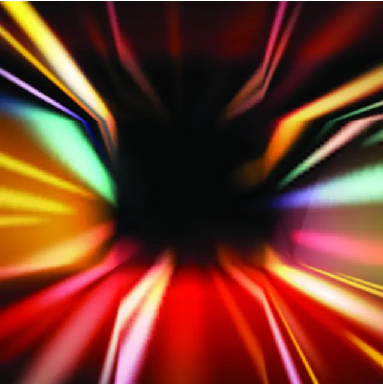
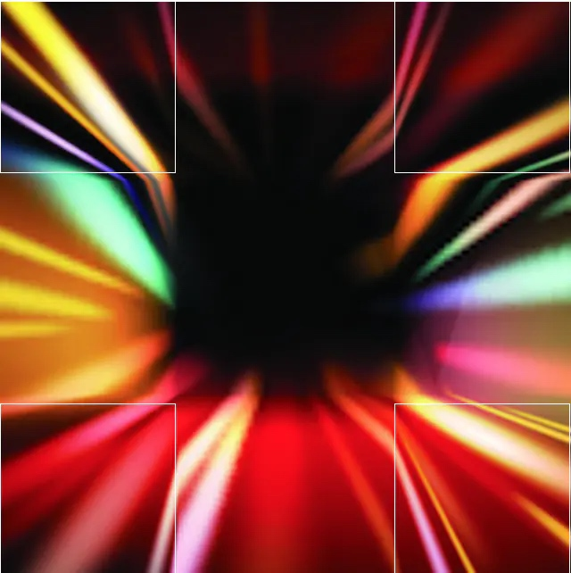
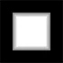
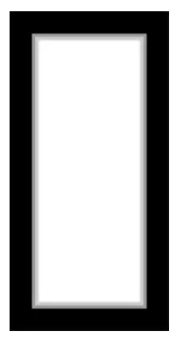
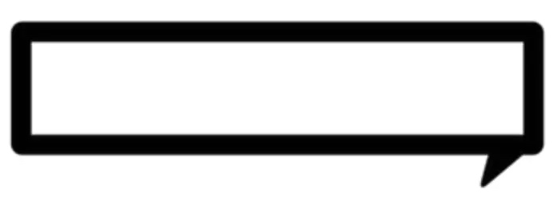
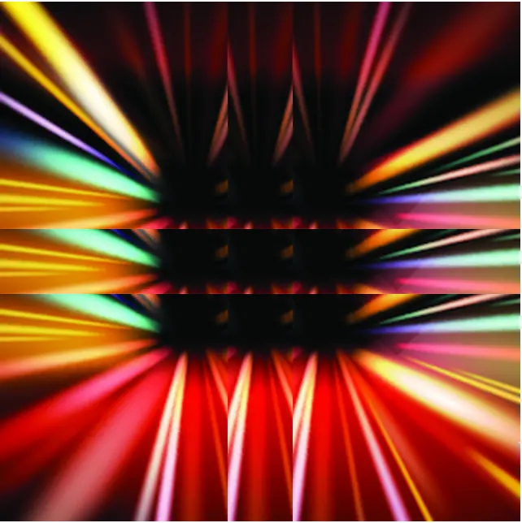

# 拉伸气泡

转载： https://www.jianshu.com/p/fe7e79f31e1e

在开发中我们经常会实现一些背景图片的指定拉伸，并且拉伸后的图片需要保持四个周角样式不变。比如聊天界面中的气泡，或者是我们要实现一个相框对于不同尺寸相片的适配。
其实这样效果的实现主要依赖UIImage的这个函数来实现

- (UIImage *)resizableImageWithCapInsets:(UIEdgeInsets)capInsets resizingMode:(UIImageResizingMode)resizingMode NS_AVAILABLE_IOS(6_0); 
// the interior is resized according to the resizingMode
首先来看一个例子：

图片来自网络，侵权即删

这是一个240*240像素的图片，我们用
resizableImageWithCapInsets:resizingMode:函数调整大小然后展示出来，代码如下：
UIImageView * bgImgView = [[UIImageView alloc] initWithFrame:CGRectMake(20, 50, 320, 320)];

UIEdgeInsets edge = UIEdgeInsetsMake(100, 100, 100, 100);
UIImage * frameImg1 = [UIImage imageNamed:@"111.png"];
frameImg1 = [frameImg1 resizableImageWithCapInsets:edge resizingMode:UIImageResizingModeStretch];
[bgImgView setImage:frameImg1];
    
[self.view addSubview:bgImgView];
效果如下：

再来仔细观察一下白框中的四个角

我们发现这四个角的图片的画质是没有变化的，画质发生拉伸变化的部分是：距离上边界100像素和距离下边界100像素的中间部分，以及距离左边界100像素和距离右边界100像素的中间部分，也就是resizableImageWithCapInsets:resizingMode:函数的capInsets参数，我们设置为edge= UIEdgeInsetsMake(100, 100, 100, 100)。
然后我们再来看UIImageResizingModeStretch这个值。作为
resizableImageWithCapInsets:resizingMode:函数的resizingMode参数类型是UIImageResizingMode，该类型共有两个值：
/* UIImage will implement the resizing mode the fastest way possible while
 retaining the desired visual appearance.
 Note that if an image's resizable area is one point then UIImageResizingModeTile
 is visually indistinguishable from UIImageResizingModeStretch.
 */
typedef NS_ENUM(NSInteger, UIImageResizingMode) {
    UIImageResizingModeTile,
    UIImageResizingModeStretch,
};
我们上面使用的是UIImageResizingModeStretch，这个值代表图片会按照我们设置的图片区域，也就是capInsets所设置的区域拉伸。
通过上面的例子我们可以看出这种拉伸方式会保持图片四个角的一定区域在拉伸中不会发生改变，这样就可以实现我们关于气泡、相框等一些效果的实现。

看看应用的实际效果，下面是一个很小的相框图片

按照上面方式拉伸后的效果：

再来看一个气泡的效果：

拉伸后的效果：

介绍了UIImageResizingModeStretch这种拉伸方式，我们再来看看UIImageResizingModeTile这种图片大小的调整方式。
上边的代码不变，只不过UIImageResizingModeStretch值变为
UIImageResizingModeTile，效果如下：

这种方式原意为瓷砖模式，意思就是会将我们设置的区域作为瓷砖一样平铺到扩展空间中。
从上图中我们可以看出中间黑色部分被平铺出9块。其他部分则是按照中间部分等距平铺出来。
版权声明：出自MajorLMJ技术博客的原创作品 ，转载时必须注明出处及相应链接！

作者：JerryLMJ
链接：https://www.jianshu.com/p/fe7e79f31e1e
来源：简书
著作权归作者所有。商业转载请联系作者获得授权，非商业转载请注明出处。