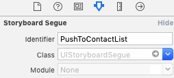

# UIStoryBoardSegue
当用StoryBoard进行两个VC跳转的时候, 系统就会自动生成Segue对象.

一个箭头就是一个Segue
* 跳转有分自动跳转和手动跳转
* 当用Button与VC连线, 得到的Segue是自动跳转
* 当VC与VC连线, 得到的是Segue需要手动调用的, 这时候需要给Segue设置Identify

* 因为一个VC可以与多个VC连线, 所以这时候只能通过id来识别segue

手动跳转要通过代码执行
`- (void)performSegueWithIdentifier:(NSString *)identifier sender:(nullable id)sender NS_AVAILABLE_IOS(5_0);`

* 无论是手动跳转还是自动跳转, 都会执行以下代码
    * `- (void)prepareForSegue:(UIStoryboardSegue *)segue sender:(nullable id)sender NS_AVAILABLE_IOS(5_0);`

一个Segue执行跳转的逻辑如下:
* 先找到segue, 然后生成UIStoryBoardSegue对象
* 把segue对象发送给`prepareForSegue`方法
* 执行segue对象的`perform`方法