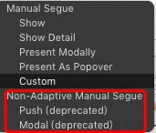
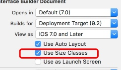
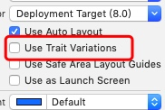
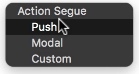

# 输入框
##禁止输入框输入空格, 回车
```c
- (BOOL)textField:(UITextField *)textField shouldChangeCharactersInRange:(NSRange)range replacementString:(NSString *)string {
    if ([string isEqualToString:@""] && range.length > 0) {
        //delete
        return YES;
    }
    string = [string zx_stringByRemoveAllSpaceAndEnter];
    if(range.length > 0) {
        range = NSMakeRange(range.location, string.length);
    }
    NSString *result = [textField.text stringByReplacingCharactersInRange:range withString:string];
    textField.text = result;
//    NSLog(@"range: %@ \n string: %@ \n current: %@ \n result: %@", NSStringFromRange(range), string, textField.text, result);
    return NO;
}
```
##监听输入
除了上述的Delegate可以监听之外, 还可以通过addTarget来监听.
```c
[self.accountTF addTarget:self action:@selector(didChange) forControlEvents:UIControlEventEditingChanged];
```
只有上述Delegate返回YES的时候, 才会发消息给target. 或者可以主动触发事件
`[textField sendActionsForControlEvents:UIControlEventEditingChanged];`

##StoryBoard
###Size classed
在连线的时候出现以下情况

是因为用了Size classed
在Xcode7的时候:


在Xcode9里变成如下: Trait Variations


把勾去掉了. 就变成如下:

