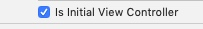
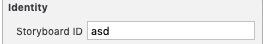
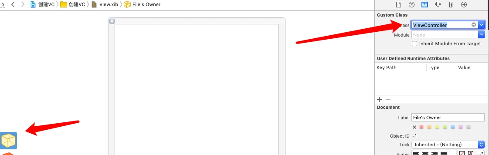
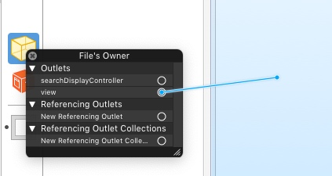

# 创建ViewController

##使用StoryBoard创建
###创建sb里箭头指向的vc, 即设置了vc的初始化

```
UIStoryboard *sb = [UIStoryboard storyboardWithName:@"Main" bundle:nil];
UIViewController *vc = [sb instantiateInitialViewController];

或者
UIViewController *vc = [sb instantiateViewControllerWithIdentifier:@"asd"];
```


##使用Xib创建
1. 创建Xib, 并将xib的File's owner与ViewController类绑定
    1. 
2. 是File's owner上面的view与xib的view关联, 为了是ViewController的view与Xib的view关联
    1. 
3. 敲代码`UIViewController *vc = [[UIViewController alloc] initWithNibName:@"View" bundle:nil];`


# loadView
1. 当view为nil时, 调用self.view则会触发loadView
    1. 即使使用xib创建vc, loadView还是会触发.
2. 如果没有使用xib, 代码创建时, 若没调super loadView, 则直接使用self.view的话会死循环
3. 加载网页时候会用到???

#ZXViewController *vc = [[ZXViewController alloc] initWithNibName:nil bundle:nil];
* `ZXViewController *vc = [[ZXViewController alloc] initWithNibName:nil bundle:nil];` 与 `ZXViewController *vc = [ZXViewController new]` 与 `ZXViewController  *vc = [[ZXViewController alloc] init]`是一样的
* 当出现上面三个方法时, 就回去`NSBundle.mainBundle`里寻找与ZXViewController相同名字的xib文件, 或者与ZXView相同名字的xib文件, 如果找到就加载xib文件, 如果没有就走默认加载.