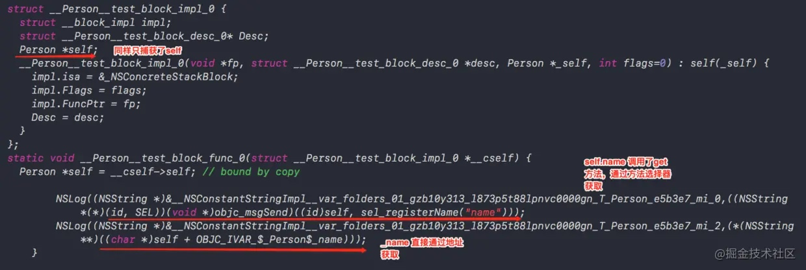

# block原理
* block是一个结构体
* block的方法逻辑被转化成一个c函数, 入参是block结构体
    * 因为c函数要通过这个结构体拿到相应的变量
* block结构体里有一个__block_impl结构体成员变量, 该结构体有函数指针指向c函数, 还有isa指针
* block结构体里c函数所需的变量的成员变量
    * 如果是普通变量, 则创建普通变量, 并复制给他
    * 如果是静态变量, 则创建静态变量指针, 并指向这个静态变量
    * 如果是全局变量或者全局静态变量, 则不创建成员变量(因为c函数可直接引用该变量)
* 当block捕捉到的是对象类型时, 在block的desc结构体里, 会加入copy和dispose方法, 用于对该对象进行内存管理
* __block的结果是: 会把变量包成一个结构体, 然后block的结构体引用这个结构体, 这个结构体里有这个变量的值
* 当block内存在栈上, 并不会做任何内存管理. 当被copy到推上, 则会调用copy和dispose对变量进行内存管理
* __forwarding指针
    * 他是__block变量转化成结构体之后里指向自身结构体的指针
    * 这个存在是为了方便内存管理, 当栈block复制到堆block时, 栈block还在, 但栈block的__forwarding指针已经指向堆block了.

    
```c
struct __block_impl {
    void *isa;
    int Flags;
    int Reserved;
    void *FuncPtr;
};

struct __main_block_impl_0 {
  struct __block_impl impl;
  struct __main_block_desc_0* Desc;
  // 构造函数（类似于OC的init方法），返回结构体对象
  __main_block_impl_0(void *fp, struct __main_block_desc_0 *desc, int flags=0) {
    impl.isa = &_NSConcreteStackBlock;
    impl.Flags = flags;
    impl.FuncPtr = fp;
    Desc = desc;
  }
};

// 封装了block执行逻辑的函数
static void __main_block_func_0(struct __main_block_impl_0 *__cself) {

            NSLog((NSString *)&__NSConstantStringImpl__var_folders_2r__m13fp2x2n9dvlr8d68yry500000gn_T_main_c60393_mi_0);
        }

static struct __main_block_desc_0 {
  size_t reserved;
  size_t Block_size;
} __main_block_desc_0_DATA = { 0, sizeof(struct __main_block_impl_0)};
int main(int argc, const char * argv[]) {
    /* @autoreleasepool */ { __AtAutoreleasePool __autoreleasepool;
        // 定义block变量
        void (*block)(void) = &__main_block_impl_0(
                                                   __main_block_func_0,
                                                   &__main_block_desc_0_DATA
                                                   );

        // 执行block内部的代码
        block->FuncPtr(block);
    }
    return 0;
}
```

对被__block包成的成员变量
```c
struct __Block_byref_age_0 {
  void *__isa;
__Block_byref_age_0 *__forwarding;//age的地址
 int __flags;
 int __size;
 int age;//age 的值
};
```

strongSelf原理
```
- (void)test
{
    void(^block)(void) = ^{
        NSLog(@"%@",self.name);
        NSLog(@"%@",_name);
    };
    block();
}
```


self.name, 通过调用objc_sendMsg实现
_name, 直接获取地址

个人理解:
strongself,是在方法里生成局部变量, 指向weakSelf. 但因为在声明strongSelf的时候有用到weakSelf, 所以block的struct里还会有weak的指针, 在执行方法的时候, 通过block结构体实例,拿到weak指针, 赋值给strongSelf, 当方法执行完毕, strongSelf会被释放. 从而指针变量-1. 实现在执行函数过程中, 强引用self, 执行完就释放指针.

```
//WEAK_SELF(self);
__weak id weakself = self;
self.request1(^{
    //STRONG_SELF(self);
    id self = weakSelf;
    NSLog(self);
    self.request2(^{
        NSLog(self);
    });
});
```

```
struct BLK1 {
    __weak id weakself;
}
void request1(BLK1) {
    id self = BLK1.weakSelf;
    NSLog(self)//局部变量
}

struct BLK2 {
    id self;
}
void request2(BLK2) {
    NSLog(BLK2->self)
}

```
