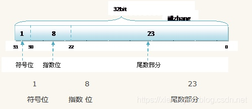
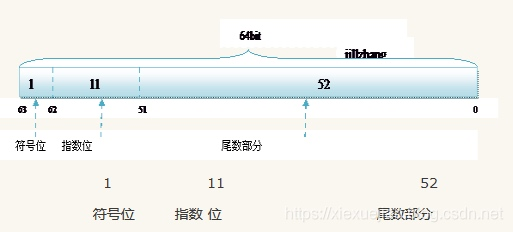

# float精度问题
#十进制的小数点如何用二进制表示
小数乘2, 取整数的值
如: 0.25 = 0.01
0.25 * 2 = 0.5, 整数位: 0
0.5 * 2 = 1.0, 整数位: 1
所以为二进制的0.01

0.45则是无限循环的0.0111001100110011....
0.45 * 2 = 0.9, 取 0
0.9 * 2 = 1.8 , 取 1
0.8 * 2 = 1.6, 取 1
0.6 * 2 = 1.2, 取 1
0.2 * 2 = 0.4, 取 0
0.4 * 2 = 0.8, 取 0
0.8 * 2 = 1.6, 取 1
0.6 * 2 = 1.2, 取 1
...

float和double都采用科学计数法的方式存储在内存
都有符号位: 1bit
指数位: float:8bit, double:11bit
(指数位第一位又是表示符号位, 所以有效位数是7)
尾数部分: float:23bit, double:52bit

0.45 = 0.0111011011... * 2^0
用float表示: 符号位是1, 指数位是0, 剩下的是尾数部分
1 00000000 0111001100110011...(23位)

用double表示
1 00000000 0111001100110011...(52位)

99999999 = 10111101011110000011111111 = 1.0111101011110000011111111 * 2^26 (不存在小数)
用float表示, 指数26, 所以要用26+127=153
1 10011001 0111101011110000011111111(里的23位)
由于位数有26位, 但是float只能表示23位, 所以会失去精度

这时候用double表示, 尾数部分有52位, 足够表示精度

综上所述, 虽然说float可以表示的数量可以很大, 但是精度问题不能保证.
double也不是所有精度都能保证, 只是保证的比float精准一些