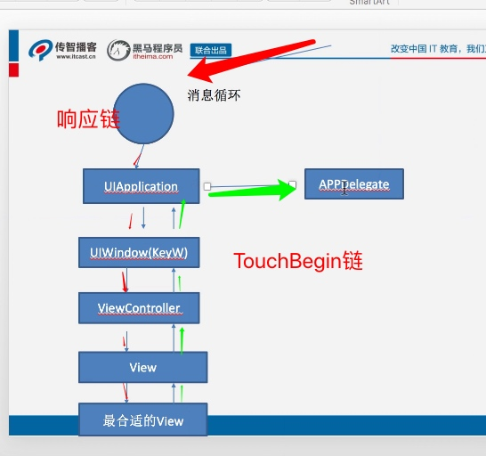
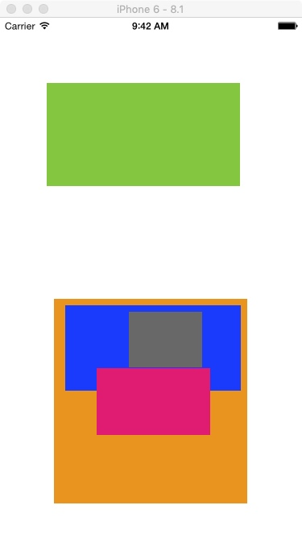
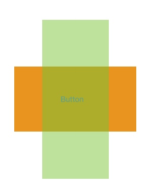

# 事件
* 事件分为3种
    * MultiTouch Event
    * Acceleration Event
    * Remote Control Event

* 能响应事件的, 只有继承UIResponder的对象才能响应事件
    * UIView, AppDelegate, UIViewController

##事件的产生和传递
* 事件由系统产生, 硬件设备收到用户的触摸后, 并反馈到系统, 系统再传送给UIApplication, 由UIApplication管理的<font color='red'>事件队列</font>里,
* UIApplication会从事件队列取出最前面的事件, 并将事件分发下去处理. 通常会先发送事件给主窗口(UIWindow)  
    * TODO:如果是AccelerationEvent或者RemoteControlEvent, 那第一个分发给谁处理呢?
* 主窗口会在视图层次结构中找到一个最适合的视图来处理触摸事件
* 找到适合的视图控件之后, 就会调用控件的touch方法来做具体的处理 


--
* 用户点击屏幕后产生的一个触摸事件, 进过一系列传递过程后, 会找到最适合的视图控件来处理这个事件
* 之后会调用该视图的处理事件方法
    * touchBegin, touchMove, touchEnd等等
* 这些touches方法的默认做法是: 将事件顺着<font color='red'>响应者链条</font>, 将事件交给上一个响应者进行处理

##个人理解: hitTest和touchBegin的联系
* 当发生触摸时, 首先调用hitTest来找到最佳响应者
* 然后调用该响应者的touchBegin套装方法来响应这些事件
* 而默认的touchBegin方法是调用上一级响应者的方法
* 所以当子View不实现TouchBegin的时候, 点击子View就是调用父View的touchBegin方法

##响应者链条
* 是由多个响应者连接组成的
* 起始位置都是UIApplication
* TouchBegin响应链(不代表响应链)
    * UIViewController -> UIWindow -> UIApplication -> AppDelegate


##案例解析

* 白色View是ZXView, 是VC的view
* 层级ZXView:0, Green:1.0, Orange:1.1, Blue:2.0, Red: 2.1, Black:3.0
* 当点击Green, 
    * hitTest: ZXView -> OrangeView -> Green
    * Touch: Green -> ZXView -> ViewController -> UIWindow -> UIApplication -> AppDelegate
    * 根据结果得知, 即使VC的view是ZXView, 在VC的touch之前, 还是要执行ZXView的touch
* 当点击Orange
    * hitTest: ZXView -> Orange -> Red -> Blue
    * Touch: Orange -> ZXView -> VC
* 点击Red:
    * hitTest: ZXView -> Orange -> Red
    * Touch: Red -> Orange -> ZXView -> VC
* 点击Blue:
    * HitTest: ZXView -> Orange -> Red -> Blue -> Black
    * Touch: Blue -> Orange -> ZXView -> VC
* 点击Black:
    * HitTest: ZXView -> Orange -> Red -> Blue -> Black
    * Touch: Black -> Blue -> Orange -> ZXView -VC

总结:
* HitTest的逻辑: 即寻找最佳响应者
    * 从底层View出发开始搜索
    * 在都符合基本响应前提下(hidden, alpha, userInterActionEnable..)
    * 每进过一层, 先从后向前遍历subView, 找到符合点击位置的subView就继续subView的hitTest, 否则返回self
* 找到最佳响应者之后, 形成响应者链条
    * 第一响应者最优先响应事件. 至于往不往上传, 就看第一响应者传不传
    * 往上传就调用Super来处理.

###HitTest默认逻辑如下:
```c
- (UIView *)hitTest:(CGPoint)point withEvent:(UIEvent *)event{
    NSLog(@"%s",__func__);
    //    1> 自己是否能接收触摸事件？否，事件传递到此结束
    if(self.userInteractionEnabled == NO || self.hidden || self.alpha <= 0.01) return nil;
    //    2> 触摸点是否在自己身上？否，事件传递到此结束
    if(![self pointInside:point withEvent:event]) return nil;
    //    3> 从后往前遍历子控件，重复前面的两个步骤
    for (int i = (int)(self.subviews.count-1); i >= 0; i--) {
        UIView *subView = self.subviews[i];
        //把当前坐标系的点转化为子控件坐标系的点
        CGPoint subP = [self convertPoint:point toView:subView];
        UIView *fitView = [subView hitTest:subP withEvent:event];
        if (fitView)  return fitView;
    }
    //    4> 如果没有符合条件的子控件，那么就自己最适合处理
    return self;
}
```    
* return nil则放弃响应
* return self就是自己响应
* <font color='red'>即: return 谁就从哪里开始响应, 如果OrangeView一直return self, 那GreenView便再无机会响应</font>
* 然后需要执行[subView hitTest]来确定子View是否响应, 根据结果来判断!
* 入参: 
    * point: 以当前self为原点, 如果point不在self上, x,y会出现负数
    * event: 由始至终, event对象都不变, 即使传到touch方法, 还是同一个对象, 在hitTest中, UITouch对象未生成, 在touch方法里才生成.
* 所以在调用subView的hitTest之前, 必须要把point转成以subView为原点的point
* <font color='red'>就算不使用上述自写代码, 默认的hitTest, 也会默认的调用pointInside方法来确认点是否在view内!!!</font>
* 但是却没有用上`converToPoint`的方法=.=

##响应者链条如何生成的: hitTest | pointInside (个人猜测)
从最根本开始执行hitTest, 每次执行完pointInside之后, 会就记录这个view, 继续遍历子视图. 之后响应链就慢慢生成. 然而touch的默认执行方法, 就是从响应链的尾部执行到头部


#触摸事件
##UIView默认不支持多点触摸
如题, 如果需要, 则要打开UIView的`_view2.multipleTouchEnabled = YES;`属性才行

#UIResponder
成为第一响应者才能第一个收到事件(个人瞎说=.=), 然后有能力把事件分发下去, 或者自己处理

UIResponder里都有方法去处理3大事件
```c
// Generally, all responders which do custom touch handling should override all four of these methods.
// Your responder will receive either touchesEnded:withEvent: or touchesCancelled:withEvent: for each
// touch it is handling (those touches it received in touchesBegan:withEvent:).
// *** You must handle cancelled touches to ensure correct behavior in your application.  Failure to
// do so is very likely to lead to incorrect behavior or crashes.
- (void)touchesBegan:(NSSet<UITouch *> *)touches withEvent:(nullable UIEvent *)event;
- (void)touchesMoved:(NSSet<UITouch *> *)touches withEvent:(nullable UIEvent *)event;
- (void)touchesEnded:(NSSet<UITouch *> *)touches withEvent:(nullable UIEvent *)event;
- (void)touchesCancelled:(NSSet<UITouch *> *)touches withEvent:(nullable UIEvent *)event;
- (void)touchesEstimatedPropertiesUpdated:(NSSet<UITouch *> *)touches NS_AVAILABLE_IOS(9_1);

// Generally, all responders which do custom press handling should override all four of these methods.
// Your responder will receive either pressesEnded:withEvent or pressesCancelled:withEvent: for each
// press it is handling (those presses it received in pressesBegan:withEvent:).
// pressesChanged:withEvent: will be invoked for presses that provide an analog value
// (like thumbsticks or analog push buttons)
// *** You must handle cancelled presses to ensure correct behavior in your application.  Failure to
// do so is very likely to lead to incorrect behavior or crashes.
- (void)pressesBegan:(NSSet<UIPress *> *)presses withEvent:(nullable UIPressesEvent *)event NS_AVAILABLE_IOS(9_0);
- (void)pressesChanged:(NSSet<UIPress *> *)presses withEvent:(nullable UIPressesEvent *)event NS_AVAILABLE_IOS(9_0);
- (void)pressesEnded:(NSSet<UIPress *> *)presses withEvent:(nullable UIPressesEvent *)event NS_AVAILABLE_IOS(9_0);
- (void)pressesCancelled:(NSSet<UIPress *> *)presses withEvent:(nullable UIPressesEvent *)event NS_AVAILABLE_IOS(9_0);

- (void)motionBegan:(UIEventSubtype)motion withEvent:(nullable UIEvent *)event NS_AVAILABLE_IOS(3_0);
- (void)motionEnded:(UIEventSubtype)motion withEvent:(nullable UIEvent *)event NS_AVAILABLE_IOS(3_0);
- (void)motionCancelled:(UIEventSubtype)motion withEvent:(nullable UIEvent *)event NS_AVAILABLE_IOS(3_0);

- (void)remoteControlReceivedWithEvent:(nullable UIEvent *)event NS_AVAILABLE_IOS(4_0);

```

#UITouch
当处理触摸事件的时候, 会传一个`NSSet<UITouch *> touches`的NSSet对象给我们
* 通过touches.anyObject来获取UITouch对象
* 当触摸手指就一个时, NSSet的count就只有一个
* 当触摸手指有两个时, Count就是2. 所以用anyTouches是随机获取其中一个给你. 此时你需要遍历, 都获取, 而不是anyObject

#HitTest方法
`- (nullable UIView *)hitTest:(CGPoint)point withEvent:(nullable UIEvent *)event;`
是UIView的方法

##UIView不接收事件的四种情况
1. userInteractionEnabled
2. hidden
3. alpha = [0~0.01]
4. 子控件范围超出父控件

以上前三种都是UIView的属性

##案例: 不到事件结束, 都不会改变响应者
当A_View被添加在VC的view上, 在A_View里面移动, 然后移动到A_View区域外面, 无论坐标在哪里, 响应事件的还是A_View
总结:
* 由触摸开始 -> 触摸移动 -> 触摸结束, 都是属于同一个事件, 使用同一个UIEvent对象.
* 所以从TouchBegin开始, 无论手指触摸到哪里, 甚至超出A_View的接线, 都还是A_View来响应, 因为事件没结束, 一开始决定是A_View来响应, 不到事件结束, 都不会改变!!

##HitTest案例


橙色绿色交接, 绿色不响应, 给橙色响应
图层结构: 白色:0, 橙色:1, Button:2, 绿色:1.1
重写GreenView的pointInside即可:
```c
- (BOOL)pointInside:(CGPoint)point withEvent:(UIEvent *)event {
    CGPoint orangePoint = [self convertPoint:point toView:self.orangeView];
    if ([_orangeView pointInside:orangePoint withEvent:event]) {
        return false;
    }
    return [super pointInside:point withEvent:event];
}

```

#手势: UIGestureRecognizer
* 继承NSObject, 并不是UIResponder, 所以不能响应事件
* 只能添加到View上, 让View能识别更多手势, 否则只能识别点击, 移动
* 

##缩放
```c
UIPinchGestureRecognizer *pinch;

//在target的selector上
view.transform = CGAffinetransformScale(view.transform, pinch.scale, pinch.scale);
/// 复位  由于手势是相对原始位置计算的旋转角度 复位可以试试保存
pinch.scale = 1;

//同理与旋转
-(void)rotation:(UIRotationGestureRecognizer*)rotation
{
    self.view.transform=CGAffineTransformRotate(self.view.transform, rotation.rotation);
    // 复位 默认传递的旋转的角度都是相对于最开始的位置
    rotation.rotation=1;
}
```


#事件和手势
参考文档: [ios事件处理](https://segmentfault.com/a/1190000013265845)

>摘要: 在UIApplication向第一响应者派发事件，并且遍历响应者链查找手势时，会开始执行响应者链中的touches系列方法。会先执行touchesBegan和touchesMoved方法，如果响应者链能够继续响应事件，则执行touchesEnded方法表示事件完成，如果将事件交给手势处理则调用touchesCancelled方法将响应者链打断。


当view有能力处理事件时, 同时view也有手势处理这个事件, 则会优先处理给手势处理. 事件会走cancel流程(begin->cancel)
```
[ZXView touchesBegan:withEvent:] //View的响应
[ViewController touchesBegan:withEvent:]
[ViewController asd] //点击手势响应
[ZXView touchesCancelled:withEvent:]
[ViewController touchesCancelled:withEvent:]

```

当你移动之后
```
[ZXView touchesBegan:withEvent:]
[ViewController touchesBegan:withEvent:]
[ZXView touchesMoved:withEvent:]
[ViewController touchesMoved:withEvent:]
...
[ZXView touchesMoved:withEvent:]
[ViewController touchesMoved:withEvent:]
[ViewController asd]
[ZXView touchesCancelled:withEvent:]
[ViewController touchesCancelled:withEvent:]

```

>摘要: 根据苹果的官方文档，手势不参与响应者链传递事件，但是也通过hitTest的方式查找响应的视图，手势和响应者链一样都需要通过hitTest方法来确定响应者链的。在UIApplication向响应者链派发消息时，只要响应者链中存在能够处理事件的手势，则手势响应事件，如果手势不在响应者链中则不能处理事件。

当子view不添加手势, 父view有手势, 子view和父view都有touches处理, 打印如下
```
[ZXView touchesBegan:withEvent:]// 子View
[ViewController touchesBegan:withEvent:]// 父view
[ViewController qwe]// 父view
[ZXView touchesCancelled:withEvent:]
[ViewController touchesCancelled:withEvent:]

```
意思是: 只要响应链上有手势. 就优先处理手势. 然后响应者会走cancel

>总结: 当事件到来时，会通过hitTest和pointInside两个方法，从Window开始向上面的视图查找，找到第一响应者的视图。找到第一响应者后，系统会判断其是继承自UIControl还是UIResponder，如果是继承自UIControl，则直接通过UIApplication直接向其派发消息，并且不再向响应者链派发消息。
>但是UIControl上面添加手势, 是优先响应手势.

>如果是继承自UIResponder的类，则调用第一响应者的touchesBegin，并且不会立即执行touchesEnded，而是调用之后顺着响应者链向后查找。如果在查找过程中，发现响应者链中有的视图添加了手势，则进入手势的代理方法中，如果代理方法返回可以响应这个事件，则将第一响应者的事件取消，并调用其touchesCanceled方法，然后由手势来响应事件。

>如果手势不能处理事件，则交给第一响应者来处理。如果第一响应者也不能响应事件，则顺着响应者链继续向后查找，直到找到能够处理事件的UIResponder对象。如果找到UIApplication还没有对象响应事件的话，则将这次事件丢弃。
>
>

场景一：
自定义多手势冲突。例如我们设置的单次点击、双击和三次点击手势，需要设置优先识别三击手势，识别失败后再识别双击手势；同理，双击手势识别失败后再识别单击手势。
```
    /// 自定义多手势冲突
    func test_1() {
        let oneGes = UITapGestureRecognizer(target: self, action: #selector(oneTap(tapGes:)))
        oneGes.numberOfTapsRequired = 1
        self.scrollVeiw.addGestureRecognizer(oneGes)
        
        let twoGes = UITapGestureRecognizer(target: self, action: #selector(twoTap(tapGes:)))
        twoGes.numberOfTapsRequired = 2
        self.scrollVeiw.addGestureRecognizer(twoGes)
        
        let threeGes = UITapGestureRecognizer(target: self, action: #selector(threeTap(tapGes:)))
        threeGes.numberOfTapsRequired = 3
        self.scrollVeiw.addGestureRecognizer(threeGes)
        // 优先级设置
        oneGes.require(toFail: twoGes)
        twoGes.require(toFail: threeGes)
    }
    @objc func oneTap(tapGes: UITapGestureRecognizer) {
        print("=================> oneTap")
    }
    @objc func twoTap(tapGes: UITapGestureRecognizer) {
        print("=================> twoTap")
    }
    @objc func threeTap(tapGes: UITapGestureRecognizer) {
        print("=================> threeTap")
    }
```

cancelsTouchesInView（是否取消向事件响应链传递）：
默认 YES，自定义的手势响应后，系统手势不再响应，但自定义手势识别前，会先执行系统手势。
设置为 NO 后，自定义手势和系统手势会同时识别响应。
delaysTouchesBegan（延迟响应链的识别）：
默认 NO，先执行响应链中的方法（系统方法），识别到自定义手势后，不再执行系统方法。
设置为 YES 后，优先识别自定义手势，当自定义手势识别失败后才会响应系统方法

————————————————
版权声明：本文为CSDN博主「kangpp」的原创文章，遵循CC 4.0 BY-SA版权协议，转载请附上原文出处链接及本声明。
原文链接：https://blog.csdn.net/kangpengpeng1/article/details/103919904

```
//手指触摸屏幕后回调的方法，返回NO则不再进行手势识别，方法触发等
- (BOOL)gestureRecognizer:(UIGestureRecognizer *)gestureRecognizer shouldReceiveTouch:(UITouch *)touch;
//开始进行手势识别时调用的方法，返回NO则结束，不再触发手势
- (BOOL)gestureRecognizerShouldBegin:(UIGestureRecognizer *)gestureRecognizer;
//是否支持多时候触发，返回YES，则可以多个手势一起触发方法，返回NO则为互斥
- (BOOL)gestureRecognizer:(UIGestureRecognizer *)gestureRecognizer shouldRecognizeSimultaneouslyWithGestureRecognizer:(UIGestureRecognizer *)otherGestureRecognizer;
//下面这个两个方法也是用来控制手势的互斥执行的
//这个方法返回YES，第一个手势和第二个互斥时，第一个会失效
- (BOOL)gestureRecognizer:(UIGestureRecognizer *)gestureRecognizer shouldRequireFailureOfGestureRecognizer:(UIGestureRecognizer *)otherGestureRecognizer NS_AVAILABLE_IOS(7_0);
//这个方法返回YES，第一个和第二个互斥时，第二个会失效
- (BOOL)gestureRecognizer:(UIGestureRecognizer *)gestureRecognizer shouldBeRequiredToFailByGestureRecognizer:(UIGestureRecognizer *)otherGestureRecognizer NS_AVAILABLE_IOS(7_0);
```

