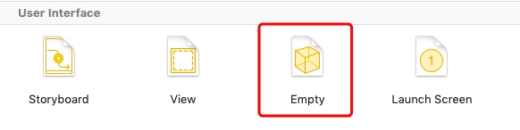
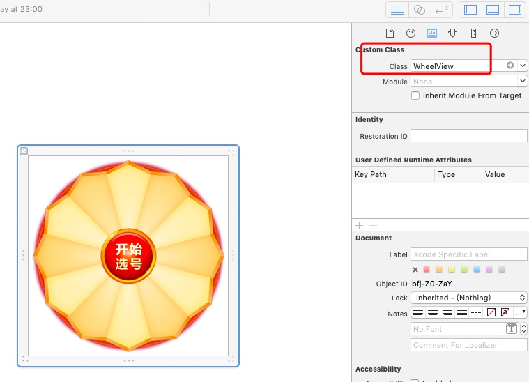

# 使用Xib
* 创建empty user interface
* 
* 画好你的view, 给好view的大小, 添加子view, 给定子view的约束
* 创建自定义View类
* 在xib里, 把祖view(最外面的view)与自定义view绑定
* 
* 使用代码加载xib, 创建view
    * `[NSBundle.mainBundle loadNibNamed:@"WheelView" owner:nil options:nil].lastObject`
    * 记得lastObject
    * 创建出来view多大就是xib设置的多大
* 使用xib.sb创建的view, 系统会调用view的initWithCoder, awakeFromNib
    * initWithCoder
        * 此时还没有子View, 使用祖view
    * awakeFromNib
        * 此时子View已经加载完毕
    * 可以xib与自定义view连线.从而拿到子view

#initWithCoder
任何对象, 只要实现了NSCoding协议, 都可以使用initWithCoder来初始化
任何时候, 只要通过文件来创建对象, 都会调用initWithCoder    