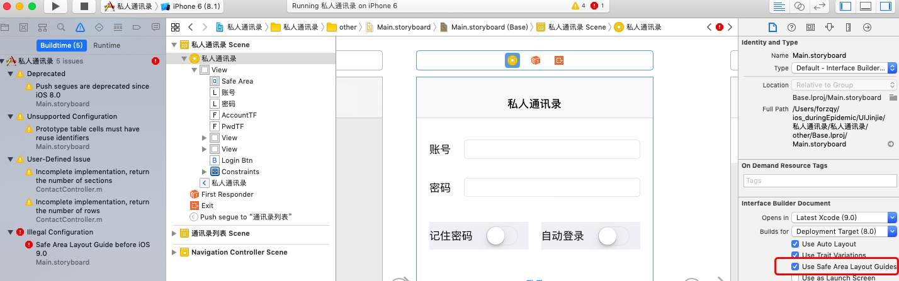

# 历届Xcode的区别
* Xcode6以前(不含6), 使用的是Image.xcassets, 只能加载png格式图片, Xcode6开始使用Assets.xcassets, 可支持jpg格式图片
* Xcode6以前会在项目中自动创建PrefixHeader.pch(PCH文件: Precompiled Header), 此后就需要手动创建


#历届iOS的区别
##UIApplication: 
* ios8以后, 要修改Applicable的badgeNumber(角标), 要先注册通知. 以前只要设置了角标就会显示, 用户无法控制.
    * 授权方式如下:
    
    * ```js
     if ([[[UIDevice currentDevice] systemVersion] doubleValue] >= 8.0) {
                UIUserNotificationSettings *settings = [UIUserNotificationSettings settingsForTypes:UIUserNotificationTypeBadge categories:nil];
                [[UIApplication sharedApplication] registerUserNotificationSettings:settings];
            }
        ```
* ios7以后, 状态管理由UIViewController管理, Application的statusBarHidden无效, 除非在info.plist里配置一项---`view Controller-based status Bar appearance` --> NO, 则状态栏交还给Application管理
    * 控制器如下控制StatusBar

    ```js
    /**
     *  隐藏状态栏
     */
    - (BOOL)prefersStatusBarHidden {
        return YES;
    }
    /**
     *  改变状态栏样式
     */
    - (UIStatusBarStyle)preferredStatusBarStyle {
        return UIStatusBarStyleLightContent;
    }
    ```
    
    * Application管理StatusBar如下:

    ```js
    UIApplication *app = [UIApplication sharedApplication];

    /****** 无动画 ***********/
    app.statusBarHidden = YES;
    app.statusBarStyle = UIStatusBarStyleLightContent;

    /****** 有动画 ***********/
    [app setStatusBarHidden:YES withAnimation:UIStatusBarAnimationSlide];
    [app setStatusBarStyle:UIStatusBarStyleLightContent animated:YES];
    ```
    
    * UIApplication管理StatusBar好处:
        *  可以设置动画
        *  更灵活, 随时随地改变状态栏样式

        
##Alert组件
ios8以后使用UIAlertController, 以前使用UIAlertView


##Safe Area Layout Guide
iOS9以前没有安全区域

把勾去掉就行

##NSUserDefault
iOS8以前, NSUserDefault是异步执行的, 若需要马上执行则调用`synchronize`
iOS8以后, 就不需要调用了

##3DTouch
ios9之后出现

##UITouch
UITouchType在IOS9.1以后多了笔尖, Apple Pencil

##infoPlist的key
NSPhotoLibraryAddUsageDescription是iOS 11新推出的隐私规则
当使用`UIImageWriteToSavedPhotosAlbum`来保存图片到相册上, 则要求这个key, 否则crash