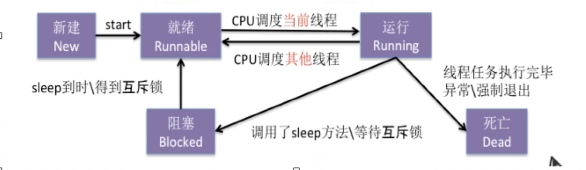

#多线程
1. 每个子线程创建的时候, 占512KB的栈内存, 主线程占512KB栈内存
2. 内存里, 栈速度比堆速度快
    1. 测试: 循环一千万次, 里面就赋值int a = 123, 和 NSString *a = @"123"对比, 用时明显不一样.


#NSThread
```c
NSThread *t = [NSThread alloc] initWithTarget:self selector:@selector() object:nil];
[t start];

//或者
[NSThread detachNewThreadSelector:@selector() toTarget:self withObject:nil];
```

* `[NSThread exit]; `强制退出
    * 在调用exit方法之前, 需要清除手动释放的资源
    * 主线程下不能调用, 不会蹦, 但UI不响应
* `[NSThread cancel];` 不能真正的取消, 只是打了个标记flag, 如果需要取消执行, 则需要在线程内部自己判断.
    * 判断[NSThread isCancel], 然后return出去就行了, 不用exit
    * 如果在线程被调度之前, 就调用了cancel, 则线程不会再被调度
* `[NSThread start];` 把线程放入<font color='red'>可调度池</font>里
* 
* `[NSThread threadPriority]; `[0,1], 1优先级最高
    * 高优先级: 确保该线程被CPU调度的频率会多, 不能保证该线程优先执行.
 
#互斥锁
`@synchronized(self.lockObj){code} `
self.lockObj是另外自己创建的NSObject对象, 平时没什么用, 就在互斥锁这里使用而已.
1. 能够保证同一时间内, 只有一个线程执行锁里的代码
2. 锁住的范围要尽可能小, 范围越大, 执行效率越差 
3. self.lockObj可以是任意的NSObject对象, 但每次访问的时候必须是要同一个对象, 才能锁住!一般用self即可

#原子属性
1. atomic, 默认属性
2. 保证同一时间, 只有一个线程可以修改, 但读取没有限制
    1. 所以只有在setter里加锁<font color='red'>(自旋锁)</font>, getter里没有加, 
    2. 如果重写了setter方法, 那必须要重写getter方法, 同时系统不会自动生成下划线的成员变量
        1. 此时使用@synthsize obj = _obj, 合成指令来解决
            1. 意思是为obj这个属性, 生成一个_obj的成员变量
            2. _obj的名字可以随便取, 不一定要和属性名一样

#自旋锁和互斥锁的区别
1. 相同点: 同一时间内, 代码只有一个线程能执行
2. 不同点: 如果是互斥锁, 线程发现代码被锁住时, 会进入睡眠状态. 如果是自旋锁, 发现发现代码被锁住, 会进入循环状态, 而不休眠 

#线程安全
1. 多个线程进行读写操作, 仍然能得到正确结果, 称之为"线程安全"
2. 线程安全必须要用到锁
3. NSMutableArray不是线程安全
    1. 多个子线程同时操作NSMutableArray, 比如同时addObject, 则会蹦, 因为同一个索引不能插两个obj
    2. 同理: NSMutableDictionary, NSMutableString, NSMutableAttributeString 

#学习心得
1. 为什么子线程不能操作UI
    1. 因为UI不是线程安全. 是为了更好的用户体验. 没加锁. 更快

    
