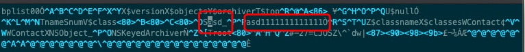
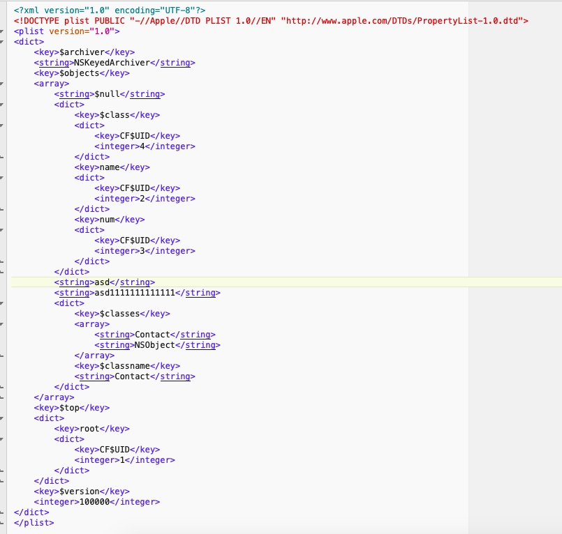

# 沙盒
沙盒有三个文件夹: Documents, Library, tmp
Documents, iTunes同步APP时会复制这个
Library, 里面也有两个文件夹, Preferences和Caches, 
* 而Preferences是是APP的用户设置, NSUSerDefault的结果, 文件名字\</BundleID/>.plist, iTunes同步的时候会同步这个
* Caches则不会同步

tmp也不会同步

##获取沙盒路径
获取Documents路径
```c
NSString *home = NSHomeDirectory();
NSString *Document = [home stringByAppendingPathComponent:@"Documents"];
NSString *document = [home stringByAppendingString:@"/Documents"];


NSSearchPathForDirectoriesInDomains(NSDocumentDirectory, NSUserDomainMask, YES)
=.=只能使用NSUserDomainMask
```

#writeToFile
如果存储NSArray, NSDictionary, NSString, NSData, 就是用`writeToFile`API
```c
[array writeToFile:path atomically:YES];
[dictionary writeToFile:path atomically:YES];
[string writeToFile:path atomically:YES encoding:NSUTF8StringEncoding error:nil];
[data writeToFile:path atomically:YES];
```

#NSKeyedArchiver
归档之后的内容是没加密的, 可解读

使用TextWrangler可以更好的解读


```c
//filePath是沙盒路径, c是遵循NSCoding协议的对象
[NSKeyedArchiver archiveRootObject:c toFile:filePath];
//执行上述代码之后, 框架会生成NSCoder对象, 作为入参, 执行c的`encodeWithCoder:`
- (void)encodeWithCoder:(NSCoder *)aCoder {
    [aCoder encodeObject:self.name forKey:@"name"];
    [aCoder encodeObject:self.num forKey:@"num"];
}

- (nullable instancetype)initWithCoder:(NSCoder *)aDecoder {
    //注意, 这里如果父类也遵循了NSCoding协议, 则要输入[super initWithCoder:aDecoder]
    self = [super init];
    if (self) {
        self.name = [aDecoder decodeObjectForKey:@"name"];
        self.num = [aDecoder decodeObjectForKey:@"num"];
    }
    return self;
}

```

