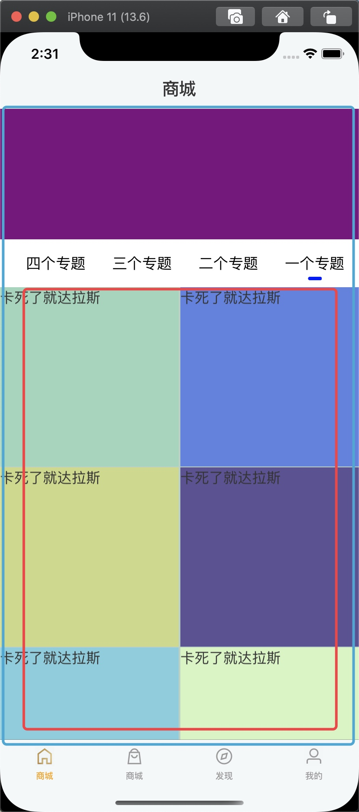

# cancelPreviousPerformRequestsWithTarget
```c
- (void)touchesBegan:(NSSet<UITouch *> *)touches withEvent:(UIEvent *)event {
    NSLog(@"%s", __FUNCTION__);
    //只能配合带afterDelay的performSelector方法来使用, 在sad里调用dispatch_after是没用的, 本方法的机制是在performSelector在Selector调用之前cancel
    [NSObject cancelPreviousPerformRequestsWithTarget:self selector:@selector(sad) object:nil];
    
    [self performSelector:@selector(sad) withObject:nil afterDelay:5];
    
}

- (void)sad {
    NSLog(@"%s", __FUNCTION__);
}

```

#古老的写法
```c

// 获取安全区
#define VIEWSAFEAREAINSETS(view) ({UIEdgeInsets i; if(@available(iOS 11.0, *)) {i = view.safeAreaInsets;} else {i = UIEdgeInsetsZero;} i;})
 
#define XHISGIFTypeWithData(data)\
({\
BOOL result = NO;\
if(!data) result = NO;\
uint8_t c;\
[data getBytes:&c length:1];\
if(c == 0x47) result = YES;\
(result);\
})
 
#define XHISVideoTypeWithPath(path)\
({\
BOOL result = NO;\
if([path hasSuffix:@".mp4"])  result =  YES;\
(result);\
})
 
#define XHDataWithFileName(name)\
({\
NSData *data = nil;\
NSString *path = [[NSBundle mainBundle] pathForResource:name ofType:nil];\
if([[NSFileManager defaultManager] fileExistsAtPath:path]){\
    data = [NSData dataWithContentsOfFile:path];\
}\
(data);\

————————————————
版权声明：本文为CSDN博主「枫志应明」的原创文章，遵循CC 4.0 BY-SA版权协议，转载请附上原文出处链接及本声明。
原文链接：https://blog.csdn.net/wsyx768/java/article/details/102943300
```

2.用来写手势
```c
UIView * tagView = [myLjjTools createViewWithFrame:CGRectMake(SCREEN_WIDTH- W_In_375(70), 0, W_In_375(70), SCREEN_HEIGHT) andBgColor:nil];
[self.view addSubview:tagView];
[tagView addGestureRecognizer:({
    UITapGestureRecognizer *tap = [[UITapGestureRecognizer alloc] initWithTarget:self action:@selector(showToolMenuyyy)];
    tap;
})];
```
3.用来设置frame

```c
self.tabBar.frame = ({
    CGRect frame = self.tabBar.frame;
    CGFloat tabBarHeight = self.tabBarHeight;
    frame.size.height = tabBarHeight;
    frame.origin.y = self.view.frame.size.height - tabBarHeight;
    frame;
});
```

4.用来初始化视图
```c
self.numberLabel = ({
    UILabel *label = [[UILabel alloc] init];
    label.textAlignment = NSTextAlignmentCenter;
    label.layer.masksToBounds = YES;
    label;
});
[self.contentView addSubview:self.numberLabel];
```
其实意思很简单
```
/**
 *括号中将view赋值给tempView，括号外可以使用tempView执行各种操作
 *{} 包装代码
 *() 表示执行
 */
UIView *tempView = ({
    UIView *view = [[UIView alloc] initWithFrame:CGRectMake(0, 0, 200, 200)];
    view.backgroundColor = UIColor.redColor;
    [self.view addSubview:view];
    view;
});
NSLog(@"%@",tempView);
```
————————————————
版权声明：本文为CSDN博主「枫志应明」的原创文章，遵循CC 4.0 BY-SA版权协议，转载请附上原文出处链接及本声明。
原文链接：https://blog.csdn.net/wsyx768/java/article/details/102943300

#宏的符号
##两个'#'
```c
#define kConnect(x,y) x##y
```
kConnect(123,456) 等价于 123456
##一个'#'
一个 # 号
表示加双引号
```
#define kToString(x) #x`
```
kToString(123) 等价于 "123"

显然，这个一个C字符串

要想变成OC的字符串

还需要改进一下:
```
#define kToString(x) @""#x
```
or
```
#define kToString(x) @#x
```

#用宏判断系统版本
```
#ifdef __IPHONE_10_3
  //iOS10 的新特性代码
#endif


#if __IPHONE_OS_VERSION_MAX_ALLOWED >= __IPHONE_10_3

  //系统版本大于iOS 10.3 的新特性代码
#endif
```

#用取宏的名字
```
#define kName1(name) name
#define kName2(name) #name
#define ZXName @"a"

NSLog(@"%@", kName1(ZXName); //a
NSLog(@"%s", kName2(ZXName); //ZXName
```

#宏: 一段计算的代码, 结果返回给宏
```
#define isIPhoneXSeries  \
({BOOL isPhoneX = NO;\
if (@available(iOS 11.0, *)) {\
isPhoneX = [[UIApplication sharedApplication] delegate].window.safeAreaInsets.bottom > 0.0;\
}\
(isPhoneX);})
//进过一系列判断和计算, 返回iPhoneX
```

#计算iosUI安全区域
```
/** 适配导航栏 */
#define SafeAreaTopHeight (isIPhoneXSeries ? 88.f : 64.f)
/** 适配tabbar*/
#define SafeAreaTabbarHeight (isIPhoneXSeries ? 83.f : 49.f)
/** 适配底部角无tabBar时 */
#define SafeAreaBottomHeight (isIPhoneXSeries ? 34.f : 0.f)
#define kstatusBarHeight (isIPhoneXSeries ? 44.0 : 20.0)
#define iphoneXStatusBarHeight 44
```

#NSString 多行
```
NSString *asd = @"asdasdas"
    "asd"
    "zxczxc"
    "awqewqe";
    NSLog(@"%@", asd);//asdasdasasdzxczxcawqewqe
```

#UIScrollView的s.panGestureRecognizer.cancelsTouchesInView
默认为YES
1. 表示在发生平滑手势的时候, touch对象不会传给scrollView, 会通过cancelTouch方法来取消这个时间的传递
2. 此时scrollView只会调用TouchBegin, TouchCancel(begin刚结束, 就马上调用cancel了), 不会调用TouchMove

改为NO
1. touch事件会传递给ScrollView, scrollView会调用TouchBegin, Move, End


#UIScrollView的contentInsetAdjustmentBehavior
前提: 在带NaviBar的VC上, scrollView的frame = self.view.bounds
当给scrollView添加subView的时候, 才有效果. 坐标0,0默认是bar的下面开始
在ios11之后, 才使用这个属性, 在之前使用VC的setAutomaticallyAdjustsScrollViewInsets

#@dynamic  @synthesize
```
class Person:NSObject
property view; //私有

- view; //实现getter

class Me:Person
property view: //私有
@dynamic view; //声明动态
```
1. 父类实现getter, 子类只是声明property
2. 子类的property展开后会覆盖父类getter
3. 所以子类调用getter的时候会得到nil
4. 此时要添加@dynamic view; 才会调用父类的getter

#requireGestureRecognizerToFail
实用例子:
应该就是两者recognizer不能共存的意思吧=.=



蓝框: NestTableView , 红框: ContentView
1. 当contentView左右滑动的时候, 会连带这NestTableView上下滑动
2. `[NestTableView.panGestureRecognizer requireGestureRecognizerToFail: contentView.panGestureRecognizer]`
3. 即可解决这个问题, 两者将不同时存在