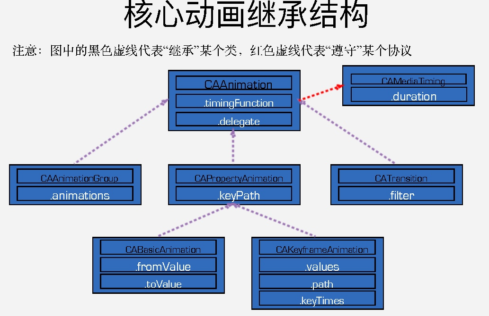
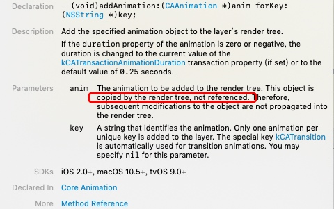
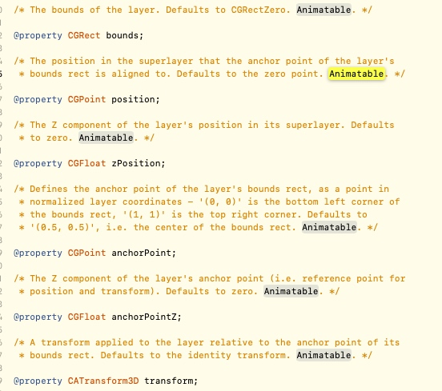
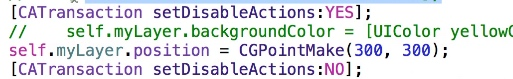
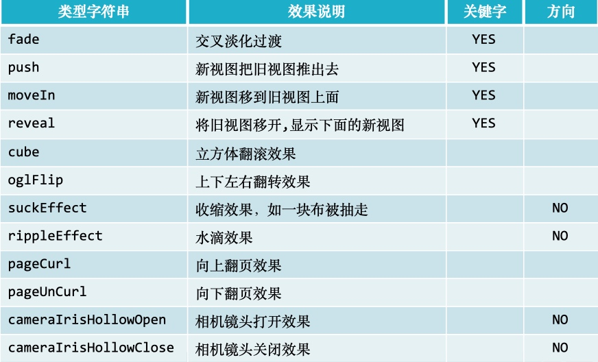

# 核心动画
* 动画的执行是在后台操作的, 不会阻塞主线程.
* 动画是直接作用在CALayer上, 不是UIView
* 在执行动画的时候, View还在原地!! layer也在原地=.=, 那动画的是什么=.=?
    * 如果使用UIView的封装动画, 那不论是修改view还是layer, 都会移动!!
    * 核心动画发生的是假象, UIView动画才是发生位移



# CALayer
* layer是用来显示和动画的
* UIView是监听和响应事件的
* UIView本身不具备显示功能, 是由于有Layer存在才能显示
* 当UIView将要显示到屏幕上时, 会调用drawRect来进行绘图, 绘制到自己图层上, 绘图完毕后, 会将图层拷贝到屏幕上, 于是完成UIView的显示

## CALayer addAnimation(创建的animation对象和执行时的对象不一样!)

1. 创建好的animation对象, 执行这个方法后, 会被系统copy, 随后的修改将无效!
2. 所以animation对象被copy之后, 若无其他强引用, 则会被释放, 执行时的对象执行完之后, 默认会被remove, 也会被释放.

# 隐式动画(implicit animation)
一般创建view的时候都会自带一个layer, 如果是自己创建layer, 一般改变这个layer的某些属性时, 会自带动画, 我们称这些属性为: Animatable Properties.

在CALayer.h里面, 带有animatable的属性都是有隐式动画的.

上述动画的配置项是由CATransaction类来配置的, 比如动画时长
CATransaction.h里面全是类方法, 所以我猜=.=, 无论是隐式动画(implicit animation), 还是显式动画(explicit animation), 都根据CATransaction来配置.
所以, 针对某个动画修改配置时, 需要该动画结束之后, 把配置复原, 否则会影响其他动画


#基本动画(位移, 缩放, 旋转, 透明度)
CABasicAnimation: toValue, fromValue

```c
CABasicAnimation *animation = [CABasicAnimation animation];
animation.keyPath = @"position.y";
animation.beginTime = CACurrentMediaTime() + 3;
animation.duration = 3;
animation.fromValue = @(500);
animation.toValue = @(300);
[_aView.layer addAnimation:animation forKey:nil];

//若fillMode: kCAFillModeRemoved | kCAFillModeForwards; removeOnCompletion: YES
//3秒之后进入动画初始状态, 并马上执行动画, 结束动画回到原位0

//若fillMode = kCAFillModeBackwards | kCAFillModeBoth; removeOnCompletion: YES
//马上进入动画初始状态, 3秒后执行动画, 结束动画回到原位0

//若fillMode = kCAFillModeRemoved; removeOnCompletion: NO
//3秒之后进入动画初始状态, 并马上执行动画, 结束动画回到原位0

//若fillMode = kCAFillModeForwards; removeOnCompletion: NO
//3秒之后进入动画初始状态, 并马上执行动画, 结束动画停留在最后一帧

//若fillMode = kCAFillModeBackwards; removeOnCompletion: NO
//马上进入动画初始状态, 3秒后执行动画, 结束动画回到原位0

//若fillMode = kCAFillModeBoth; removeOnCompletion: NO
//马上进入动画初始状态, 3秒后执行动画, 结束动画停留在最后一帧
```

##动画的暂停和继续
通过layer的beginTime, timeOffset, speed来设置
> 暂时不知道原理=.=, 反正暂停和继续代码如下=.=, 得闲再研究

```c
/*
暂停
*/
_aView.layer.speed = 0;
    _aView.layer.timeOffset = CACurrentMediaTime();
```

```c
/*
继续
*/
CFTimeInterval pauseTime = _aView.layer.timeOffset;
    _aView.layer.speed = 1.0;
    _aView.layer.timeOffset = 0;
    _aView.layer.beginTime = 0;
    
    //继续时的时间与暂停时间差
    CFTimeInterval timeSincePause = CACurrentMediaTime() - pauseTime;
    _aView.layer.beginTime = pauseTime;
```

# 帧动画
CAKeyframeAnimation: 
设置path: CGPath 或者 value: NSArray

#转场动画

```
UIWindow *win = [UIApplication sharedApplication].keyWindow;
CATransition *transition = [CATransition animation];
transition.duration = 0.5;
transition.type = kCATransitionFade;
transition.timingFunction = [CAMediaTimingFunction functionWithName:kCAMediaTimingFunctionEaseInEaseOut];
[win.layer addAnimation:transition forKey:nil];
UIViewController *vc =[ViewController new];
vc.view.backgroundColor = UIColor.brownColor;
win.rootViewController = vc;
```
1. CATransition都是一次性的, 用完一次, 又要重新创建一个, 然后加入到layer
    1. 可以创建CAAnimation的分类, 打印dealloc看看, 每次动画结束都会释放animation