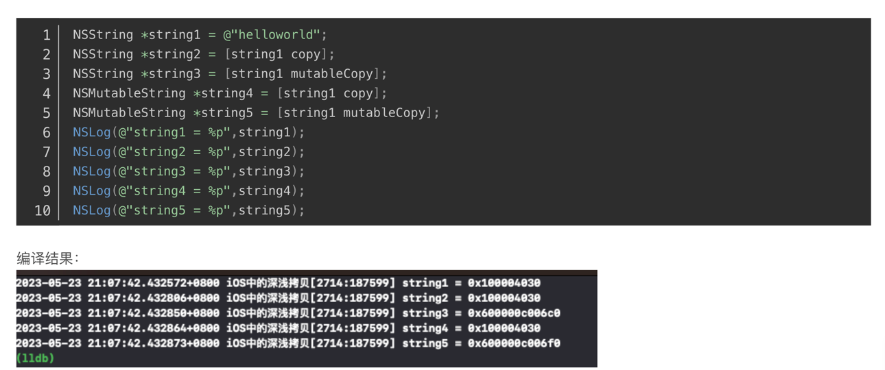
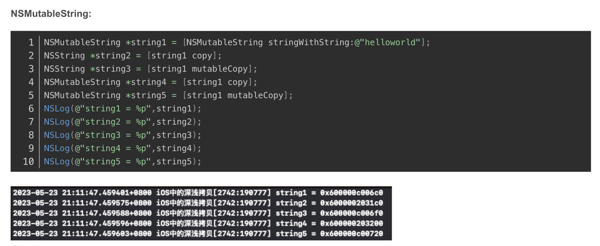
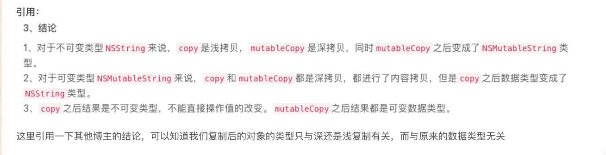
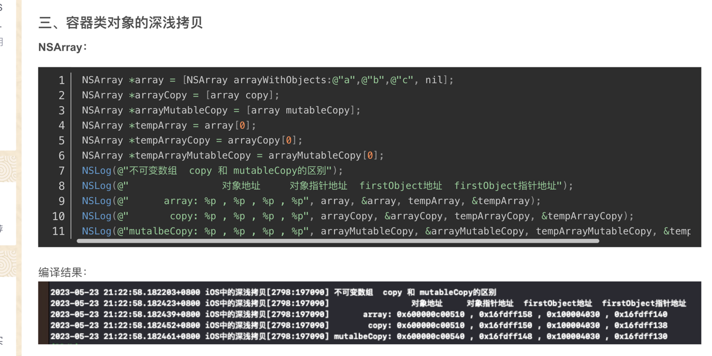
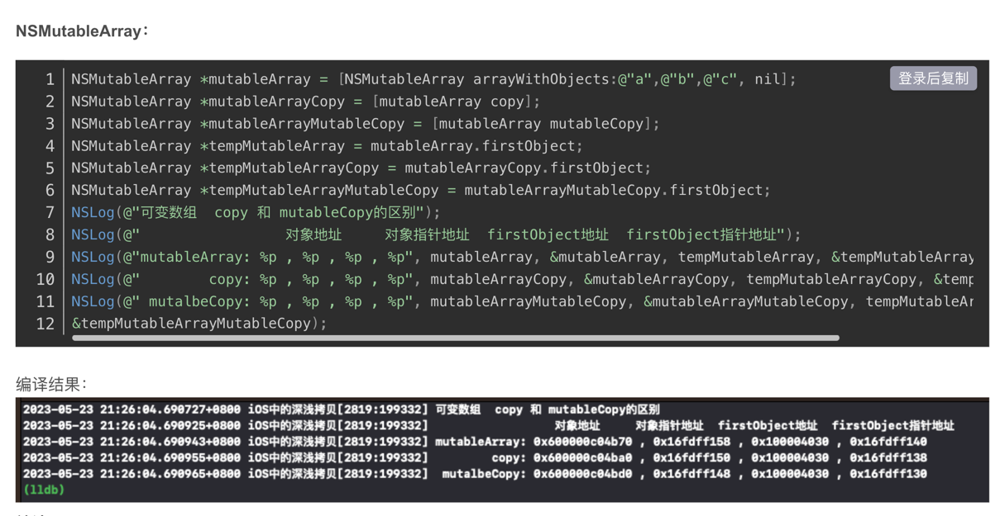
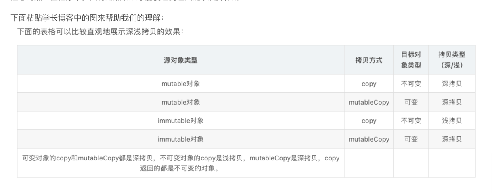

1. 浅拷贝: 只是创建一个空间, 存放对象的指针, 对象并没有被拷贝, 对象被修改, 则两个指针变量所指向的对象也被修改
2. 深拷贝: 对象被重新拷贝一份, 存放到新的地址, 新指针指向新地址, 对象被修改, 不影响原对象.

# NSString 和 NSMutableString的深拷贝和浅拷贝

1. 首先要知道浅拷贝和深拷贝是个概念, 不是方法. copy和mutableCopy是方法
2. 上述可知, NSString的copy, 只是浅拷贝, 只是把字符串对象地址给了新变量而已, 而mutableCopy就是深拷贝, 是创建了一个新对象, 有了新的地址
3. 只是因为NSString做了性能优化处理, 每次深拷贝, 得到的都是同一个地址

1. NSMutableString的copy, 是深拷贝, 因为创建了新的地址, mutableCopy也是深拷贝. 
2. 每次深拷贝得到的对象, 都是新的地址, 跟NSString不一样.

这里只是针对NSString和NSMutableString的copy和mutableCopy的后得到的对象类型做说明,
copy和mutableCopy本身不是指浅拷贝和深拷贝, 只是他实现了在不同场景下的浅拷贝和深拷贝.

# NSArray 和 NSMutableArray的深拷贝和浅拷贝

1. 上述可知, NSArray的copy,是浅拷贝, 
   1. 但是我不能理解的是, &arr[0]会变, 浅拷贝是指原对象地址不变, 那这个对象里用于存储的第一个对象地址的空间也应该不会变.才对,算了. 不懂=.=
   2. 已通过xcode验证, 确实&arr[0]会变
2. NSArray的mutableCopy是深拷贝, 他创建了一个新的NSMutableArray对象, 只是元素指向的对象还是不变

1. 纵向观看.
2. NSMutableArray的copy和mutableCopy都是深拷贝, 这点跟NSString很像
3. 但是里面的元素都不变. 这点得牢记. (但是这不是浅拷贝和深拷贝的概念, 是copy和mutableCopy的实现导致的)

为什么数组, 无论是copy还是MutableCopy, 里面的元素都是不变的.
1. 这是因为数据中存储的是对象的地址, 而不是对象本身. 
2. 所以就算是深拷贝, 也是新建一个空间, 但里面放的还是原来对象的地址.
3. 而浅拷贝, 只是新建一个指针对象, 指向原来的数组地址.

总结

# 思考拓展
1. 解档 归档, 是通过实现NSCoding协议, 把对象转成二进制, 再吧二进制转成对象, 得到全新的对象. 打到深拷贝的效果
2. 自定义对象, 要进行copy和mutableCopy, 需要实现NSCopying协议, copy之后得到的是新对象, 但属性还是原来的属性
3. 如何对对象进行深层次的深拷贝
   1. 在实现NSCopying协议的时候. 对属性进行深拷贝处理.
4. 容器对象深拷贝
   1. 添加新方法, 拷贝时, 把容器对象里的一一重新深拷贝, 放入新拷贝的数组里.