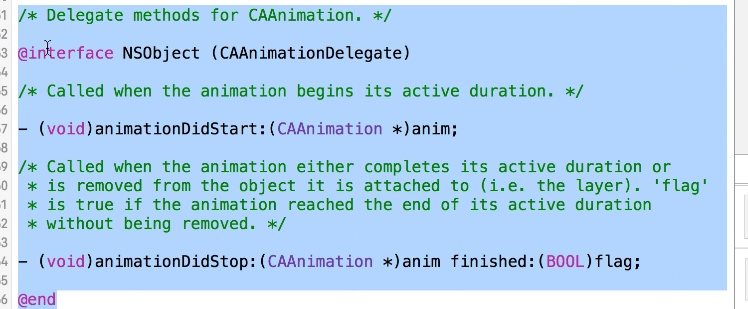

# 使用分类声明协议内容(非正式协议)
一般使用代理的时候都会声明协议, 然后某个类实现这个协议来做代理

这种方法就是不声明protocol, 使用NSObject分类, 名字就叫xxxDelegate

比如VC要做这个代理, 必须要实现这个协议, 一般在类扩展上`<XXXDelegate>`这样实现协议, 并实现协议里的方法
但上面使用NSObject的分类, 则不用实现协议, 直接在代理类上, 重写这两个方法即可. 之后还是一样把代理对象赋值给代理属性 `XXX.delegate = self;`

综上所述:
1. 协议的意义是为了扩展方法, 同样NSObject的分类也可以扩展方法, 起到同样的效果.
2. 没有第二=.=