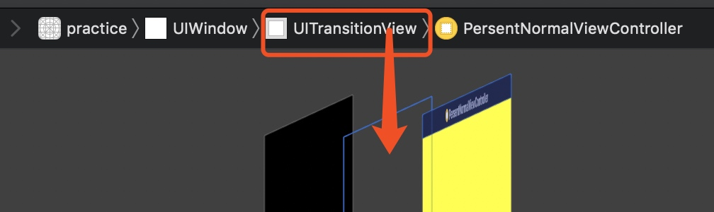
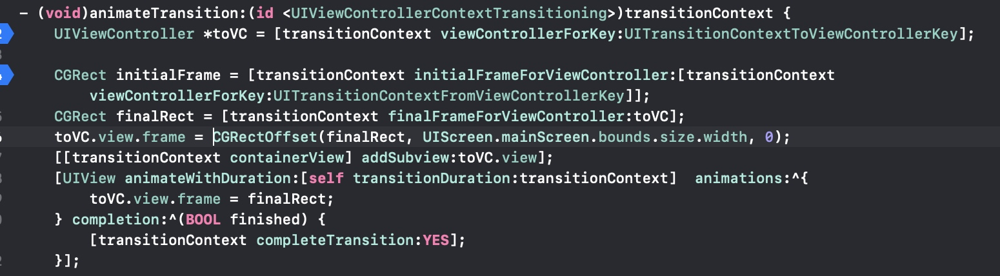

# 转场动画
* 转场动画有几种系统默认好的style, 通过presentedVC的modalTransitionStyle来设置, 默认modal的方式, 其他还有渐变, 水平翻转, 由下至上"翻页"
* 也可以设置vc的transitionDelegate, 那样子style就无效了. 通过一个实现UIViewControllerTransitioningDelegate的对象
    * 该对象几个方法, 头两个方法都是返回一个对象, 实现UIViewControllerAnimatedTransitioning
    * 该协议主要定义动画的duration, 和具体的动画实现.
    * 动画的实现, 主要要依赖一个context<UIViewControllerContextTransition> (系统生成的)
        * context可以拿到presentedVC, 通过viewControllerFromKey: UIViewControllerContext..ToVC
        * context可以拿到transitionView, 就是context.containerView
            * 这个TransitionView是当发生present的时候, 会在源VC前加一个TransitionView
            * 
            * 最必须的操作就是要拿到presented的View, 然后transitionView addSubView: presentedView 
            * 所以要明白的是: present出来之后, presentedView不是加入到原来的VC.View上, 而是系统生成的transitionView上
            * 最后要注意的是, 动画执行完, 必须要执行context的completeTransition方法
* DEMO:
* 
* 
