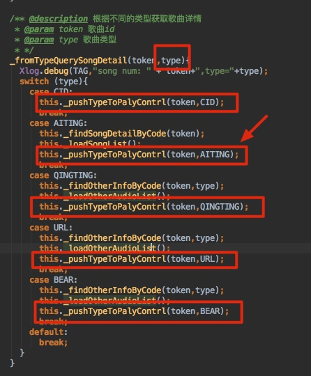
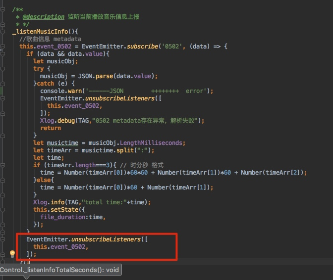

#RN 订阅通知规范
## 1. 订阅`Native`端通知使用`EventEmitter.subscribe`, 订阅RN内部的通知使用`EventEmitter.subscribeIn`

示例:
     
     
     
* 以上代码中订阅`musicInfoType`通知使用了`EventEmitter.subscribe`, 但这个通知在Native端是找不到的.只有在RN端的一处找到, 而且两者有业务上的逻辑关联, 所以我认为除了RN端这处以外不存在Native端SDK或其他地方发出的通知.
* 虽然这样RN发起通知, 也能够接收到, 因为订阅Native的通知, 原理也是在订阅RN通知的基础上实现的, 可以达到接收RN内部通知的效果. <font color='red'>但是这样子是不规范, 在其他同学定位问题时, 会误导他先去Native端找这个通知</font>

##2. 当逻辑复杂时, 注意订阅通知的逻辑, 不要同个对象多次订阅同个通知.
示例: 
在`PlayControl.js`里有个订阅0502的通知如下:

他的订阅时机如下:

* 该订阅唯一的入口就是这里, 在订阅`musicInfoType`通知的回调, 当data.type==1时(PS:const AITING=1), 就会订阅0502通知
* 再看看`musicInfoType`推送的时机
    * 在`music-play.js`里
    * 只有这里推送通知
    * 上面方法只有这里5处调用到, 只有箭头指着的时候才会去订阅0502
    * 而以上的方法会有<font color='red'>2处</font>被调用到, 由于代码太长, 有兴趣的同学可以沿着这个思路跟下去, 我就不贴上来了.
        * 一个是`music-play.js`初始化的时候会调用一次网络请求
            * 
            * 当出现上面红框中的`1`的时候, <font color='red'>会订阅一次`0502`!</font>
        * 另一个是`music-play.js`中, 订阅了`05`的Native通知, 当type=1且token变了的时候, <font color='red'>这里的业务逻辑就是:每次切歌的时候便会再次订阅0502通知. 所以会多次订阅. 如果连续切歌, 就不止订阅2次了.</font>
        ```JSON
        {
    devid = "d1deefc8-15bf-4c6b-bdd4-f0f1a440d371";
    key = 05;
    value =     {
        bufferState = 0;
        metadata = "{\"title\":\"\U7231\U4f60\U5c31\U8981\U5ac1\U7ed9\U4f60\",\"artistName\":\"\U6d77\U54f2\U660e,\U5e84\U5fc3\U598d\",\"LengthMilliseconds\":\"03:15\"}";
        playState = 1;
        progress = 93857;
        token = 9932362;
        type = 1;
    };
}
```


##3. 保证订阅一次释放一次
示例:

* 这种写法是按道理是没问题的, 这么写是为了让通知只执行一次避免多余的操作.
* 但这种写法忽略了一个情况: 就是通知没来得及走回调, 页面就被pop回去了, 即UNmount了. 这样改通知就没被释放了. 并会一直保存在内存.
    * 此时测试同学做一个不断push页面, 不断pop页面的连续操作, 这样就会大量存在这个通知在内存, 比如存在10个这样的订阅对象在内存, 只要Native端发送一次0502, 那这个回调就会被执行10次, 这样`EventEmitter.unsubscribeListeners`就会被执行10次, 会导致iOS的Native端把Native与RN的通信的通知remove掉. 从而导致RN接收不到Native的通知. (有兴趣的同学可以研究一下RCTEventEmitter这类, 仅限iOS端. 安卓端本人不太了解)----<font color='red'>所以会出现进度条不滚动问题</font>
* 