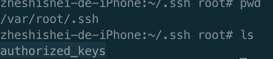
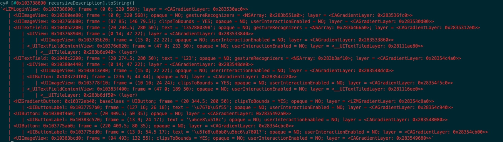
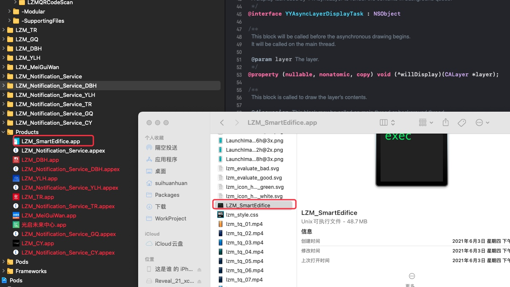

# SSH
SSL, openSSL, SSH, OpenSSH

SSL 是secure Socket Layer, 安全套接层, 是网络协议
OpenSSL, 是SSL的开源实现, HTTPS = Http + OpenSSL
SSH 是Secure Shell 安全外壳协议, 是两端安全连接的协议, 基于SSL实现的协议
OpenSSH, 是SSH的实现.

手机要安装OpenSSH
链接方式 SSH 用户名@ip地址, ex: 
`ssh root@192.168.3.23`
密码一般都是alpine
服务器发送公钥出来, 客户端确认公钥是正确之后, 进行连接, 并保存这个公钥在mac: ~/.ssh/know_host
服务器(手机)公钥保存在: /etc/ssh/ssh_host_rsa_key.pub

删除客户端保存的服务器公钥: ssh-keygen -R 域名, ex: 
`ssh-keygen -R 192.168.1.23`
或者直接到~/.ssh/know_host, vim编辑一下, 把对应的ip地址的那行删掉即可

免密登录
SSH协议里优先会执行这个逻辑, 如果走不通, 才会要求客户端输入密码
免密登录意思是客户端自己生成一对RSA秘钥, 把自己的公钥追加到服务器的authorized_keys(路径: ~/.ssh/authorized_keys)文件里, 这样下次登录就可以不用输入密码了, 具体操作: 
`ssh-keygen`在客服端生成一对RSA秘钥, 路径: ~/.ssh/
`ssh-copy-id root@192.168.1.23`
手机的~, 即/var/root, 所以authorized_keys在/var/root/.ssh里



SSH有两个版本, SSH-1, SSH-2
客户端和服务器两端都要使用相同版本的SSH, 如何查看?
mac: /etc/ssh/
作为客户端时, 查看ssh_config, 作为服务器时, 查看sshd_config
手机: /etc/ssh/
同理与mac

Cycript, 结合ES6, objective-C++, java的语言, 可以调试运行中的app
首先手机安装cycript
调试某个app, 则执行cycript -P 端口号, 或者cycript -P 应用名
如何获得端口号或应用名, 要手机安装adv-cmds, 然后输入指令: 
`ps -A` 或者 `ps -A | grep 关键字`

usbmuxd : USB调试
SSH是通过网络来传输接受数据的, 我们手机想通过USB来接受指令, 可以使用usbmuxd
原理:
使用SSH让mac跟mac链接, ssh是使用22端口的, 让他链接到自己的10010端口(自定义), 然后让usbmuxd把10010端口的东西通过USB数据线转发到手机的22端口.即可
安装地址: [usbmuxd](https://cgit.sukimashita.com/usbmuxd.git/snapshot/usbmuxd-1.0.8.tar.gz)
下载好之后, 直接使用到`/Python-client/tcprelay.py`,这个文件
执行如下指令, 即可把端口10010的数据发送到远程22端口
`python ~/python-client/tcprelay.py -t 22:10010`
会一直卡死, 因为一直在监听, 此时需要另起一个终端, 输入登录指令, 此时要登录到localhost, 而不是远程ip
`ssh root@localhost -p 10010`
> PS: 注意不要连接多个手机, 否则会出错.
> 

#编写脚本
在~目录下创建shell脚本, `observe.sh`
写上`python ~/python-client/tcprelay.py -t 22:10010`
然后执行sh文件方式
```shell
source observe.sh
. observe.sh
bash observe.sh
sh observe.sh
```
以上4中方式都可以执行脚本, 区别:
source 和 . 是一样的, 但执行环境都在当前环境
bash 和 sh执行时会另起进程去执行, 不会改变当前环境

#Cycript语法
`UIapp`代表UIApplication.shareApplication对象
`#内存地址`代表该地址的对象
`*对象`打印该对象的成员变量

##递归打印view的子控件
`[view recursiveDescription]`
`对象.toString()`打印完整

可以简单的使用JS语法, 效果一样
`UIApp.keyWindos.recursiveDescription().toString()`

##查看app的沙盒(appleStore下载的app)
只要找到app沙盒所在路径, 即可访问app的沙盒
在cycript调试下, 输入`NSHomeDirectory()`即可拿到路径, 然后cd到这个路径即可


#手机终端命令
重启SpringBoard: `killall SpringBoard`
重启手机: `reboot`

##ipa包的生成

代码经过编译+链接+签名后, 会变成.app文件, 文件里面有个"可执行文件", 格式为`Mach-O`

把.app文件放进Payload文件夹里, 再压缩成.zip, 把zip改成ipa即可!

##终端命令寻找方式
先`/usr/bin`
后`/usr/local/bin`