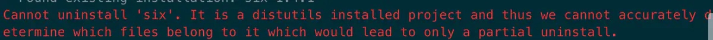
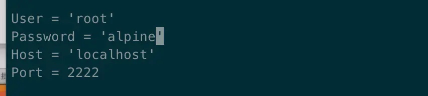
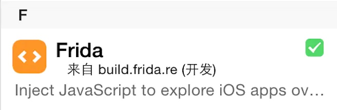
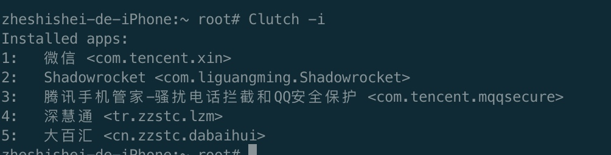
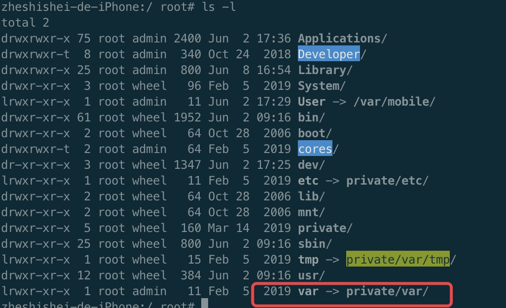
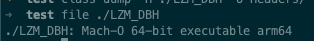
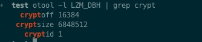
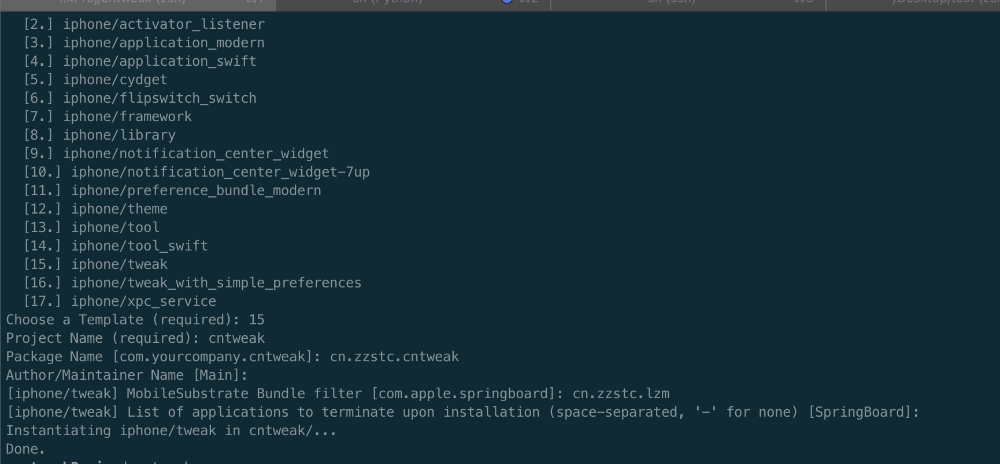

#逆向
app源代码经过编译链接, 生成一个个可执行文件.o, 再链接动态库之后. 变成一个可执行文件. 汇编语言. 可通过hopper Disassembler来进行解码查看汇编语言. 也可以通过class-dump导出所有用到的头文件. 
注入代码: 
脱壳app. 拿出可执行文件. class-dump导出头文件. 
猜测你要修改的类和方法. 使用tweak编写hook代码. 并注入到app.
可使用reveal查看app图层(未脱壳也能看). 
可使用cycript调试运行时的app. 考虑如何编写tweak.

#frida
由于系统日益更新, clutch和dumpdecrypt可能会不适合当前系统. 网上找了一个脱壳方法.
mac:
`sudo easy_install pip`
```
sudo -H pip install frida_tools
//如果报下图中的错误则更换为另外一条命令。
sudo pip install six --upgrade --ignore-installed six
```

克隆到根目录`git clone https://github.com/AloneMonkey/frida-ios-dump ~/`
更改dump.py的配置项

对我们来说.只要改port = 10010即可
手机:
添加源: https://build.frida.re
安装应用Frida


手机打开所需要脱壳的app(不打开她也会自动帮你打开)在mac去到克隆的目录下: 执行`./dump.py 深慧通`这个中文字可以通过`Clutch -i`得到.
`./dump.py bundleId`也行
执行过程中会出现找不到什么库. 直接执行`sudo pip install 库`即可.
比如: `No module named paramiko`, 则执行`sudo pip install paramiko`


# Clutch

[Clutch](https://github.com/KJCracks/Clutch/releases)

下载放到手机的`/usr/bins`
`scp -P 10010 ./Clutch root@localhost:/usr/bin`
复制了之后. 记得修改权限
`chmod +x /usr/bin/Clutch`

`Clutch -i`: 列出未脱壳的app

`Clutch -d id`: 脱壳操作, id 就是上述的id, 或者是bundleId

`/private/var/` == `var` 是替身, 引用关系
使用`ls -l`就知道


`file`指令可直接看到file是什么mach-o类型


查看该文件是否加壳
`otool -l filePath | grep crypt`

或者使用`class-dump -H filePath -o path` 导出头文件失败

#dumpdecrypt
https://github.com/stefanesser/dumpdecrypted
(脱壳流程: 拷贝下来, 生成dylib动态库文件, 放到手机, 注入到app里)
1. clone下来
2. 执行make指令(编译连接), 生成一个动态库文件dylib
3. 将dylib放到手机上, 路径: /var/root, 前提是你用的root用户权限(也不知道要放哪里)
4. 在手机里输入指令: DYLD_INSERT_LIBRARIES=dumpdecrypted.dylib /var/mobile/Applications/xxxxxxxx-xxxx-xxxx-xxxx-xxxxxxxxxxxx/Scan.app/Scan
5. 后面的路径可通过`ps -A`查看.

#给文件追加命令
`echo "export THEOS=~/theos" >> ~/.zprofile`


#安装theos

首页: https://github.com/theos/theos
安装方法: https://github.com/theos/theos/wiki/Installation-macOS
```
1. brew install ldid xz
2. echo "export THEOS=~/theos" >> ~/.zprofile // 这个只是在环境变量添加THEOS=~/theos
3. git clone --recursive https://github.com/theos/theos.git $THEOS
// --recursive, 标识递归克隆, 因项目又子模块. 所以这个参数就搞定. $THEOS是上一步所加的环境变量
1. 直接把下面一大串复制粘贴进terminal, 回车就好了.=.=
 curl -LO https://github.com/theos/sdks/archive/master.zip
 TMP=$(mktemp -d)
 unzip master.zip -d $TMP
 mv $TMP/sdks-master/*.sdk $THEOS/sdks
 rm -r master.zip $TMP
```
上述步骤做好之后. 我们要使用theos/bin/nic.pl这个命令. 所以要吧~/theos/bin这个加入PATH环境变量里.
`export PATH=$PATH:$HOME/theos/bin`

设置好之后. 直接在terminal敲`nic.pl`即可


然后会在当前目录生成一个文件夹. 首先编辑MakeFile文件. 第一二行添加
```
export THEOS_DEVICE_IP=127.0.0.1
export THEOS_DEVICE_PORT=10010
```
然后编写tweak.x即可. 
```
%hook className
%end
```
综上:
1. 不是要脱壳了才能注入. 加壳状态下也能注入. 但前提是你要知道className和对应的methodName
2. methodName不是源代码的入参. 而是class-dump出来的方法和入参.

#tweak编写
`%orig`: 表示执行原方法, 并拿到返回值. 也可以穿入参`%orig(arg1)`, 不传默认

`%new`: 在tweak编写的默认都是hook原来app里的, 如果app里没有, 要新增的话, 则需要在方法上一行声明这个:
```
%new
- (void)newMethod:(id)sender {
}
```

`%c(SSTipModel)` : 等同于NSClassFromString(@"SSTipModel")

#多文件开发
起始文件: tweak.x, 在Makefile里设置好路径: src/tweak.x
如果有多个问题, 比如添加一个类. 就和正常一样. #import(class.h)即可, 在Makefile里, tweak路径后面加上这个路径, 用","分割
PS: 上述import, 需要填写相对tweak.x的相对路径, 比如#import(model/Person.h)
Makefile路径支持通配符: `src/*.x, src/model/*.m`

#加载图片
在tweak文件夹里, 创建layout文件夹. 这个文件夹在install的时候.就当做是手机的根目录.
我们建议把图片放到`/Library/PreferenceLoader/Preferences/{ProjectName}`

#tweak原理
在make指令的时候. 会生成一个.theos文件夹. 在obj文件夹里有一个dylib格式的动态库.

make package指令是为了能让这个dylib文件更方便的打进手机app, 从而生成一个deb格式的文件.PS: `make package debug=0`则是打包release版本的deb

make install
1. 先根据我们的配置: THEOS_DEVICE_IP, THEOS_DEVICE_PORT, 登录到我们手机, 把deb包传给手机
2. 通过cydia安装这个deb文件
3. cydia把deb包里dylib库拿出来, 放到`/Library/MobileSubstrate/DynamicLibrary`, 这个路径是cydia Substrate管理(自带程序)


当我们启动app时, cydia Substrate就去上述路径去找对应的dylib(根据bundleId), 匹配上了就去加载对应的dylib, 然后改变app代码执行流程(执行hook操作)

tweak本质: 修改微信内存中的代码. 而不是修改微信执行文件里的代码

